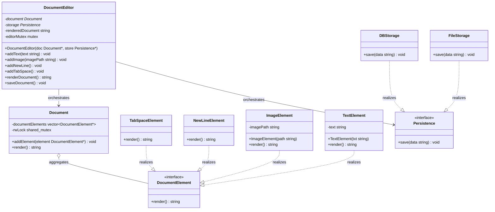

# Notepad (Document Editor) LLD

This case study covers the low level design of a document editor (Notepad), focusing on structural document elements (Composite Pattern) and extensible document storage (Strategy Pattern).

---

## Requirements

### Functional Requirements
*   **Mixed Content Hierarchy**: Support documents containing mixed elements, such as text segments, newlines, tab spaces, and images.
*   **Unified Document Rendering**: Concatenate and render all document elements in order to generate a single document view.
*   **Storage Extensibility**: Support saving the document to different backends (e.g., local files, database storage).

### Non Functional Requirements
*   **Thread Safety**: Ensure multiple reader threads can render the document concurrently without data races, while writers (inserting new elements) hold exclusive locks.
*   **Performance Cache**: Invalidate the rendered document string cache on edits, and cache the rendered document on subsequent reads.

### Scope Boundaries
*   **In Scope**: Thread safe element registration, dynamic formatting nodes, storage strategy polymorphism.
*   **Out of Scope**: GUI display components, text selection/cursor state, file sync over networks.

---

### Requirements to API & Pattern Mapping

| Requirement | Target Class / API | Design Pattern / Primitives | Architectural Role |
| --- | --- | --- | --- |
| **Mixed Content Hierarchy** | `DocumentElement` | **Composite Pattern** | Unified abstraction treating leaves and document trees uniformly. |
| **Unified Document Rendering** | `Document::render()` | **Composite Traversal** | Iterates over and concatenates the output of all child elements. |
| **Storage Extensibility** | `Persistence`, `FileStorage` | **Strategy Pattern** | Decouples document data from the specific saving mechanism. |
| **Safe Concurrent Rendering** | `Document::rwLock` | **`std::shared_mutex`** | Allows concurrent reads (render) while locking for writes (addElement). |

---

## Class Design

Below is the UML class diagram matching the course structure:




---

## Complete Code

Below is the complete C++ implementation based directly on **Lecture 07 (Good Design)**, updated to include thread safety:

```cpp
#include <iostream>
#include <vector>
#include <string>
#include <shared_mutex>
#include <mutex>
#include <fstream>
#include <memory>

// ==========================================
// 1. COMPOSITE PATTERN - DOCUMENT ELEMENTS
// ==========================================

// Component Abstraction
class DocumentElement {
public:
    virtual ~DocumentElement() = default;
    virtual std::string render() = 0;
};

// Leaf: Text
class TextElement : public DocumentElement {
private:
    std::string text;
public:
    TextElement(const std::string& txt) : text(txt) {}
    std::string render() override { return text; }
};

// Leaf: Image
class ImageElement : public DocumentElement {
private:
    std::string imagePath;
public:
    ImageElement(const std::string& path) : imagePath(path) {}
    std::string render() override { return "[Image: " + imagePath + "]"; }
};

// Leaf: NewLine Layout
class NewLineElement : public DocumentElement {
public:
    std::string render() override { return "\n"; }
};

// Leaf: TabSpace Layout
class TabSpaceElement : public DocumentElement {
public:
    std::string render() override { return "\t"; }
};

// Composite: Represents the full Document containing elements
class Document {
private:
    std::vector<DocumentElement*> documentElements;
    mutable std::shared_mutex rwLock; // Read-Write lock for concurrent access

public:
    ~Document() {
        std::unique_lock<std::shared_mutex> lock(rwLock);
        for (auto element : documentElements) {
            delete element;
        }
    }

    void addElement(DocumentElement* element) {
        std::unique_lock<std::shared_mutex> lock(rwLock); // Exclusive lock for writes
        documentElements.push_back(element);
    }

    // Traverse and concatenate all leaf elements (polymorphic render)
    std::string render() const {
        std::shared_lock<std::shared_mutex> lock(rwLock); // Shared lock for concurrent reads
        std::string result;
        for (auto element : documentElements) {
            result += element->render();
        }
        return result;
    }
};

// ==========================================
// 2. STRATEGY PATTERN - PERSISTENCE
// ==========================================

// Strategy Interface
class Persistence {
public:
    virtual ~Persistence() = default;
    virtual void save(std::string data) = 0;
};

// Concrete Strategy: File Storage
class FileStorage : public Persistence {
public:
    void save(std::string data) override {
        std::ofstream outFile("document.txt");
        if (outFile) {
            outFile << data;
            outFile.close();
            std::cout << "Document saved to document.txt" << std::endl;
        } else {
            std::cerr << "Error: Unable to open file for writing." << std::endl;
        }
    }
};

// Concrete Strategy: Database Storage
class DBStorage : public Persistence {
public:
    void save(std::string data) override {
        std::cout << "Saving data to SQL Database..." << std::endl;
    }
};

// ==========================================
// 3. ORCHESTRATOR - DOCUMENT EDITOR
// ==========================================

class DocumentEditor {
private:
    Document* document;
    Persistence* storage;
    std::string renderedDocument;
    mutable std::mutex editorMutex; // Protects local editor state and cache

public:
    DocumentEditor(Document* doc, Persistence* store)
        : document(doc), storage(store) {}

    void addText(const std::string& text) {
        std::lock_guard<std::mutex> lock(editorMutex);
        document->addElement(new TextElement(text));
        renderedDocument.clear(); // Invalidate cache
    }

    void addImage(const std::string& imagePath) {
        std::lock_guard<std::mutex> lock(editorMutex);
        document->addElement(new ImageElement(imagePath));
        renderedDocument.clear(); // Invalidate cache
    }

    void addNewLine() {
        std::lock_guard<std::mutex> lock(editorMutex);
        document->addElement(new NewLineElement());
        renderedDocument.clear(); // Invalidate cache
    }

    void addTabSpace() {
        std::lock_guard<std::mutex> lock(editorMutex);
        document->addElement(new TabSpaceElement());
        renderedDocument.clear(); // Invalidate cache
    }

    std::string renderDocument() {
        std::lock_guard<std::mutex> lock(editorMutex);
        if (renderedDocument.empty()) {
            renderedDocument = document->render();
        }
        return renderedDocument;
    }

    void saveDocument() {
        std::string content = renderDocument();
        storage->save(content);
    }
};

// ==========================================
// 4. CLIENT FLOW
// ==========================================

int main() {
    Document* document = new Document();
    Persistence* fileStorage = new FileStorage();

    DocumentEditor* editor = new DocumentEditor(document, fileStorage);

    editor->addText("Hello, world!");
    editor->addNewLine();
    editor->addText("This is a real-world document editor example.");
    editor->addNewLine();
    editor->addTabSpace();
    editor->addText("Indented text after a tab space.");
    editor->addNewLine();
    editor->addImage("picture.jpg");

    std::cout << "--- Document Render Preview ---" << std::endl;
    std::cout << editor->renderDocument() << std::endl;
    std::cout << "-------------------------------" << std::endl;

    editor->saveDocument();

    delete editor;
    delete fileStorage;
    delete document;
    return 0;
}
```

---

## Code Analysis

The `Notepad` document editor is designed as a modular, extensible, and thread safe system. The architecture relies on several fundamental structural and behavioral patterns:

### 1. The Composite Pattern (Structural Document Representation)
The system represents a document as a collection of diverse formatting and content nodes:
*   **Component (`DocumentElement`)**: Exposes a unified interface `render()` returning `std::string`.
*   **Leaf Nodes (`TextElement`, `ImageElement`, `NewLineElement`, `TabSpaceElement`)**: Implement specific rendering behaviors. For instance, `TextElement` returns raw text, while `ImageElement` wraps paths in formatting strings.
*   **Aggregate Root (`Document`)**: Maintains a vector of child `DocumentElement*` objects. It is the composite container that handles polymorphic layout traversal through its `render()` function, iterating over child elements without needing to know their concrete classes.

### 2. The Strategy Pattern (Extensible Storage Backends)
To support saving document contents across different targets, we decouple the serialization mechanism:
*   **Strategy Interface (`Persistence`)**: Declares the `save(std::string data)` virtual contract.
*   **Concrete Strategies (`FileStorage`, `DBStorage`)**: Implement custom persistence rules (such as writing to local files using `std::ofstream` or logging SQL database statements).
*   **Context (`DocumentEditor`)**: References a `Persistence` pointer, delegating serialization dynamically. This allows the backend storage to be swapped at runtime or injected during initialization.

### 3. The Facade Pattern (System Coordination)
`DocumentEditor` acts as a unified facade for the client. It aggregates the `Document` model and the `Persistence` strategy, offering a single entry point for operations like adding text, inserting formatting, caching the rendered view, and triggering saves. This shields the caller from low level details of composition and strategy orchestration.

---

## Concurrency & Synchronization

1.  **Read Write Lock (High Reader Throughput)**: 
    * In a document editor, rendering operations (reads) are far more frequent than formatting operations (writes). 
    * A standard `std::mutex` would block concurrent readers unnecessarily. Thus, we utilize `std::shared_mutex` inside `Document`. Concurrent reader threads calling `render()` acquire a shared lock (`std::shared_lock`), while writers calling `addElement()` block readers using an exclusive lock (`std::unique_lock`).
2.  **State Cache Invalidation**:
    * The `DocumentEditor` caches the rendered output in `renderedDocument` to avoid repeated traversal. 
    * This cache is protected by `editorMutex` and cleared immediately whenever any write operation occurs (`addText`, `addImage`, `addNewLine`, `addTabSpace`).

---

## SOLID Trade-offs

| SOLID Principles Satisfied | Design Drawbacks & Tradeoffs |
| --- | --- |
| **Open/Closed Principle (OCP)**: New layout formatting nodes (e.g. `UnderlineElement`) can be added without altering the `Document` collection class. Similarly, new storage targets (e.g. `CloudStorage`) can be plugged in without changing the core `DocumentEditor`. | **Fine Grained Allocations**: In a large document, creating a separate object heap allocation for every character or tab space leads to high memory overhead and fragmentation. |
| **Single Responsibility Principle (SRP)**: The representation of elements (Composite) is decoupled from the storage of document data (Strategy). | **No Structural Undo/Redo**: This design focuses purely on composite rendering. Without an action history stack (Command pattern), rolling back incremental modifications is not supported. |
