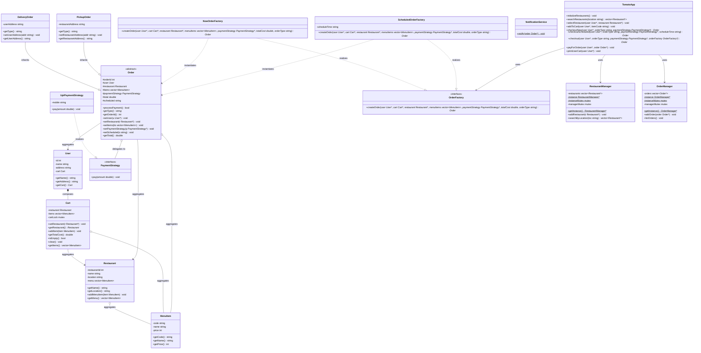

# Zomato (Food Delivery System) LLD

This case study covers the low level design of a food ordering and delivery system (Tomato/Zomato), focusing on abstract factories for scheduled deliveries and structural manager services.

---

## Requirements

### Functional Requirements
*   **Restaurant & Menu Management**: Support cataloging restaurants by location and managing their menus (items and prices).
*   **Cart Operations**: Allow users to select a restaurant and add items to a shopping cart.
*   **Payment Integration**: Process order payments using configurable gateways (e.g. UPI, credit cards).
*   **Extensible Order Creation**: Support multiple order types (Delivery or Pickup) and scheduling configurations (immediate checkout vs. scheduled checkouts).
*   **Notification Delivery**: Automatically log and dispatch notification messages upon successful order payment.

### Non Functional Requirements
*   **Thread Safety**: Ensure multiple user threads can modify their carts concurrently, and protect shared manager registries (Order/Restaurant managers) from race conditions.
*   **Centralized Facade**: Provide a unified entry point (`TomatoApp`) for clients to search, add to cart, checkout, and pay.

### Scope Boundaries
*   **In Scope**: Thread safe cart updates, abstract order factory hierarchy, payment strategy execution, and singleton manager registries.
*   **Out of Scope**: Delivery tracking via GPS, database persistence queries, real-time rider allocation algorithms.

---

### Requirements to API & Pattern Mapping

| Requirement | Target Class / API | Design Pattern / Primitives | Architectural Role |
| --- | --- | --- | --- |
| **Instant vs. Scheduled Checkout** | `OrderFactory` | **Factory Method Pattern** | Decouples order instantiation from scheduling time logic. |
| **Interchangeable Payments** | `PaymentStrategy` | **Strategy Pattern** | Standard interface for executing user transactions. |
| **Centralized Registries** | `RestaurantManager`, `OrderManager` | **Singleton Pattern** | Global access points to query restaurants and orders. |
| **System Orchestration** | `TomatoApp` | **Facade Pattern** | Simplifies client interactions with managers, carts, and factories. |
| **Thread Safe Cart** | `Cart::cartLock` | **`std::mutex`** | Guards user cart contents from concurrent modifications. |

---

## Class Design

Below is the UML class diagram matching the course structure:




---

## Complete Code

Below is the complete, thread safe C++ implementation combining all classes from the **Lecture 11 (Tomato)** directories:

```cpp
#include <iostream>
#include <vector>
#include <string>
#include <algorithm>
#include <mutex>
#include <ctime>
#include <memory>
#include <iomanip>

// ==========================================
// 1. UTILS
// ==========================================
class TimeUtils {
public:
    static std::string getCurrentTime() {
        std::time_t now = std::time(0);
        char* dt = std::ctime(&now);
        std::string s(dt);
        if (!s.empty() && s.back() == '\n')
            s.pop_back();
        return s;
    }
};

// ==========================================
// 2. DOMAIN MODELS
// ==========================================
class MenuItem {
private:
    std::string code;
    std::string name;
    int price;

public:
    MenuItem(const std::string& code, const std::string& name, int price) 
        : code(code), name(name), price(price) {}

    std::string getCode() const { return code; }
    std::string getName() const { return name; }
    int getPrice() const { return price; }
};

class Restaurant {
private:
    static int nextRestaurantId;
    int restaurantId;
    std::string name;
    std::string location;
    std::vector<MenuItem> menu;

public:
    Restaurant(const std::string& name, const std::string& location) 
        : name(name), location(location) {
        restaurantId = ++nextRestaurantId;
    }

    ~Restaurant() {
        menu.clear();
    }

    std::string getName() const { return name; }
    std::string getLocation() const { return location; }
    void addMenuItem(const MenuItem& item) { menu.push_back(item); }
    const std::vector<MenuItem>& getMenu() const { return menu; }
};
int Restaurant::nextRestaurantId = 0;

class Cart {
private:
    Restaurant* restaurant;
    std::vector<MenuItem> items;
    mutable std::mutex cartLock; // Protects user cart operations

public:
    Cart() : restaurant(nullptr) {}

    void setRestaurant(Restaurant* r) {
        std::lock_guard<std::mutex> lock(cartLock);
        restaurant = r;
    }

    Restaurant* getRestaurant() const {
        std::lock_guard<std::mutex> lock(cartLock);
        return restaurant;
    }

    void addItem(const MenuItem& item) {
        std::lock_guard<std::mutex> lock(cartLock);
        if (!restaurant) {
            std::cerr << "Cart: Set a restaurant before adding items." << std::endl;
            return;
        }
        items.push_back(item);
    }

    double getTotalCost() const {
        std::lock_guard<std::mutex> lock(cartLock);
        double sum = 0;
        for (const auto& it : items) {
            sum += it.getPrice();
        }
        return sum;
    }

    bool isEmpty() const {
        std::lock_guard<std::mutex> lock(cartLock);
        return (!restaurant || items.empty());
    }

    void clear() {
        std::lock_guard<std::mutex> lock(cartLock);
        items.clear();
        restaurant = nullptr;
    }

    std::vector<MenuItem> getItems() const {
        std::lock_guard<std::mutex> lock(cartLock);
        return items;
    }
};

class User {
private:
    int id;
    std::string name;
    std::string address;
    Cart cart;

public:
    User(int id, const std::string& name, const std::string& address) 
        : id(id), name(name), address(address) {}

    std::string getName() const { return name; }
    std::string getAddress() const { return address; }
    Cart* getCart() { return &cart; }
};

// ==========================================
// 3. PAYMENT STRATEGIES
// ==========================================
class PaymentStrategy {
public:
    virtual ~PaymentStrategy() = default;
    virtual void pay(double amount) = 0;
};

class UpiPaymentStrategy : public PaymentStrategy {
private:
    std::string mobile;
public:
    UpiPaymentStrategy(const std::string& mob) : mobile(mob) {}
    void pay(double amount) override {
        std::cout << "Paid ₹" << amount << " using UPI (" << mobile << ")" << std::endl;
    }
};

// ==========================================
// 4. ORDER HIERARCHY
// ==========================================
class Order {
protected:
    static int nextOrderId;
    int orderId;
    User* user;
    Restaurant* restaurant;
    std::vector<MenuItem> items;
    PaymentStrategy* paymentStrategy;
    double total;
    std::string scheduled;

public:
    Order() : user(nullptr), restaurant(nullptr), paymentStrategy(nullptr), total(0.0) {
        orderId = ++nextOrderId;
    }

    virtual ~Order() {
        delete paymentStrategy;
    }

    bool processPayment() {
        if (paymentStrategy) {
            paymentStrategy->pay(total);
            return true;
        } else {
            std::cout << "Please choose a payment mode first" << std::endl;
            return false;
        }
    }

    virtual std::string getType() const = 0;

    int getOrderId() const { return orderId; }
    void setUser(User* u) { user = u; }
    User* getUser() const { return user; }
    void setRestaurant(Restaurant* r) { restaurant = r; }
    Restaurant* getRestaurant() const { return restaurant; }
    
    void setItems(const std::vector<MenuItem>& its) {
        items = its;
        total = 0;
        for (auto &i : items) {
            total += i.getPrice();
        }
    }
    const std::vector<MenuItem>& getItems() const { return items; }
    void setPaymentStrategy(PaymentStrategy* p) { paymentStrategy = p; }
    void setScheduled(const std::string& s) { scheduled = s; }
    std::string getScheduled() const { return scheduled; }
    double getTotal() const { return total; }
    void setTotal(double t) { total = t; }
};
int Order::nextOrderId = 0;

class DeliveryOrder : public Order {
private:
    std::string userAddress;
public:
    DeliveryOrder() : userAddress("") {}
    std::string getType() const override { return "Delivery"; }
    void setUserAddress(const std::string& addr) { userAddress = addr; }
    std::string getUserAddress() const { return userAddress; }
};

class PickupOrder : public Order {
private:
    std::string restaurantAddress;
public:
    PickupOrder() : restaurantAddress("") {}
    std::string getType() const override { return "Pickup"; }
    void setRestaurantAddress(const std::string& addr) { restaurantAddress = addr; }
    std::string getRestaurantAddress() const { return restaurantAddress; }
};

// ==========================================
// 5. FACTORIES (FACTORY METHOD)
// ==========================================
class OrderFactory {
public:
    virtual Order* createOrder(User* user, Cart* cart, Restaurant* restaurant, const std::vector<MenuItem>& menuItems,
                               PaymentStrategy* paymentStrategy, double totalCost, const std::string& orderType) = 0;
    virtual ~OrderFactory() = default;
};

class NowOrderFactory : public OrderFactory {
public:
    Order* createOrder(User* user, Cart* cart, Restaurant* restaurant, const std::vector<MenuItem>& menuItems,
                       PaymentStrategy* paymentStrategy, double totalCost, const std::string& orderType) override {
        Order* order = nullptr;
        if (orderType == "Delivery") {
            auto deliveryOrder = new DeliveryOrder();
            deliveryOrder->setUserAddress(user->getAddress());
            order = deliveryOrder;
        } else {
            auto pickupOrder = new PickupOrder();
            pickupOrder->setRestaurantAddress(restaurant->getLocation());
            order = pickupOrder;
        }
        order->setUser(user);
        order->setRestaurant(restaurant);
        order->setItems(menuItems);
        order->setPaymentStrategy(paymentStrategy);
        order->setScheduled(TimeUtils::getCurrentTime());
        order->setTotal(totalCost);
        return order;
    }
};

class ScheduledOrderFactory : public OrderFactory {
private:
    std::string scheduleTime;
public:
    ScheduledOrderFactory(const std::string& time) : scheduleTime(time) {}
    Order* createOrder(User* user, Cart* cart, Restaurant* restaurant, const std::vector<MenuItem>& menuItems,
                       PaymentStrategy* paymentStrategy, double totalCost, const std::string& orderType) override {
        Order* order = nullptr;
        if (orderType == "Delivery") {
            auto deliveryOrder = new DeliveryOrder();
            deliveryOrder->setUserAddress(user->getAddress());
            order = deliveryOrder;
        } else {
            auto pickupOrder = new PickupOrder();
            pickupOrder->setRestaurantAddress(restaurant->getLocation());
            order = pickupOrder;
        }
        order->setUser(user);
        order->setRestaurant(restaurant);
        order->setItems(menuItems);
        order->setPaymentStrategy(paymentStrategy);
        order->setScheduled(scheduleTime);
        order->setTotal(totalCost);
        return order;
    }
};

// ==========================================
// 6. MANAGERS (SINGLETONS)
// ==========================================
class RestaurantManager {
private:
    std::vector<Restaurant*> restaurants;
    static RestaurantManager* instance;
    static std::mutex instanceMutex;
    std::mutex managerMutex; // Protects catalog registration

    RestaurantManager() = default;

public:
    static RestaurantManager* getInstance() {
        if (!instance) {
            std::lock_guard<std::mutex> lock(instanceMutex);
            if (!instance) {
                instance = new RestaurantManager();
            }
        }
        return instance;
    }

    void addRestaurant(Restaurant* r) {
        std::lock_guard<std::mutex> lock(managerMutex);
        restaurants.push_back(r);
    }

    std::vector<Restaurant*> searchByLocation(std::string loc) {
        std::lock_guard<std::mutex> lock(managerMutex);
        std::vector<Restaurant*> result;
        std::transform(loc.begin(), loc.end(), loc.begin(), ::tolower);
        for (auto r : restaurants) {
            std::string rl = r->getLocation();
            std::transform(rl.begin(), rl.end(), rl.begin(), ::tolower);
            if (rl == loc) {
                result.push_back(r);
            }
        }
        return result;
    }
};
RestaurantManager* RestaurantManager::instance = nullptr;
std::mutex RestaurantManager::instanceMutex;

class OrderManager {
private:
    std::vector<Order*> orders;
    static OrderManager* instance;
    static std::mutex instanceMutex;
    std::mutex managerMutex; // Protects order registry list

    OrderManager() = default;

public:
    static OrderManager* getInstance() {
        if (!instance) {
            std::lock_guard<std::mutex> lock(instanceMutex);
            if (!instance) {
                instance = new OrderManager();
            }
        }
        return instance;
    }

    void addOrder(Order* order) {
        std::lock_guard<std::mutex> lock(managerMutex);
        orders.push_back(order);
    }

    void listOrders() {
        std::lock_guard<std::mutex> lock(managerMutex);
        std::cout << "\n--- All Orders ---" << std::endl;
        for (auto order : orders) {
            std::cout << order->getType() << " order for " << order->getUser()->getName()
                      << " | Total: ₹" << order->getTotal()
                      << " | At: " << order->getScheduled() << std::endl;
        }
    }
};
OrderManager* OrderManager::instance = nullptr;
std::mutex OrderManager::instanceMutex;

// ==========================================
// 7. SERVICES
// ==========================================
class NotificationService {
public:
    static void notify(Order* order) {
        std::cout << "\nNotification: New " << order->getType() << " order placed!" << std::endl;
        std::cout << "---------------------------------------------" << std::endl;
        std::cout << "Order ID: " << order->getOrderId() << endl;
        std::cout << "Customer: " << order->getUser()->getName() << endl;
        std::cout << "Restaurant: " << order->getRestaurant()->getName() << endl;
        std::cout << "Items Ordered:\n";

        const auto& items = order->getItems();
        for (const auto& item : items) {
            std::cout << "   - " << item.getName() << " (₹" << item.getPrice() << ")\n";
        }

        std::cout << "Total: ₹" << order->getTotal() << std::endl;
        std::cout << "Scheduled For: " << order->getScheduled() << std::endl;
        std::cout << "Payment: Done" << std::endl;
        std::cout << "---------------------------------------------" << std::endl;
    }
};

// ==========================================
// 8. FACADE ORCHESTRATOR
// ==========================================
class TomatoApp {
public:
    TomatoApp() {
        initializeRestaurants();
    }

    void initializeRestaurants() {
        Restaurant* restaurant1 = new Restaurant("Bikaner", "Delhi");
        restaurant1->addMenuItem(MenuItem("P1", "Chole Bhature", 120));
        restaurant1->addMenuItem(MenuItem("P2", "Samosa", 15));

        Restaurant* restaurant2 = new Restaurant("Haldiram", "Kolkata");
        restaurant2->addMenuItem(MenuItem("P1", "Raj Kachori", 80));
        restaurant2->addMenuItem(MenuItem("P2", "Pav Bhaji", 100));
        restaurant2->addMenuItem(MenuItem("P3", "Dhokla", 50));

        Restaurant* restaurant3 = new Restaurant("Saravana Bhavan", "Chennai");
        restaurant3->addMenuItem(MenuItem("P1", "Masala Dosa", 90));
        restaurant3->addMenuItem(MenuItem("P2", "Idli Vada", 60));
        restaurant3->addMenuItem(MenuItem("P3", "Filter Coffee", 30));

        RestaurantManager* restaurantManager = RestaurantManager::getInstance();
        restaurantManager->addRestaurant(restaurant1);
        restaurantManager->addRestaurant(restaurant2);
        restaurantManager->addRestaurant(restaurant3);
    }

    std::vector<Restaurant*> searchRestaurants(const std::string& location) {
        return RestaurantManager::getInstance()->searchByLocation(location);
    }

    void selectRestaurant(User* user, Restaurant* restaurant) {
        user->getCart()->setRestaurant(restaurant);
    }

    void addToCart(User* user, const std::string& itemCode) {
        Restaurant* restaurant = user->getCart()->getRestaurant();
        if (!restaurant) {
            std::cout << "Please select a restaurant first." << std::endl;
            return;
        }
        for (const auto& item : restaurant->getMenu()) {
            if (item.getCode() == itemCode) {
                user->getCart()->addItem(item);
                break;
            }
        }
    }

    Order* checkoutNow(User* user, const std::string& orderType, PaymentStrategy* paymentStrategy) {
        return checkout(user, orderType, paymentStrategy, new NowOrderFactory());
    }

    Order* checkoutScheduled(User* user, const std::string& orderType, PaymentStrategy* paymentStrategy, const std::string& scheduleTime) {
        return checkout(user, orderType, paymentStrategy, new ScheduledOrderFactory(scheduleTime));
    }

    Order* checkout(User* user, const std::string& orderType, PaymentStrategy* paymentStrategy, OrderFactory* orderFactory) {
        Cart* userCart = user->getCart();
        if (userCart->isEmpty()) {
            delete orderFactory;
            return nullptr;
        }

        Restaurant* orderedRestaurant = userCart->getRestaurant();
        std::vector<MenuItem> itemsOrdered = userCart->getItems();
        double totalCost = userCart->getTotalCost();

        Order* order = orderFactory->createOrder(user, userCart, orderedRestaurant, itemsOrdered, paymentStrategy, totalCost, orderType);
        OrderManager::getInstance()->addOrder(order);
        delete orderFactory; // clean up concrete factory pointer
        return order;
    }

    void payForOrder(User* user, Order* order) {
        if (order->processPayment()) {
            NotificationService::notify(order);
            user->getCart()->clear();
        }
    }

    void printUserCart(User* user) {
        std::cout << "Items in cart:" << std::endl;
        std::cout << "------------------------------------" << std::endl;
        for (const auto& item : user->getCart()->getItems()) {
            std::cout << item.getCode() << " : " << item.getName() << " : ₹" << item.getPrice() << std::endl;
        }
        std::cout << "------------------------------------" << std::endl;
        std::cout << "Grand total : ₹" << user->getCart()->getTotalCost() << std::endl;
    }
};

// ==========================================
// 9. CLIENT FLOW
// ==========================================
int main() {
    TomatoApp* tomato = new TomatoApp();

    User* user = new User(101, "Aditya", "Delhi");
    std::cout << "User: " << user->getName() << " is active." << std::endl;

    std::vector<Restaurant*> restaurantList = tomato->searchRestaurants("Delhi");
    if (restaurantList.empty()) {
        std::cout << "No restaurants found!" << std::endl;
        delete tomato;
        delete user;
        return 0;
    }

    tomato->selectRestaurant(user, restaurantList[0]);
    tomato->addToCart(user, "P1");
    tomato->addToCart(user, "P2");

    tomato->printUserCart(user);

    Order* order = tomato->checkoutNow(user, "Delivery", new UpiPaymentStrategy("1234567890"));
    tomato->payForOrder(user, order);

    OrderManager::getInstance()->listOrders();

    delete tomato;
    delete user;
    return 0;
}
```

---

## Code Analysis

The `TomatoApp` system relies on a structural facade and several design patterns to achieve clean, decoupled, and thread safe orchestration:

### 1. The Facade Pattern (System Orchestration)
The client interacts solely with the facade orchestrator (`TomatoApp`), which coordinates user registrations, restaurant lookup, cart modifications, order processing, and payment notifications. The facade encapsulates subsystems like:
*   `RestaurantManager` (searching and cataloging).
*   `OrderManager` (tracking historical operations).
*   `Cart` (updating selections).
*   `OrderFactory` (dispatching and scheduling logic).

### 2. The Factory Method Pattern (Extensible Creation)
Creating different kinds of orders (e.g. standard immediate delivery vs. delayed pickup) requires distinct object setup routines:
*   **Abstract Creator (`OrderFactory`)**: Declares the `createOrder()` method interface.
*   **Concrete Creators (`NowOrderFactory`, `ScheduledOrderFactory`)**: Implement custom instantiation algorithms, setting the delivery address details or timing stamps (`TimeUtils::getCurrentTime()`) correctly depending on checkout types.

### 3. The Strategy Pattern (Dynamic Transaction Gateways)
Rather than hardcoding payment systems within checkout managers:
*   **Strategy Interface (`PaymentStrategy`)**: Standardizes the transaction interface with `pay(double amount)`.
*   **Concrete Strategies (`UpiPaymentStrategy`, etc.)**: Implement custom processing gateways.
*   **Context (`Order`)**: Contains a reference to a `PaymentStrategy*` object and executes payments dynamically during checkout, complying with OCP.

### 4. The Singleton Pattern (Central Managers)
The registry managers (`RestaurantManager` and `OrderManager`) coordinate shared global data. They are implemented with thread safe Double Checked Locking, ensuring a single instances exists in memory.

---

## Concurrency & Synchronization

To adapt the system for multi-threaded environments, synchronization locks are integrated:
1.  **Thread Safe User Session Cart**: Modifying or checking cart items (`Cart::addItem`, `Cart::clear`, `Cart::getTotalCost`) is synchronized using `cartLock` (`std::mutex`) inside the `Cart` class.
2.  **Singleton Double Checked Locking**: Thread safe initialization for `RestaurantManager` and `OrderManager` is achieved using double checked locking, guarded by `instanceMutex`.
3.  **Shared Registries Guards**: Modifying the lists inside `RestaurantManager::addRestaurant` or `OrderManager::addOrder` uses fine grained local `managerMutex` objects to prevent race conditions during concurrent orders or catalog initialization.

---

## SOLID Trade-offs

| SOLID Principles Satisfied | Design Drawbacks & Tradeoffs |
| --- | --- |
| **Open/Closed Principle (OCP)**: Adding new delivery types (e.g. `DroneDeliveryOrder`) or scheduling rules can be integrated by extending the `Order` base class and writing a corresponding factory without altering `TomatoApp`. | **Fat Interface Smells**: The facade `TomatoApp` aggregates a large number of orchestrating methods, which can make it a focal point of complexity. |
| **Dependency Inversion Principle (DIP)**: `TomatoApp` is decoupled from specific order instantiations by depending on the `OrderFactory` and `Order` abstractions. | **Overkill for Simple Flows**: Introducing the Factory Method pattern for creating standard orders adds structural indirection that is unnecessary if the delivery model is fixed. |
