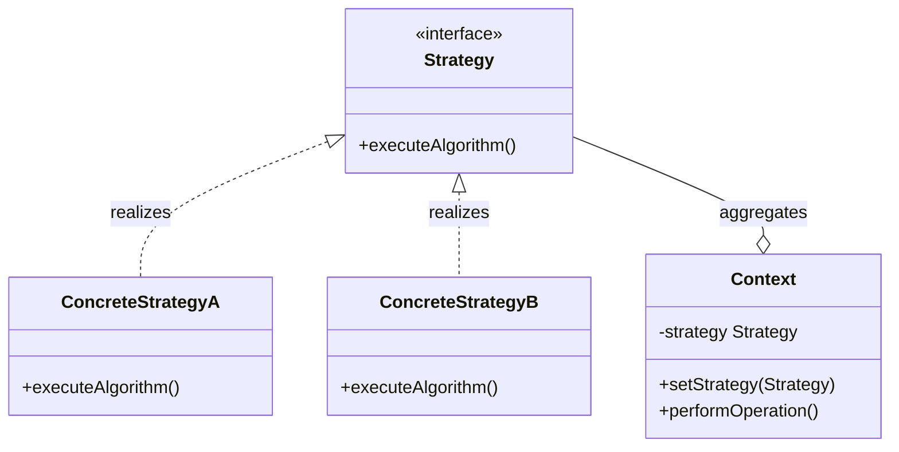
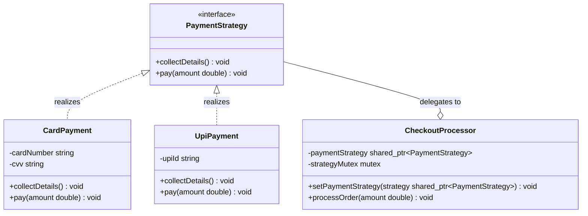

# Strategy Design Pattern

The Strategy pattern is a behavioral design pattern that defines a family of algorithms, encapsulates each one, and makes them interchangeable. Strategy lets the algorithm vary independently from the clients that use it. It promotes the core design principle: **Favor Composition over Inheritance**.

---

## Core Architecture

The static class hierarchy decouples algorithm execution from the context that utilizes it. The context class contains a reference to the Strategy interface and delegates the algorithm execution to the concrete strategy object.

| Participant          | Responsibility                                                             |
| -------------------- | -------------------------------------------------------------------------- |
| **Context**          | Maintains a reference to a Strategy object and interfaces with the client. |
| **Strategy**         | Declares a common interface for all supported algorithms.                  |
| **ConcreteStrategy** | Implements the specific algorithm defined by the Strategy interface.       |

---

## Standard UML Representation



---

## The Coupling Problem

Without Strategy, the natural approach is to encode each algorithm variant directly inside the context class using conditional branching, or to use inheritance to specialize behavior:

```cpp
// Inheritance approach: one subclass per payment variant
class CheckoutProcessor { public: virtual void pay(double) = 0; };
class CardCheckoutProcessor  : public CheckoutProcessor { ... };
class UpiCheckoutProcessor   : public CheckoutProcessor { ... };
class CryptoCheckoutProcessor: public CheckoutProcessor { ... }; // new variant = new class
```

This creates a rigid subclass hierarchy. Adding a new payment method means adding a new subclass of `CheckoutProcessor` — the hierarchy grows linearly with variants. Combining variants (e.g. a checkout that tries UPI first, falls back to card) requires yet another subclass or branching. Runtime switching between algorithms is impossible without changing the object's type entirely.

The Strategy pattern inverts this: instead of the context *being* an algorithm variant, it *holds* one. The algorithm is extracted into its own interface, making it independently replaceable at runtime without subclassing the context.

---

## Example (Payment Processing System)

Below is the UML class diagram for the Payment Processing System scenario:



This implementation demonstrates a thread safe checkout context executing dynamic payment strategies, featuring smart memory management, custom exceptions, and scoped locking.

```cpp
#include <iostream>
#include <memory>
#include <mutex>
#include <stdexcept>
#include <string>

using namespace std;

// Custom System Exception
class PaymentException : public runtime_error {
public:
    explicit PaymentException(const string& msg) : runtime_error(msg) {}
};

// Strategy Interface
class PaymentStrategy {
public:
    virtual ~PaymentStrategy() = default;
    virtual void collectDetails() = 0;
    virtual void pay(double amount) = 0;
};

// Concrete Strategies
class CardPayment : public PaymentStrategy {
private:
    string cardNumber;
    string cvv;

public:
    CardPayment(string card, string code) : cardNumber(card), cvv(code) {
        if (card.empty() || code.empty()) {
            throw PaymentException("Invalid card details provided");
        }
    }

    void collectDetails() override {
        cout << "Validating Card: " << cardNumber << "\n";
    }

    void pay(double amount) override {
        cout << "Paid " << amount << " using Credit Card.\n";
    }
};

class UpiPayment : public PaymentStrategy {
private:
    string upiId;

public:
    explicit UpiPayment(string id) : upiId(id) {
        if (id.empty()) {
            throw PaymentException("Invalid UPI ID");
        }
    }

    void collectDetails() override {
        cout << "Verifying UPI ID: " << upiId << "\n";
    }

    void pay(double amount) override {
        cout << "Paid " << amount << " using UPI.\n";
    }
};

// Context Class
class CheckoutProcessor {
private:
    shared_ptr<PaymentStrategy> paymentStrategy;
    mutable mutex strategyMutex;

public:
    CheckoutProcessor() : paymentStrategy(nullptr) {}

    void setPaymentStrategy(shared_ptr<PaymentStrategy> strategy) {
        lock_guard<mutex> lock(strategyMutex);
        if (!strategy) {
            throw PaymentException("Cannot set null payment strategy");
        }
        paymentStrategy = strategy;
    }

    void processOrder(double amount) {
        shared_ptr<PaymentStrategy> currentStrategy;
        
        {
            lock_guard<mutex> lock(strategyMutex);
            if (!paymentStrategy) {
                throw PaymentException("Payment strategy not set");
            }
            currentStrategy = paymentStrategy;
        }

        // Execute action outside the critical section to prevent lock contention
        currentStrategy->collectDetails();
        currentStrategy->pay(amount);
    }
};

// Client Driver
int main() {
    try {
        auto checkout = make_unique<CheckoutProcessor>();

        cout << "--- Card Payment Flow ---\n";
        auto card = make_shared<CardPayment>("1234-5678-9012", "999");
        checkout->setPaymentStrategy(card);
        checkout->processOrder(1500.50);

        cout << "\n--- UPI Payment Flow ---\n";
        auto upi = make_shared<UpiPayment>("user@upi");
        checkout->setPaymentStrategy(upi);
        checkout->processOrder(450.00);

    } catch (const PaymentException& ex) {
        cerr << "Payment failure: " << ex.what() << "\n";
    }

    return 0;
}
```

---

## Concurrency & Design Considerations

* **Shared State Protection**: The context class manages the active strategy under a `std::mutex` to protect against simultaneous calls to `setPaymentStrategy` and `processOrder`.
* **Minimizing Lock Contention**: The actual strategy execution (`collectDetails()` and `pay()`) runs **outside the locked critical section**.
* **Local Copy Snapshot**: The context copies the shared pointer locally under lock, releases the mutex, and then runs the payment. This prevents network delays inside the strategy from stalling the entire processor.

---

## Design Tradeoffs

| Advantages & SOLID Alignment | Drawbacks & Limitations |
| --- | --- |
| **OCP Compliance**: You can introduce new payment methods (e.g. `CryptoPayment`) without modifying existing checkout code. | **Subclass Proliferation**: Each algorithm requires a new class, increasing the codebase class count. |
| **SRP Alignment**: Separates checkout orchestration logic from concrete integration details. | **Client Awareness**: The calling client must understand the differences between strategies to instantiate and inject the correct one. |

---

## Comparison

Strategy is often compared with State and Command because all three delegate behavior to separate objects.

| Dimension | Strategy | State | Command |
| --- | --- | --- | --- |
| **Primary Intent** | Swaps interchangeable algorithms at runtime. | Models lifecycle-dependent behavior changes. | Encapsulates a request as an object for queuing or undo. |
| **Who Controls Selection** | The client or context selects the strategy. | The context changes its own state based on transitions. | The invoker triggers execution; the client creates commands. |
| **Object Relationship** | Context holds one strategy at a time. | Context holds one state at a time, transitioning between them. | Invoker holds commands; commands reference receivers. |
| **Use When** | You need to choose between algorithms without changing the context. | Behavior depends on the current lifecycle state. | You need undo/redo, queuing, or logging of requests. |
