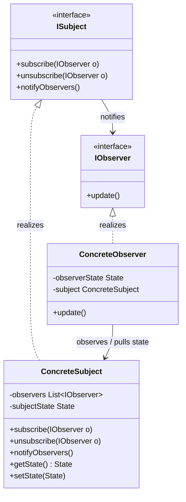
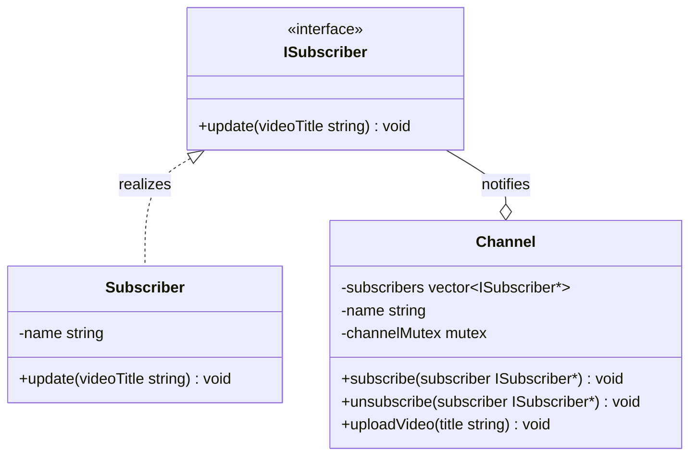

# Observer Design Pattern

The Observer pattern is a behavioral design pattern that defines a one to many dependency between objects. When one object (the Subject) changes state, all its dependents (the Observers) are notified and updated automatically. This pattern is a foundation of event driven programming and is widely used to achieve loose coupling between components.

---

## Core Architecture

The static structure decouples state monitoring from state modification. The subject maintains a list of observer interfaces, allowing it to notify them without being coupled to their concrete classes.

| Participant | Responsibility |
| --- | --- |
| **Subject (ISubject)** | Exposes interface methods to register (`subscribe`), remove (`unsubscribe`), and notify observers. |
| **Observer (IObserver)** | Exposes an `update` interface to receive change notifications from the subject. |
| **ConcreteSubject** | Stores state of interest, updates state, and triggers notifications when changes occur. |
| **ConcreteObserver** | Implements the update behavior, holding a reference to the subject to pull state updates if needed. |

---

## Standard UML Representation



---

## The State Synchronization Problem

In many software architectures, components must coordinate their state changes. Hardcoding dependencies between a central state provider (Subject) and its consumers (Observers) couples classes too tightly, making it impossible to add, remove, or modify consumers at runtime without altering the provider. The challenge is to maintain consistency between these related objects without forcing compile time or lifetime dependencies.

### Push vs. Pull Notification Models

State updates can be propagated from the Subject to Observers in two ways:

| Model | Notification Signature | Coupling | Data Overhead |
| --- | --- | --- | --- |
| **Push Model** | Subject passes data arguments: `update(State data)`. | Loosely coupled on domain instances, but a change in the data structure breaks the update signature. | High. Pushes all state to all observers, regardless of whether they need it. |
| **Pull Model** | Subject triggers simple callback: `update()`. | Tighter coupling. Observers must hold a reference to the Concrete Subject to query getters. | Low. Observers query and pull only the specific fields they require. |

The example below uses the **Push model** — `Channel` calls `update(title)` passing the video title directly. This fits YouTube's notification model: every subscriber needs the same piece of data (the title), so pushing it avoids redundant getter calls into the subject.

---

## Example (YouTube Channel Notifications)

Below is the UML class diagram for the YouTube Channel Notifications scenario:



This C++ implementation implements thread safe subscriptions and handles notifications using asynchronous execution threads to prevent blocking bottlenecks.

```cpp
#include <iostream>
#include <vector>
#include <string>
#include <mutex>
#include <algorithm>
#include <thread>
#include <chrono>

using namespace std;

// Observer Interface
class ISubscriber {
public:
    virtual ~ISubscriber() = default;
    virtual void update(const string& videoTitle) = 0;
};

// Concrete Subject (Thread Safe)
class Channel {
private:
    vector<ISubscriber*> subscribers;
    string name;
    mutex channelMutex; // Protects subscribers list

public:
    explicit Channel(const string& channelName) : name(channelName) {}

    void subscribe(ISubscriber* subscriber) {
        lock_guard<mutex> lock(channelMutex);
        if (find(subscribers.begin(), subscribers.end(), subscriber) == subscribers.end()) {
            subscribers.push_back(subscriber);
        }
    }

    void unsubscribe(ISubscriber* subscriber) {
        lock_guard<mutex> lock(channelMutex);
        auto it = find(subscribers.begin(), subscribers.end(), subscriber);
        if (it != subscribers.end()) {
            subscribers.erase(it);
        }
    }

    void uploadVideo(const string& title) {
        cout << "\n[" << name << " uploaded \"" << title << "\"]\n";

        // Take a local snapshot of observers to minimize locking duration
        vector<ISubscriber*> subscribersSnapshot;
        {
            lock_guard<mutex> lock(channelMutex);
            subscribersSnapshot = subscribers;
        }

        // Notify observers asynchronously to prevent slow observer blocking
        vector<thread> notificationThreads;
        for (ISubscriber* sub : subscribersSnapshot) {
            notificationThreads.emplace_back([sub, title]() {
                sub->update(title);
            });
        }
        for (auto& t : notificationThreads) {
            t.join();
        }
    }
};

// Concrete Observer
class Subscriber : public ISubscriber {
private:
    string name;

public:
    explicit Subscriber(const string& subscriberName) : name(subscriberName) {}

    void update(const string& videoTitle) override {
        // Simulate a slow notification process (e.g. external network push)
        this_thread::sleep_for(chrono::milliseconds(50));
        cout << "Notification delivered to " << name << " for video: " << videoTitle << "\n";
    }
};

int main() {
    auto channel = make_unique<Channel>("CoderArmy");

    auto subs1 = make_unique<Subscriber>("Varun");
    auto subs2 = make_unique<Subscriber>("Tarun");

    channel->subscribe(subs1.get());
    channel->subscribe(subs2.get());

    channel->uploadVideo("Thread Safe Observer Pattern Tutorial");

    // Sleep to allow detached threads to complete their execution
    this_thread::sleep_for(chrono::milliseconds(200));

    return 0;
}
```

---

## Concurrency & Design Considerations

Synchronous iteration over raw observer pointers causes two primary issues in concurrent environments:
* **Thread Safe Subscriptions**: Concurrent modifications to the observer collection (e.g. subscribing/unsubscribing) will cause race conditions. Access must be synchronized using a `std::mutex` or `std::shared_mutex`.
* **Slow Observer Bottleneck**: If the Subject notifies observers sequentially in a single thread, any delayed subscriber (due to I/O or network transactions) will block subsequent notifications.
* **Asynchronous Decoupling**: To resolve this, take a local snapshot copy of the observers list under lock, release the lock immediately, and dispatch notifications asynchronously (e.g. using a thread pool).

> **Notification Ordering**: Dispatching via detached threads (as in the example) makes notification order non-deterministic — observers may receive `update()` in any sequence. Systems where observer B must process after observer A (e.g. a logger must run before an email sender) require a sequenced dispatch mechanism such as a priority queue or a single ordered thread pool, not raw detached threads.

### The Lapsed Listener Problem (Memory Leaks & Dangling Pointers)

The Lapsed Listener Problem occurs when a long lived Subject retains a reference to a short lived Observer that is no longer needed, preventing cleanup.

| Environment | Mechanism | Consequence | Mitigation |
| --- | --- | --- | --- |
| **Garbage Collected** *(Java, C#)* | Subject holds a strong reference. | **Memory Leak**: GC cannot reclaim the observer; callbacks run in the background. | Use **Weak References** (`WeakReference`) inside the Subject. |
| **Manual Memory Management** *(C++)* | Observer is deleted but Subject retains its raw pointer. | **Dangling Pointer Crash**: Dereferencing it during notification causes a segmentation fault. | Use **RAII** (unsubscribe in Observer destructor) or `std::weak_ptr`. |

### C++ RAII Mitigation Example

```cpp
#include <iostream>
#include <string>

using namespace std;

class ISubscriber {
public:
    virtual ~ISubscriber() = default;
    virtual void update(const string& videoTitle) = 0;
};

class Channel {
public:
    void subscribe(ISubscriber* s) {}
    void unsubscribe(ISubscriber* s) {}
};

class Subscriber : public ISubscriber {
private:
    Channel& channel;
    string name;

public:
    Subscriber(Channel& ch, string n) : channel(ch), name(n) {
        channel.subscribe(this); // Auto subscribe on creation
    }

    ~Subscriber() override {
        channel.unsubscribe(this); // Auto unsubscribe on destruction prevents dangling pointers
    }

    void update(const string& videoTitle) override {
        cout << name << " received: " << videoTitle << "\n";
    }
};
```

---

## Design Tradeoffs

| Advantages & SOLID Alignment | Drawbacks & Limitations |
| --- | --- |
| **Loose Coupling**: The Subject only knows that its Observers implement the `ISubscriber` interface. It does not need to know their concrete classes, simplifying codebase modularity. | **Dangling References**: In languages without garbage collection (e.g. C++), managing observer lifetimes requires extra care to prevent the lapsed listener problem. |
| **Open/Closed Principle (OCP)**: New observer types can be introduced without altering the subject's implementation. | **Cascade Updates & Performance**: A single update in the Subject might trigger a cascade of updates across observers, leading to performance degradation if not dispatched asynchronously. |

---

## Comparison

Observer is often compared with Mediator and Pub/Sub because all three handle event-driven communication.

| Dimension | Observer | Mediator | Pub/Sub |
| --- | --- | --- | --- |
| **Coupling** | Subject knows observers directly; observers know the subject. | Colleagues know only the mediator; mediator knows all colleagues. | Publishers and subscribers are completely anonymous to each other. |
| **Communication Direction** | One-to-many direct notification. | Many-to-many through a central hub. | One-to-many through a broker or event bus. |
| **Lifecycle Management** | Observers must explicitly subscribe and unsubscribe. | Mediator manages colleague registration internally. | Broker handles subscription routing and message delivery. |
| **Use When** | You need direct, tight notification between known parties. | You want to centralize complex communication logic in one place. | You need decoupled, scalable broadcast across unknown consumers. |