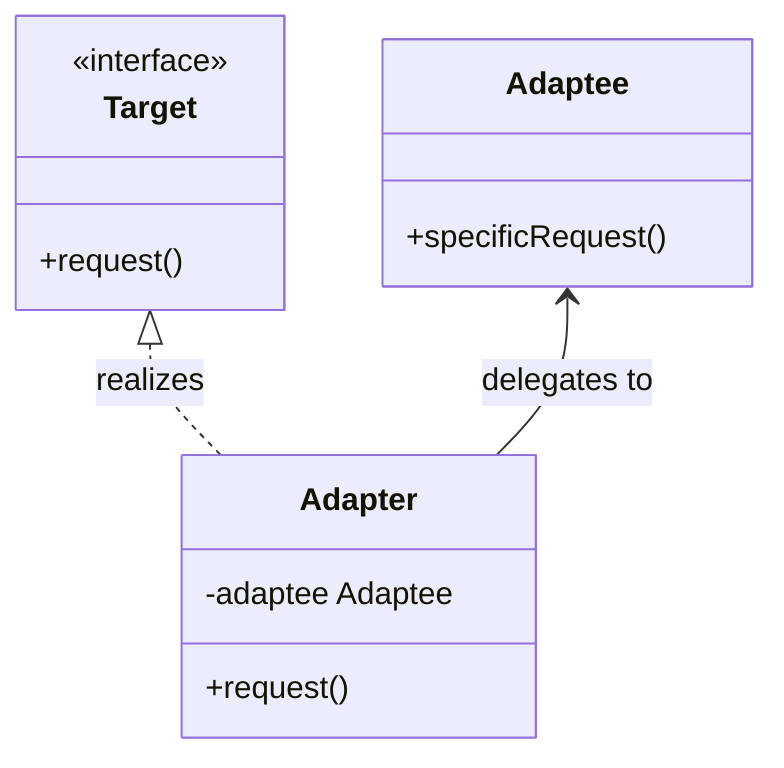
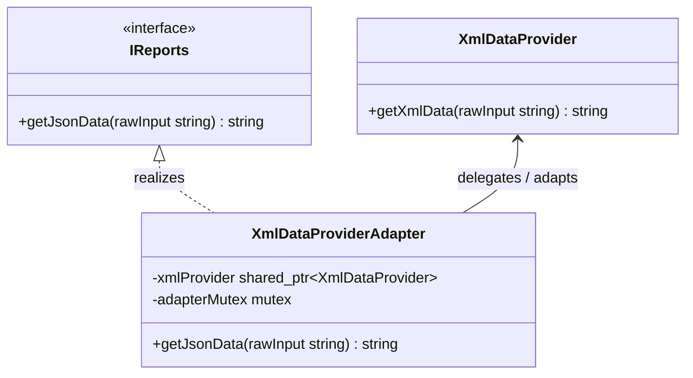

# Adapter Design Pattern

The Adapter pattern is a structural design pattern that allows objects with incompatible interfaces to collaborate. It acts as a wrapper that translates calls from a client into a format that a third party or legacy subsystem expects.

---

## Core Architecture

The Adapter pattern can be implemented using two structurally distinct approaches:

| Approach | Mechanism | Coupling | Preferred |
| --- | --- | --- | --- |
| **Object Adapter (Composition)** | Adapter implements the target interface and aggregates a reference to the adaptee | Loose: adapts any adaptee subclass | Yes — favors composition |
| **Class Adapter (Multiple Inheritance)** | Adapter inherits from both the target interface and the adaptee class | Tight: locked to one concrete adaptee | Only when adaptee override is required |

> **Scope**: This note demonstrates the **Object Adapter** in depth. Class Adapter is omitted because C++ multiple inheritance adds significant complexity (vtable layout, diamond problem) that obscures the pattern intent.

| Participant | Responsibility                                                                               |
| ----------- | -------------------------------------------------------------------------------------------- |
| **Target**  | Defines the domain specific interface that the client code uses.                             |
| **Client**  | Collaborates with objects conforming to the Target interface.                                |
| **Adaptee** | Defines an existing interface that needs adapting (usually a legacy or third party library). |
| **Adapter** | Adapts the interface of the Adaptee to the Target interface.                                 |

---

## Standard UML Representation

Below is the structure of the **Object Adapter** pattern:



---

## The Interface Incompatibility Problem

* **Problem**: Integrating third party libraries or legacy code often fails because their method signatures do not match the interface expected by your application.
* **Impact**: Directly modifying the external library or rewriting your application to handle multiple concrete types creates tight coupling and violates the **Open/Closed Principle (OCP)**.
* **Solution**: Wrap the incompatible class inside an adapter object that translates output format types transparently.

---

## Example (XML to JSON Reports Converter)

Below is the UML class diagram for the XML to JSON Reports Converter scenario:



This implementation demonstrates an Object Adapter that converts XML report data to JSON format, conforming to the application's unified reporting interface.

```cpp
#include <iostream>
#include <string>
#include <memory>
#include <stdexcept>
#include <mutex>

using namespace std;

// Custom System Exception
class AdapterException : public runtime_error {
public:
    explicit AdapterException(const string& msg) : runtime_error(msg) {}
};

// Target Interface expected by the client
class IReports {
public:
    virtual ~IReports() = default;
    virtual string getJsonData(const string& rawInput) = 0;
};

// Adaptee: Provides raw XML data from input
class XmlDataProvider {
public:
    string getXmlData(const string& rawInput) {
        size_t separator = rawInput.find(':');
        if (separator == string::npos) {
            throw AdapterException("Malformed input data format");
        }
        string username = rawInput.substr(0, separator);
        string userId = rawInput.substr(separator + 1);
        
        // Simulates generating XML payload
        return "<user><name>" + username + "</name><id>" + userId + "</id></user>";
    }
};

// Adapter: Implements target interface by delegating to and translating Adaptee
class XmlDataProviderAdapter : public IReports {
private:
    shared_ptr<XmlDataProvider> xmlProvider;

public:
    explicit XmlDataProviderAdapter(shared_ptr<XmlDataProvider> provider) : xmlProvider(provider) {
        if (!xmlProvider) {
            throw AdapterException("Null XML data provider reference");
        }
    }

    string getJsonData(const string& rawInput) override {
        // 1. Fetch XML from the adaptee
        string xmlPayload = xmlProvider->getXmlData(rawInput);

        // 2. Parse XML fields
        size_t startName = xmlPayload.find("<name>");
        size_t endName = xmlPayload.find("</name>");
        if (startName == string::npos || endName == string::npos) {
            throw AdapterException("Failed to parse name from XML payload");
        }
        string name = xmlPayload.substr(startName + 6, endName - (startName + 6));

        size_t startId = xmlPayload.find("<id>");
        size_t endId = xmlPayload.find("</id>");
        if (startId == string::npos || endId == string::npos) {
            throw AdapterException("Failed to parse ID from XML payload");
        }
        string id = xmlPayload.substr(startId + 4, endId - (startId + 4));

        // 3. Translate and return JSON
        return "{\"name\":\"" + name + "\", \"id\":" + id + "}";
    }
};

// Client class utilizing the Target interface
class ReportClient {
public:
    void displayReport(shared_ptr<IReports> reportGenerator, const string& rawData) {
        string jsonReport = reportGenerator->getJsonData(rawData);
        cout << "Processed JSON Report: " << jsonReport << "\n";
    }
};

int main() {
    try {
        auto xmlProvider = make_shared<XmlDataProvider>();
        auto adapter = make_shared<XmlDataProviderAdapter>(xmlProvider);

        auto client = make_unique<ReportClient>();
        client->displayReport(adapter, "Alice:42");

    } catch (const AdapterException& ex) {
        cerr << "Adapter Error: " << ex.what() << "\n";
    }

    return 0;
}
```

---

## Concurrency & Design Considerations

* **Stateless Adapters**: Adapter instances are usually stateless translation layers and are safe to share across threads if the underlying `Adaptee` is thread safe.
* **Stateful Synchronization**: If the wrapped `Adaptee` is stateful and not thread safe, the `Adapter` must coordinate access by wrapping delegation calls in a `std::mutex` lock.

---

## Design Tradeoffs

| Advantages & SOLID Alignment | Drawbacks & Limitations |
| --- | --- |
| **OCP Compliance**: Introduce new adapter configurations without altering existing client code. | **Indirection Cost**: Adds wrapping overhead and increases call stack depth. |
| **SRP Alignment**: Separates client execution logic from complex data conversion logic. | **Code Bloat**: Requires creating new translation helper classes for minor API updates. |

---

## Comparison

Adapter is often compared with Facade and Proxy because all three wrap or mediate access to another object.

| Dimension | Adapter | Facade | Proxy |
| --- | --- | --- | --- |
| **Primary Intent** | Converts an existing incompatible interface into the one the client expects. | Provides a simplified unified interface to a complex subsystem. | Controls access and coordinates lifecycle of the target. |
| **Interface Match** | Changes/translates interface signatures. | Defines a new simplified interface. | Matches the real subject's interface exactly. |
| **Relationship to Existing Code** | Wraps an existing class with a mismatched interface. | Sits in front of a set of existing subsystem classes. | Sits in front of a single existing subject class. |
| **Use When** | You need to reuse legacy or third-party code without changing it. | You want to simplify a complex subsystem for common use cases. | You need to add access control, lazy loading, or caching around an object. |
