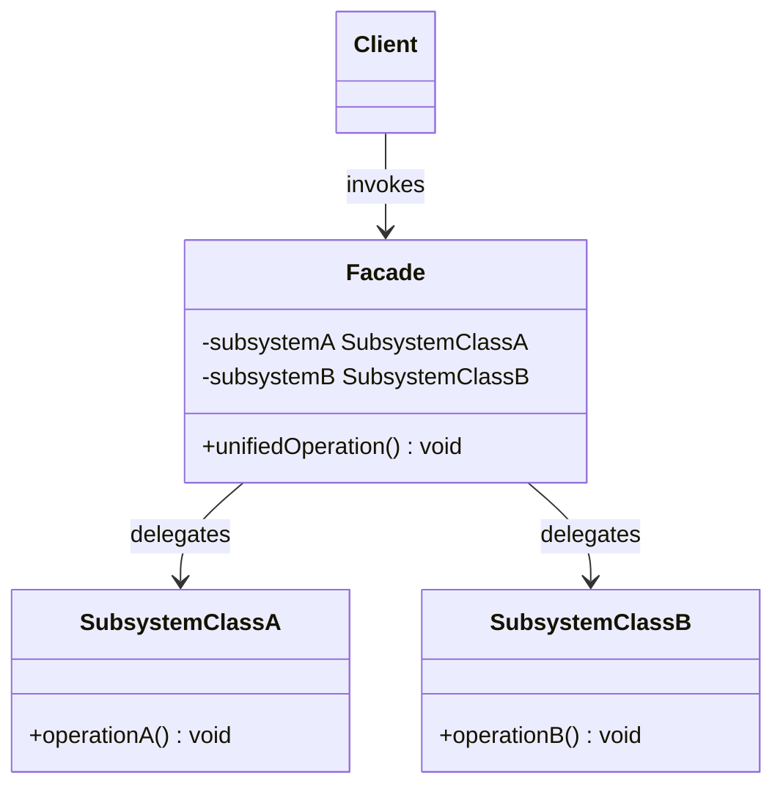
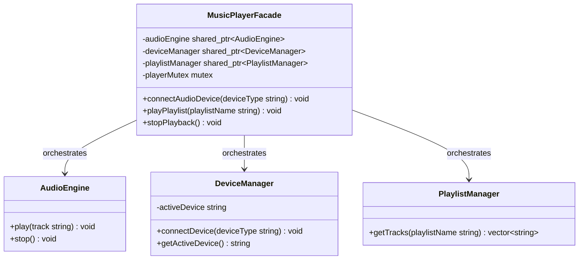

# Facade Design Pattern

The Facade pattern is a structural design pattern that provides a simplified, unified interface to a complex set of interfaces in a subsystem. It defines a higher level interface that makes the subsystem easier to use, shielding clients from low level API complexities.

---

## Core Architecture

The Facade pattern acts as an entry point to a subsystem. It delegates client requests to the appropriate subsystem classes, coordinating their interaction without preventing clients from accessing subsystem classes directly if they require advanced customization.

| Participant           | Responsibility                                                                                                      |
| --------------------- | ------------------------------------------------------------------------------------------------------------------- |
| **Facade**            | Coordinates calls to various subsystem classes and provides a simplified interface to the client.                   |
| **Subsystem Classes** | Implement specific features of the subsystem; they operate independently of the Facade and have no reference to it. |
| **Client**            | Calls the Facade instead of invoking subsystem operations directly.                                                 |

---

## Standard UML Representation



---

## The Subsystem Complexity Problem

Integrating complex subsystems (such as audio engines, device managers, and playlist controllers) forces client code to acquire deep transitive knowledge of multiple distinct interfaces. When clients coordinate these dependencies directly, method signature modifications or layout changes propagate throughout the client codebase, violating the **Principle of Least Knowledge (Law of Demeter)**.

The Law of Demeter dictates that objects should only interact with immediate neighbors, avoiding nested traversals (like `client->getPlaylistManager()->getTracks(...)`). 

The Facade serves as the client's sole immediate neighbor, enforcing this boundary by translating and orchestrating the underlying subsystem calls.

| Dimension | Subsystem Direct Interaction | Facade Mediated Interaction |
| --- | --- | --- |
| **Collaborators** | High; client couples to all subsystem types. | Low; client couples only to the Facade interface. |
| **Compilation** | High header pollution; triggers recompilation cascades. | Low header pollution; subsystem headers are hidden in implementation files. |
| **Testability** | High; requires stubbing transitive dependency graphs. | Low; mock boundary is restricted to the single Facade API. |


---

## Example (Music Player System Facade)

Below is the UML class diagram for the Music Player System Facade scenario:



This C++ implementation demonstrates a simplified `MusicPlayerFacade` that orchestrates a set of audio, device, and playlist subsystem classes.

```cpp
#include <iostream>
#include <string>
#include <vector>
#include <memory>
#include <mutex>
#include <stdexcept>

using namespace std;

// Custom System Exception
class FacadeException : public runtime_error {
public:
    explicit FacadeException(const string& msg) : runtime_error(msg) {}
};

// Subsystem 1: Audio Engine
class AudioEngine {
public:
    void play(const string& track) {
        cout << "[AudioEngine] Decoding and playing track: " << track << "\n";
    }
    void stop() {
        cout << "[AudioEngine] Audio playback stopped.\n";
    }
};

// Subsystem 2: Device Manager
class DeviceManager {
private:
    string activeDevice;

public:
    DeviceManager() : activeDevice("Internal Speaker") {}

    void connectDevice(const string& deviceType) {
        activeDevice = deviceType;
        cout << "[DeviceManager] Connected output device: " << activeDevice << "\n";
    }

    string getActiveDevice() const {
        return activeDevice;
    }
};

// Subsystem 3: Playlist Manager
class PlaylistManager {
public:
    vector<string> getTracks(const string& playlistName) {
        cout << "[PlaylistManager] Fetching tracks for playlist: " << playlistName << "\n";
        if (playlistName == "Bollywood Hits") {
            return {"Kesariya", "Tum Hi Ho", "Jai Ho"};
        }
        return {"Generic Track 1", "Generic Track 2"};
    }
};

// Facade: Orchestrates the complex subsystems
class MusicPlayerFacade {
private:
    shared_ptr<AudioEngine> audioEngine;
    shared_ptr<DeviceManager> deviceManager;
    shared_ptr<PlaylistManager> playlistManager;
    mutex playerMutex;

public:
    MusicPlayerFacade() {
        audioEngine = make_shared<AudioEngine>();
        deviceManager = make_shared<DeviceManager>();
        playlistManager = make_shared<PlaylistManager>();
    }

    void connectAudioDevice(const string& deviceType) {
        lock_guard<mutex> lock(playerMutex);
        deviceManager->connectDevice(deviceType);
    }

    void playPlaylist(const string& playlistName) {
        lock_guard<mutex> lock(playerMutex);
        
        // Orchestrate subsystems sequentially
        vector<string> tracks = playlistManager->getTracks(playlistName);
        if (tracks.empty()) {
            throw FacadeException("Playlist is empty");
        }

        cout << "[MusicPlayerFacade] Initiating playback on device: " 
             << deviceManager->getActiveDevice() << "\n";

        for (const string& track : tracks) {
            audioEngine->play(track);
        }
    }

    void stopPlayback() {
        lock_guard<mutex> lock(playerMutex);
        audioEngine->stop();
    }
};

// Client Driver
int main() {
    try {
        auto player = make_unique<MusicPlayerFacade>();

        // Client interacts only with the simple Facade interface
        cout << "--- Connecting Bluetooth Speaker ---\n";
        player->connectAudioDevice("Bluetooth Speaker");

        cout << "\n--- Playing Playlist ---\n";
        player->playPlaylist("Bollywood Hits");

        cout << "\n--- Stopping Playback ---\n";
        player->stopPlayback();

    } catch (const FacadeException& ex) {
        cerr << "Player Facade Error: " << ex.what() << "\n";
    }

    return 0;
}
```

---

## Concurrency & Design Considerations

* **Unified Serialization**: The Facade can serialize operations across stateful subsystems using a mutex (e.g. `playerMutex`) to prevent subsystems from entering inconsistent intermediate states.
* **Granular Lock Safety**: Avoid holding coarse facade locks during slow subsystem tasks (like track loading). Locks should be acquired briefly inside subsystems rather than blocking the facade.

---

## Design Tradeoffs

| Advantages                                                                                                                                                       | Drawbacks & Limitations                                                                                                                                                                                                                                    |
| ---------------------------------------------------------------------------------------------------------------------------------------------------------------- | ---------------------------------------------------------------------------------------------------------------------------------------------------------------------------------------------------------------------------------------------------------- |
| **Decoupling**: Shields clients from complex internal changes to subsystem APIs.                                                                                 | **God Object Danger**: Facades can grow into monolithic classes that handle too much execution logic.                                                                                                                                                      |
| **Fallback Escape**: Advanced users can bypass the Facade and call subsystem methods directly if custom workflows are needed.                                    | **OCP Violation at the Facade**: Adding a new subsystem operation requires modifying the Facade class itself. The Facade is open to extension only if the subsystem provides what it needs, new capabilities not present in subsystems force Facade edits. |
| **Compilation Firewall**: Hiding subsystem headers behind the Facade implementation file prevents client recompilation cascades when subsystem internals change. | **Single Point of Failure**: All client interactions funnel through the Facade. A bug or performance bottleneck in the Facade affects every caller, whereas direct subsystem access would isolate the impact.                                              |
