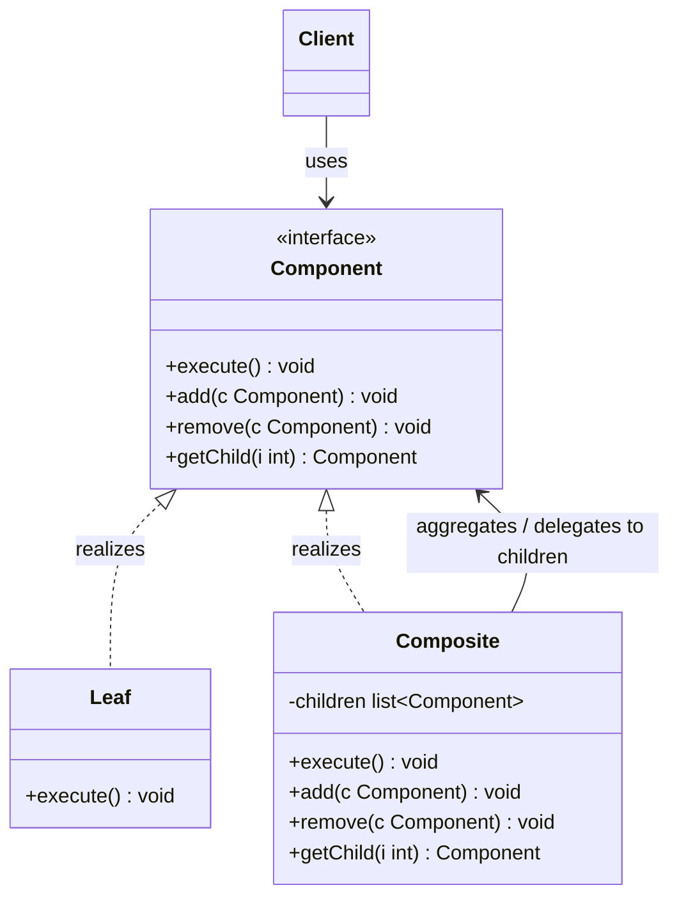
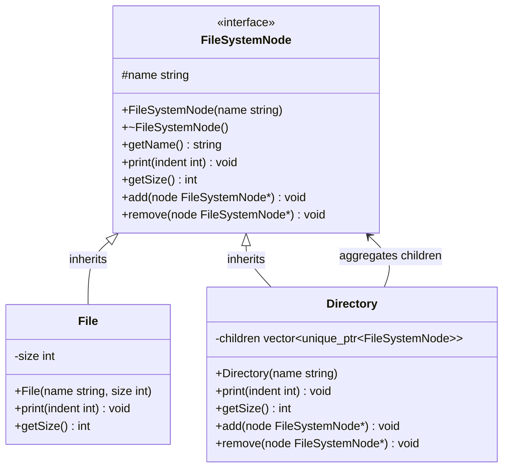

# Composite Design Pattern

The Composite pattern is a structural design pattern that lets you compose objects into `tree structures` to represent `part-whole hierarchies`. 
> Composite lets clients treat individual objects and compositions of objects uniformly.

---

## Core Architecture

The Composite pattern establishes a tree structure that simplifies client interaction by exposing a `common base component interface`. 
Clients do not need to query whether a node is a leaf (a primitive element) or a composite (a container holding other components);
they call methods on the base component interface, and composite classes recursively delegate the message down the tree structure.

| Participant   | Responsibility                                                                                                                                                                   |
| ------------- | -------------------------------------------------------------------------------------------------------------------------------------------------------------------------------- |
| **Component** | Declares the interface for objects in the composition, and (optionally) for accessing and managing its child components.                                                         |
| **Leaf**      | Represents primitive leaf objects in the composition (has no children). Defines behavior for primitive objects.                                                                  |
| **Composite** | Stores child components and implements child-related operations (like `add`, `remove`, `getChild`). Implements the main component operations by delegating them to its children. |
| **Client**    | Interacts with the elements in the composition through the Base Component interface.                                                                                             |

---

## Standard UML Representation



---

## The Tree Complexity Problem

In hierarchical systems (e.g., file systems, GUI rendering frameworks, HTML DOM representations, or organisational charts), clients frequently need to perform operations across a whole tree or subset of nodes. 

Without the Composite pattern, a client must explicitly query the type of each node to determine if it is a container or a simple element. This results in:
* **Tightly Coupled Code**: The client must know the concrete implementation details of all types in the tree.
* **Complex Conditional Logic**: Nested conditional blocks (`if-else` type-checking or casts) spread throughout the client codebase.
* **Maintenance Overhead**: Adding a new node type requires updating all client-side traversal and check routines (ocp violations).

The Composite pattern decouples the client by enforcing a single, uniform interface across both leaves and containers. The composite node handles iteration and recursion internally, allowing clients to invoke a single operation on the root of a tree and get the result automatically.

---

## Example (File System Hierarchy)

Below is the UML class diagram for the File System Hierarchy scenario:



This C++ implementation demonstrates a hierarchical file system where files and directories are treated uniformly as `FileSystemNode`s. It showcases recursion, child node aggregation with `std::unique_ptr` for resource safety, and the trade-offs of interface design.

```cpp
#include <iostream>
#include <string>
#include <vector>
#include <memory>
#include <algorithm>
#include <stdexcept>
#include <numeric>

using namespace std;

// Component Interface
class FileSystemNode {
protected:
    string name;

public:
    explicit FileSystemNode(string name) : name(std::move(name)) {}
    virtual ~FileSystemNode() = default;

    string getName() const {
        return name;
    }

    virtual void print(int indent = 0) const = 0;
    virtual int getSize() const = 0;

    virtual void add(FileSystemNode* node) {
        throw runtime_error("Operation 'add' not supported on this node type");
    }

    virtual void remove(FileSystemNode* node) {
        throw runtime_error("Operation 'remove' not supported on this node type");
    }
};

// Leaf: Represents individual files
class File : public FileSystemNode {
private:
    int size;

public:
    File(string name, int size) 
        : FileSystemNode(std::move(name)), size(size) {}

    void print(int indent = 0) const override {
        string indentation(indent, ' ');
        cout << indentation << "- [File] " << name << " (" << size << " bytes)\n";
    }

    int getSize() const override {
        return size;
    }
};

// Composite: Represents directories containing files/subdirectories
class Directory : public FileSystemNode {
private:
    vector<unique_ptr<FileSystemNode>> children;

public:
    explicit Directory(string name) : FileSystemNode(std::move(name)) {}
    
    void print(int indent = 0) const override {
        string indentation(indent, ' ');
        cout << indentation << "+ [Directory] " << name << "\n";
        for (const auto& child : children) {
            child->print(indent + 4);
        }
    }

    int getSize() const override {
        return accumulate(children.begin(), children.end(), 0, 
            [](int sum, const unique_ptr<FileSystemNode>& child) {
                return sum + child->getSize();
            });
    }

    void add(FileSystemNode* node) override {
        if (!node) return;
        cout << "[Directory: " << name << "] Adding: " << node->getName() << "\n";
        children.push_back(unique_ptr<FileSystemNode>(node));
    }

    void remove(FileSystemNode* node) override {
        if (!node) return;
        
        auto it = find_if(children.begin(), children.end(),
            [node](const unique_ptr<FileSystemNode>& child) {
                return child.get() == node;
            });

        if (it != children.end()) {
            cout << "[Directory: " << name << "] Removing: " << node->getName() << "\n";
            children.erase(it);
        } else {
            cout << "[Directory: " << name << "] Node " << node->getName() << " not found\n";
        }
    }
};

// Client Driver
int main() {
    try {
        // 1. Create root directory
        auto rootDir = make_unique<Directory>("root");

        // 2. Create subdirectories
        auto homeDir = make_unique<Directory>("home");
        Directory* rawHomePtr = homeDir.get();

        auto userDir = make_unique<Directory>("akash");
        Directory* rawUserPtr = userDir.get();

        // 3. Create files
        auto file1 = make_unique<File>("resume.pdf", 120000);
        auto file2 = make_unique<File>("profile.png", 350000);
        auto config = make_unique<File>(".bashrc", 450);
        
        FileSystemNode* rawConfigPtr = config.get();

        // 4. Assemble the hierarchy
        rawUserPtr->add(file1.release());
        rawUserPtr->add(file2.release());
        rawUserPtr->add(config.release());

        rawHomePtr->add(userDir.release());
        rootDir->add(homeDir.release());

        auto systemDir = make_unique<Directory>("sys");
        auto kernelFile = make_unique<File>("kernel.sys", 10485760); // ~10MB
        systemDir->add(kernelFile.release());
        rootDir->add(systemDir.release());

        // 5. Client interacts with the tree uniformly
        cout << "\n--- Initial Directory Tree ---\n";
        rootDir->print();

        cout << "\n--- Computing Cumulative Sizes ---\n";
        cout << "Total Root Size: " << rootDir->getSize() << " bytes\n";
        
        // 6. Test Composite Mutation (Removal)
        cout << "\n--- Removing a Node ---\n";
        rawUserPtr->remove(rawConfigPtr);

        cout << "\n--- Updated Directory Tree ---\n";
        rootDir->print();
        cout << "Total Root Size: " << rootDir->getSize() << " bytes\n";

        // 7. Verify exception when calling composite operations on a leaf
        cout << "\n--- Trying to add a file to a file (Expect Error) ---\n";
        auto dummyFile = make_unique<File>("dummy.txt", 100);
        FileSystemNode* leafNode = dummyFile.get();
        
        // This will throw runtime_error as File does not override 'add'
        leafNode->add(new File("sub-dummy.txt", 10));

    } catch (const exception& ex) {
        cerr << "Expected Exception Caught: " << ex.what() << "\n";
    }
    return 0;
}
```

### Output

```text
[Directory: akash] Adding: resume.pdf
[Directory: akash] Adding: profile.png
[Directory: akash] Adding: .bashrc
[Directory: home] Adding: akash
[Directory: root] Adding: home
[Directory: sys] Adding: kernel.sys
[Directory: root] Adding: sys

--- Initial Directory Tree ---
+ [Directory] root
    + [Directory] home
        + [Directory] akash
            - [File] resume.pdf (120000 bytes)
            - [File] profile.png (350000 bytes)
            - [File] .bashrc (450 bytes)
    + [Directory] sys
        - [File] kernel.sys (10485760 bytes)

--- Computing Cumulative Sizes ---
Total Root Size: 10956210 bytes

--- Removing a Node ---
[Directory: akash] Removing: .bashrc

--- Updated Directory Tree ---
+ [Directory] root
    + [Directory] home
        + [Directory] akash
            - [File] resume.pdf (120000 bytes)
            - [File] profile.png (350000 bytes)
    + [Directory] sys
        - [File] kernel.sys (10485760 bytes)
Total Root Size: 10955760 bytes

--- Trying to add a file to a file (Expect Error) ---
Expected Exception Caught: Operation 'add' not supported on this node type
```

---

## Concurrency & Design Considerations

* **Thread Safe Traversal**: Directory structures can be read concurrently using `std::shared_mutex` for read-only access, allowing multiple readers while blocking writers.
* **Recursive Locks**: Deep tree traversal with recursive mutex locks prevents deadlocks when a thread may re-enter a locked node.
* **Atomic Counters**: Computing cumulative sizes via atomic counters enables lock-free reads at the cost of slightly inconsistent reads during updates.
* **Lock-Free Alternatives**: For high read-heavy workloads, consider immutable directory snapshots or RCU (Read-Copy-Update) patterns.

## Design Tradeoffs

| Advantages & SOLID Alignment | Drawbacks & Limitations |
| --- | --- |
| **Uniform Client Interface**: Clients treat individual objects and compositions uniformly through the base `Component` interface, eliminating type-checking conditionals. | **Overgeneralization**: The base `Component` interface may expose methods that are meaningless or expensive for leaf nodes (e.g., `add` or `remove` on a `File`). |
| **OCP Compliance**: New leaf or composite types can be introduced without modifying existing client code that traverses the tree. | **Runtime Error Handling**: Leaves must either provide no-op implementations or throw exceptions for composite-only operations, pushing errors to runtime instead of compile time. |
| **Recursive Composition**: Complex tree structures are built recursively without the client needing to know the depth or branching factor. | **Type Safety Loss**: Clients cannot rely on the type system to guarantee that a node supports child management operations. |

---

## Comparison

Composite is often compared with Iterator and Decorator because all three deal with object structures and traversal.

| Dimension | Composite | Iterator | Decorator |
| --- | --- | --- | --- |
| **Primary Intent** | Represents part-whole hierarchies with uniform treatment of leaves and composites. | Traverses a collection without exposing its internal storage. | Attaches additional responsibilities to objects dynamically. |
| **Structure** | Tree structure where each node implements the same interface. | Cursor object that walks over existing data. | Wrapper chain where each wrapper implements the same interface as the wrapped object. |
| **Client Knowledge** | Client is unaware of node types; it calls the same method on any node. | Client is unaware of storage layout; it uses `next()` and `hasNext()`. | Client is unaware of wrappers; it calls the same method on the outermost object. |
| **Use When** | You need to treat single objects and compositions uniformly. | You need controlled traversal of a collection without exposing storage details. | You need to layer cross-cutting concerns (caching, logging) transparently. |