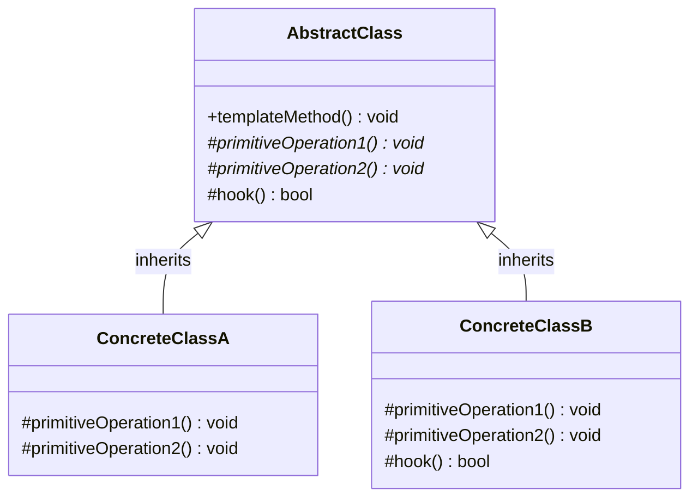
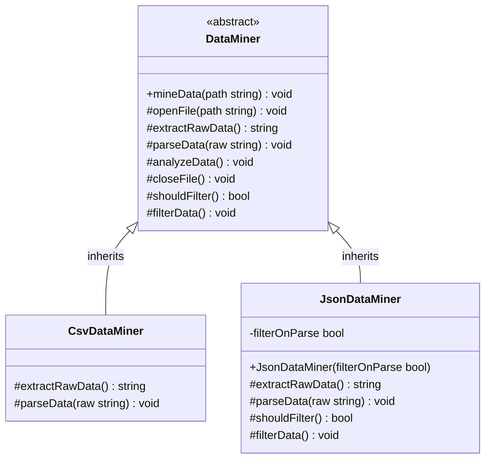

# Template Method Design Pattern

The Template Method pattern is a behavioral design pattern that defines the skeleton of an algorithm in the superclass but lets subclasses override specific steps of the algorithm without changing its structure.

---

## Core Architecture

The Template Method pattern works by defining a base class that implements the unchanging parts of an algorithm's skeleton and delegates the implementation of variant steps to virtual or abstract methods. This is an application of inheritance-based code reuse and the **Hollywood Principle** ("Don't call us, we'll call you").

| Participant       | Responsibility                                                                                                                                                    |
| ----------------- | ----------------------------------------------------------------------------------------------------------------------------------------------------------------- |
| **AbstractClass** | Defines the template method that coordinates the steps of an algorithm, and declares abstract or virtual primitive operations that concrete subclasses implement. |
| **ConcreteClass** | Implements the subclass-specific primitive operations to carry out the steps of the algorithm.                                                                    |

---

## Standard UML Representation



---

## The Algorithm Duplication Problem

When different components perform tasks that share a common series of steps (e.g., loading files, parsing configurations, rendering frames, or processing payments), developers often duplicate the structural ordering and logic across multiple independent classes. 
* **Redundant Boilerplate**: Similar orchestrations (opening files, handling exceptions, printing logs) are copy-pasted across subclasses.
* **Brittle Control Flow**: If the sequence of steps needs modification (e.g., adding an authentication check before extracting data), the change must be manually applied across all implementations.
* **Unintended Overrides**: Subclasses might override the orchestrating method itself, breaking invariants or altering the required sequence of steps.

The Template Method pattern solves this by keeping the structural flow in a single, non-virtual parent class method, while delegating the implementation details of specific steps to virtual methods implemented by subclasses.

---

## Example (Data Mining Pipeline)

Below is the UML class diagram for the Data Mining Pipeline scenario:



This C++ implementation utilizes the **Non-Virtual Interface (NVI)** pattern. The template method `mineData()` is public and non-virtual, guaranteeing that subclasses cannot change the structural execution sequence of opening, parsing, analyzing, reporting, and closing the resource.

```cpp
#include <iostream>
#include <string>
#include <vector>
#include <memory>
#include <stdexcept>

using namespace std;

// Abstract Class defining the Template Method (NVI Pattern)
class DataMiner {
public:
    virtual ~DataMiner() = default;

    // Public, Non-Virtual Template Method
    // Defines the invariant skeleton of the algorithm.
    void mineData(const string& path) {
        openFile(path);
        
        try {
            string rawData = extractRawData();
            parseData(rawData);
            
            // Hook method to optionally filter parsed data
            if (shouldFilter()) {
                filterData();
            }
            
            analyzeData();
            generateReport();
        } catch (const exception& ex) {
            cout << "[DataMiner] Error during mining pipeline: " << ex.what() << "\n";
        }
        
        closeFile();
    }

protected:
    // Base implementation for opening files (invariant step)
    virtual void openFile(const string& path) {
        cout << "[DataMiner] Opening file at: " << path << "\n";
    }

    // Pure virtual steps: Subclasses must define how they extract and parse data
    virtual string extractRawData() = 0;
    virtual void parseData(const string& raw) = 0;

    // Base implementation for analyzing (invariant step)
    virtual void analyzeData() {
        cout << "[DataMiner] Running default analysis on parsed data models...\n";
    }

    // Base implementation for reporting (invariant step)
    virtual void generateReport() {
        cout << "[DataMiner] Generating summary report.\n";
    }

    // Base implementation for closing resources (invariant step)
    virtual void closeFile() {
        cout << "[DataMiner] Closing and releasing file handles.\n";
    }

    // Hook Method: Subclasses can optionally override to control behavior
    virtual bool shouldFilter() const {
        return false;
    }

    // Default empty implementation for hook action
    virtual void filterData() {
        // Do nothing by default
    }
};

// Concrete Class 1: CSV Data Miner
class CsvDataMiner : public DataMiner {
protected:
    string extractRawData() override {
        cout << "[CsvDataMiner] Extracting raw CSV text lines...\n";
        return "id,name,value\n1,Alpha,100\n2,Beta,200";
    }

    void parseData(const string& raw) override {
        cout << "[CsvDataMiner] Parsing CSV headers and converting columns...\n";
        cout << "Parsed data: \n" << raw << "\n";
    }
};

// Concrete Class 2: JSON Data Miner with Hooks
class JsonDataMiner : public DataMiner {
private:
    bool filterOnParse;

public:
    explicit JsonDataMiner(bool filterOnParse) : filterOnParse(filterOnParse) {}

protected:
    string extractRawData() override {
        cout << "[JsonDataMiner] Loading raw JSON character buffers...\n";
        return "{\"records\":[{\"id\":1,\"value\":100},{\"id\":2,\"value\":200}]}";
    }

    void parseData(const string& raw) override {
        cout << "[JsonDataMiner] Parsing JSON structure into AST nodes...\n";
        cout << "Parsed JSON: " << raw << "\n";
    }

    // Overriding Hook to trigger custom conditional workflow step
    bool shouldFilter() const override {
        return filterOnParse;
    }

    void filterData() override {
        cout << "[JsonDataMiner] Filtering records: Removing low values...\n";
    }
};

// Client Driver
int main() {
    cout << "--- Processing CSV File ---\n";
    unique_ptr<DataMiner> csvMiner = make_unique<CsvDataMiner>();
    csvMiner->mineData("data/records.csv");

    cout << "\n--- Processing JSON File (With Filtering Hook) ---\n";
    unique_ptr<DataMiner> jsonMiner = make_unique<JsonDataMiner>(true);
    jsonMiner->mineData("data/records.json");

    return 0;
}
```

### Expected Output

```text
--- Processing CSV File ---
[DataMiner] Opening file at: data/records.csv
[CsvDataMiner] Extracting raw CSV text lines...
[CsvDataMiner] Parsing CSV headers and converting columns...
Parsed data: 
id,name,value
1,Alpha,100
2,Beta,200
[DataMiner] Running default analysis on parsed data models...
[DataMiner] Generating summary report.
[DataMiner] Closing and releasing file handles.

--- Processing JSON File (With Filtering Hook) ---
[DataMiner] Opening file at: data/records.json
[JsonDataMiner] Loading raw JSON character buffers...
[JsonDataMiner] Parsing JSON structure into AST nodes...
Parsed JSON: {"records":[{"id":1,"value":100},{"id":2,"value":200}]}
[JsonDataMiner] Filtering records: Removing low values...
[DataMiner] Running default analysis on parsed data models...
[DataMiner] Generating summary report.
[DataMiner] Closing and releasing file handles.
```

---


## Concurrency & Design Considerations

* **Non-Virtual Interface (NVI) Enforcement**: By keeping the template method itself `public` and `non-virtual`, the base class retains total authority over the execution sequence. Subclasses only fill in the behavioral gaps via `protected` or `private` virtual functions.
* **Granular Hook Placement**: Place hook methods right before or after resource-heavy actions to allow subclasses to short-circuit operations or inject pre/post validations. 
* **State and Thread Safety**: Because Template Method relies heavily on member invocation, storing mutable execution states (e.g. data buffers, open file pointers) in abstract class member variables makes the instance thread unsafe. To design a thread safe template pipeline:
  - Keep the class stateless and pass the execution state through method arguments.
  - Or, protect member variable access via mutexes.

---

## Design Tradeoffs

| Advantages & SOLID Alignment | Drawbacks & Limitations |
| --- | --- |
| **DRY (Don't Repeat Yourself)**: Consolidation of invariant workflow logic into the parent class prevents code duplication. | **Liskov Substitution Principle (LSP) Risks**: Subclasses can violate base class semantic expectations in virtual functions (e.g., throwing unexpected exceptions or entering infinite loops), disrupting the main template method flow. |
| **Open-Closed Principle (OCP)**: New subclasses can introduce specialized parsing/processing behaviors without modifying the parent orchestration pipeline. | **Inheritance Limitations**: C++ only supports single-inheritance patterns cleanly; subclassing a complex AbstractClass locks the subclass from inheriting other base structures. |
| **Hollywood Principle Enforcement**: The base class controls execution order, preventing subclasses from accidentally skipping critical steps. | **Rigidity in Variation**: Subclasses can only override predefined hook points. If the algorithm structure itself needs to change, the entire pattern must be re-engineered. |

---

## Comparison

Template Method is often compared with Strategy because both decouple generic operations from specific implementations.

| Aspect | Template Method | Strategy |
| --- | --- | --- |
| **Binding Time** | Static binding at compile time via subclass inheritance. | Dynamic binding at run time via object composition. |
| **Granularity** | Subclasses modify parts of an algorithm's internal execution steps. | Strategies replace the entire algorithm wholesale. |
| **Dependency** | Subclasses are highly coupled to the parent class and its structure. | Strategy classes are independent and decoupled from the client context. |
| **Hollywood Principle** | The base class calls subclass functions ("Don't call us, we'll call you"). | The client calls the Strategy's interface method. |
