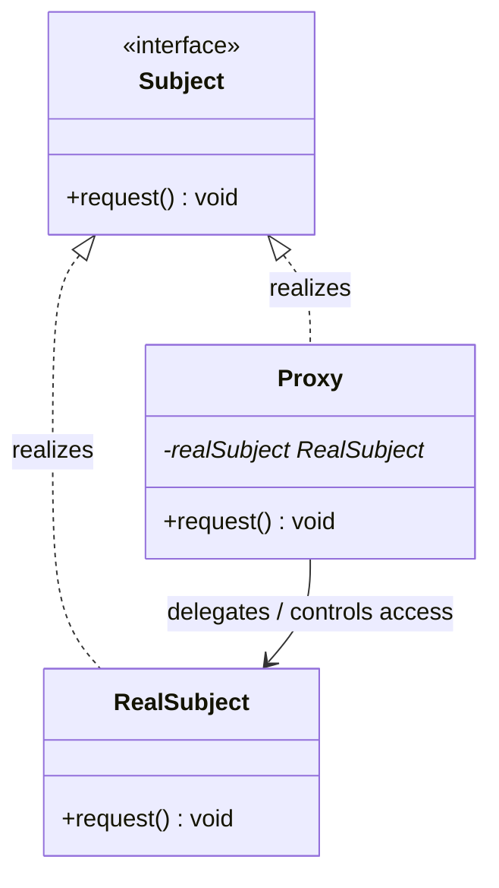
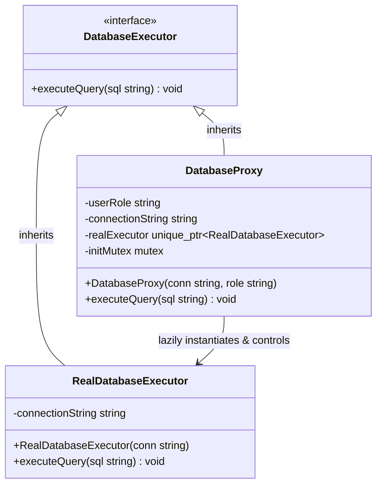

# Proxy Design Pattern

The Proxy pattern is a structural design pattern that lets you provide a substitute or placeholder for another object. 
A proxy controls access to the original object, allowing you to perform something either before or after the request gets through to the original object.

---

## Core Architecture

The Proxy pattern intercepts calls to a target object by implementing the exact same interface. The client interacts with the proxy thinking it is the real object. Behind the scenes, the proxy wraps the real subject, managing its lifecycle (lazy creation, caching) or determining whether the client has sufficient privileges to perform the operation.

| Participant     | Responsibility                                                                                                                               |
| --------------- | -------------------------------------------------------------------------------------------------------------------------------------------- |
| **Subject**     | Defines a common interface for `RealSubject` and `Proxy` so that the proxy can be used anywhere the real subject is expected.                |
| **RealSubject** | Defines the real object that performs the actual core business logic.                                                                        |
| **Proxy**       | Implements the `Subject` interface, maintains a reference to the `RealSubject`, controls access to it, and coordinates lifecycle operations. |

---

## Standard UML Representation



---

## The Resource Overhead & Access Control Problem

Directly instantiating and exposing heavy, remote, or sensitive resources (such as active database connection pools, 3D graphics buffers, remote network services, or payment systems) can introduce severe vulnerabilities and inefficiencies:
* **Eager Initialisation Bottlenecks**: Creating complex objects during application startup wastes memory and slows down launch times if the resource is never queried.
* **Lack of Access Control**: Exposing raw object APIs directly to clients prevents standard security boundaries, allowing unauthorised operations (e.g. general users executing deletion commands on a database instance).
* **Network & Overhead Costs**: Interacting with remote hosts requires boilerplate network code (socket management, serialisation) which clutters local client logic.

The Proxy pattern solves this by inserting a surrogate class between the client and the real subject. The surrogate class intercepts the request to enforce lazy-loading, perform authorisation checks, or manage network translation before delegating the work.

---

## Example (Database Query Proxy)

Below is the UML class diagram for the Database Query Proxy scenario:



This C++ implementation showcases a database query execution pipeline where the `DatabaseProxy` combines:
1. **Virtual Proxy (Lazy Loading)**: It delays establishing the expensive database connection until the client runs the first query, utilising a thread-safe double-checked lock.
2. **Protection Proxy (Access Control)**: It inspects query statements and restricts write operations (`INSERT`, `DELETE`) to clients possessing the `ADMIN` role.

```cpp
#include <iostream>
#include <string>
#include <memory>
#include <mutex>
#include <stdexcept>
#include <algorithm>

using namespace std;

// 1. Subject Interface
class DatabaseExecutor {
public:
    virtual ~DatabaseExecutor() = default;
    virtual void executeQuery(const string& sql) = 0;
};

// 2. Real Subject (Heavy/Expensive Resource)
class RealDatabaseExecutor : public DatabaseExecutor {
private:
    string connectionString;

public:
    explicit RealDatabaseExecutor(string connString) 
        : connectionString(std::move(connString)) {
        cout << "[RealDatabaseExecutor] Heavy initialization: Establishing socket connection to database: " 
             << connectionString << "...\n";
    }

    void executeQuery(const string& sql) override {
        cout << "[RealDatabaseExecutor] Executing SQL Query on DB: " << sql << "\n";
    }
};

// 3. Proxy (Controls Access & Manages Lifecycle)
class DatabaseProxy : public DatabaseExecutor {
private:
    string connectionString;
    string userRole;
    
    // Virtual Proxy: Lazily initialized pointer to the expensive resource
    unique_ptr<RealDatabaseExecutor> realExecutor;
    mutex initMutex;

    // Helper to identify modification queries
    bool isWriteQuery(const string& sql) {
        string upperSql = sql;
        transform(upperSql.begin(), upperSql.end(), upperSql.begin(), ::toupper);
        return (upperSql.rfind("INSERT", 0) == 0 || 
                upperSql.rfind("DELETE", 0) == 0 || 
                upperSql.rfind("UPDATE", 0) == 0);
    }

public:
    DatabaseProxy(string connString, string role) 
        : connectionString(std::move(connString)), userRole(std::move(role)) {}

    void executeQuery(const string& sql) override {
        cout << "\n[DatabaseProxy] Intercepted request to execute: \"" << sql << "\"\n";

        // Protection Proxy: Verify access control based on user role
        if (isWriteQuery(sql) && userRole != "ADMIN") {
            throw runtime_error("Access Denied: Role '" + userRole + "' is not authorized to execute write queries.");
        }

        // Virtual Proxy: Thread-safe double-checked lazy initialization
        if (!realExecutor) {
            lock_guard<mutex> lock(initMutex);
            if (!realExecutor) {
                realExecutor = make_unique<RealDatabaseExecutor>(connectionString);
            }
        }

        // Delegate execution to the real subject
        realExecutor->executeQuery(sql);
    }
};

// Client Driver
int main() {
    string conn = "mysql://prod-cluster.db.internal:3306/users";

    cout << "=== CLIENT A: Regular User Flow ===";
    DatabaseProxy userProxy(conn, "USER");
    
    try {
        // First read query -> triggers lazy initialization
        userProxy.executeQuery("SELECT * FROM profiles WHERE id = 42;");
        
        // Second read query -> uses already initialized database connection
        userProxy.executeQuery("SELECT name FROM profiles WHERE id = 101;");
        
        // Attempt to write -> Protection Proxy rejects this
        userProxy.executeQuery("DELETE FROM profiles WHERE id = 42;");
    } catch (const exception& ex) {
        cout << "[Client A Error]: " << ex.what() << "\n";
    }

    cout << "\n=== CLIENT B: Admin User Flow ===";
    DatabaseProxy adminProxy(conn, "ADMIN");
    
    try {
        // Read query -> triggers lazy initialization
        adminProxy.executeQuery("SELECT * FROM system_settings;");
        
        // Write query -> authorized & executed
        adminProxy.executeQuery("INSERT INTO profiles (id, name) VALUES (99, 'Bob');");
    } catch (const exception& ex) {
        cout << "[Client B Error]: " << ex.what() << "\n";
    }

    return 0;
}
```

### Expected Output

```text
=== CLIENT A: Regular User Flow ===
[DatabaseProxy] Intercepted request to execute: "SELECT * FROM profiles WHERE id = 42;"
[RealDatabaseExecutor] Heavy initialization: Establishing socket connection to database: mysql://prod-cluster.db.internal:3306/users...
[RealDatabaseExecutor] Executing SQL Query on DB: SELECT * FROM profiles WHERE id = 42;

[DatabaseProxy] Intercepted request to execute: "SELECT name FROM profiles WHERE id = 101;"
[RealDatabaseExecutor] Executing SQL Query on DB: SELECT name FROM profiles WHERE id = 101;

[DatabaseProxy] Intercepted request to execute: "DELETE FROM profiles WHERE id = 42;"
[Client A Error]: Access Denied: Role 'USER' is not authorized to execute write queries.

=== CLIENT B: Admin User Flow ===
[DatabaseProxy] Intercepted request to execute: "SELECT * FROM system_settings;"
[RealDatabaseExecutor] Heavy initialization: Establishing socket connection to database: mysql://prod-cluster.db.internal:3306/users...
[RealDatabaseExecutor] Executing SQL Query on DB: SELECT * FROM system_settings;

[DatabaseProxy] Intercepted request to execute: "INSERT INTO profiles (id, name) VALUES (99, 'Bob');"
[RealDatabaseExecutor] Executing SQL Query on DB: INSERT INTO profiles (id, name) VALUES (99, 'Bob');
```

---

## Design Considerations

* **Proxy Class Varieties**:
  1. **Virtual Proxy**: Delays creation of memory/CPU-heavy resources (lazy initialization) until first access.
  2. **Protection Proxy**: Controls permissions by acting as an access firewall, intercepting requests to validate client credentials/roles.
  3. **Caching Proxy**: Intercepts requests, checking a local database/dictionary before delegating to the expensive target subject.
  4. **Smart Reference / Logging Proxy**: Performs additional housekeeping operations when an object is accessed (such as locking the object or counting reference allocations).
* **Lazy Initialization Concurrency Safety**: When creating the real subject inside the virtual proxy lazily, standard double-checked locking using a mutex (e.g. `std::mutex` and `std::lock_guard`) must be used. Failure to synchronize instantiation will result in multiple threads triggering duplicate database socket allocations or corrupting the heap memory block.

---

## Design Tradeoffs

### Proxy vs. Decorator vs. Adapter

All three patterns wrap an object and delegate calls, but their structural intent separates them:

| Dimension | Proxy | Decorator | Adapter |
| --- | --- | --- | --- |
| **Primary Intent** | Controls access and coordinates lifecycle of the target. | Dynamically aggregates new responsibilities to the target. | Converts incompatible interface signatures. |
| **Interface Match** | Interface signature matches the real subject exactly. | Interface signature matches the wrapped component exactly. | Changes/translates interface signatures. |
| **Instantiation** | The Proxy usually instantiates and manages the target internally. | The Decorator is passed the target externally via its constructor. | The Adapter is passed the target externally via its constructor. |

### Advantages & SOLID Alignment
* **Single Responsibility Principle (SRP)**: Segregates the access rules (authorization, validation) and initialization performance policies into separate proxy structures, leaving the real subject focused strictly on core business operations.
* **Separation of Concerns**: Hides heavy instantiation footprints or socket negotiation interfaces behind simple standard methods.

### Limitations
* **Increased Latency**: Adding a proxy introduces a layer of indirection, which can increase execution times slightly for every single command request.
* **Code Overhead**: Requires creating a common interface and duplicate method structures for all subject routines, leading to code bloat for large APIs.
