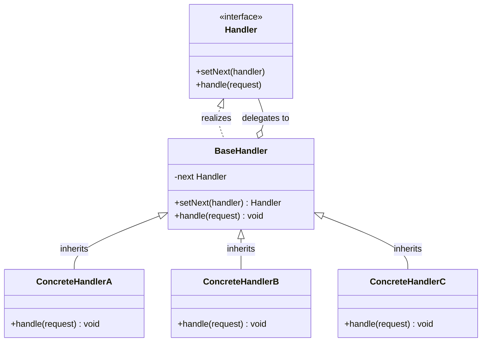
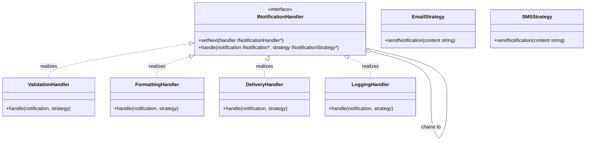

# Chain of Responsibility Design Pattern

The Chain of Responsibility pattern is a behavioral design pattern that passes a request along a linked chain of handlers. Each handler either processes the request or passes it to the next handler in the chain. This decouples senders from receivers and allows multiple handlers to contribute to the processing of a single request.

---

## Core Architecture

The pattern structures handlers as a sequential chain, where each handler maintains a reference to its successor. Requests traverse the chain until a handler claims ownership or the chain terminates.

| Participant             | Responsibility                                                                     |
| ----------------------- | ---------------------------------------------------------------------------------- |
| **Handler Interface**   | Declares the common interface for handling requests and setting the next handler.  |
| **Base Handler**        | Implements the default pass-through behavior, delegating to the next handler.      |
| **Concrete Handler**    | Contains actual processing logic; either processes the request or forwards it.     |
| **Client**              | Constructs the chain and submits the initial request to the first handler.         |

---

## Standard UML Representation



---

## The Coupling Problem

Without Chain of Responsibility, request processing logic becomes tightly coupled to the dispatching code. Consider a notification pipeline where validation, formatting, delivery, and logging must all execute in order:

```cpp
// Monolithic dispatch: all steps hardcoded in the service
void NotificationService::sendNotification(INotification* notification) {
    validate(notification);
    format(notification);
    deliver(notification);
    log(notification);
}
```

This approach creates several problems:
1. **Tight coupling**: The service must know the exact sequence and details of every processing step.
2. **Inflexible ordering**: Changing the pipeline order requires modifying the service code.
3. **No conditional skipping**: Every step executes regardless of whether it is applicable.
4. **Single Responsibility Violation**: The service orchestrates business logic it should not own.

The Chain of Responsibility pattern inverts control: each handler decides whether to act or pass the request along, allowing pipeline steps to be added, removed, or reordered without touching the dispatcher.

---

## Example (Notification Processing Pipeline)

Below is the UML class diagram for the Notification Processing Pipeline:



This implementation demonstrates a notification processing pipeline using the Chain of Responsibility pattern, integrated with the existing Strategy pattern for delivery channels.

```cpp
#include <iostream>
#include <string>
#include <stdexcept>

// Forward declarations to prevent circular includes
class INotification;
class INotificationStrategy;

class INotificationHandler {
protected:
    INotificationHandler* next = nullptr;

public:
    virtual ~INotificationHandler() = default;
    void setNext(INotificationHandler* handler) {
        next = handler;
    }
    virtual void handle(INotification* notification, INotificationStrategy* strategy) = 0;
};

class ValidationHandler : public INotificationHandler {
public:
    void handle(INotification* notification, INotificationStrategy* strategy) override {
        if (notification == nullptr || strategy == nullptr) {
            throw std::invalid_argument("Invalid notification or strategy");
        }
        std::cout << "[ValidationHandler] Notification validated" << std::endl;
        if (next) {
            next->handle(notification, strategy);
        }
    }
};

class FormattingHandler : public INotificationHandler {
public:
    void handle(INotification* notification, INotificationStrategy* strategy) override {
        std::cout << "[FormattingHandler] Applying content formatting" << std::endl;
        if (next) {
            next->handle(notification, strategy);
        }
    }
};

class DeliveryHandler : public INotificationHandler {
public:
    void handle(INotification* notification, INotificationStrategy* strategy) override {
        std::string content = notification->getContent();
        strategy->sendNotification(content);
        if (next) {
            next->handle(notification, strategy);
        }
    }
};

class LoggingHandler : public INotificationHandler {
public:
    void handle(INotification* notification, INotificationStrategy* strategy) override {
        std::cout << "[LoggingHandler] Delivery logged to audit trail" << std::endl;
    }
};
```

---

## Concurrency & Design Considerations

* **Handler Chain Mutability**: The `setNext` linkage is typically established during pipeline construction (single-threaded initialization). After construction, the chain structure should remain immutable to prevent race conditions during traversal.
* **Request Scoped Processing**: Each handler processes the request in a stateless manner or uses local state only. Shared mutable state across handlers should be protected by the same synchronization primitives used in the surrounding system (e.g. `std::mutex` for logging or history vectors).
* **Exception Propagation**: If a handler throws an exception, the chain terminates unless the caller wraps the `handle` invocation in a try-catch block. This provides natural error containment but requires explicit retry or fallback logic at the client level.
* **Memory Ownership**: Handlers do not own the notification or strategy objects; they operate on borrowed references. The client retains ownership and manages lifetime, preventing double-free scenarios.

---

## Design Tradeoffs

| Advantages & SOLID Alignment | Drawbacks & Limitations |
| --- | --- |
| **OCP Compliance**: New handlers (e.g. `EncryptionHandler`, `RateLimiterHandler`) can be inserted into the chain without modifying existing handler code. | **Request Latency**: Each handler adds a function call overhead. Deep chains increase end-to-end latency linearly. |
| **SRP Alignment**: Each handler encapsulates a single processing concern (validation, formatting, delivery, logging). | **Debugging Complexity**: Tracing request flow through a long chain requires inspecting each handler sequentially, complicating diagnosis. |
| **Decoupled Dispatching**: The client only knows about the first handler; the chain structure and internal order are hidden. | **Unpredictable Termination**: If no handler processes the request, the request silently disappears unless explicit terminal handlers are implemented. |
| **Dynamic Reordering**: Handlers can be rearranged at runtime by re-linking the chain, enabling adaptive pipelines. | **Ordering Dependencies**: Some handlers may implicitly depend on prior handlers (e.g. formatting must follow validation). This ordering constraint is enforced by chain construction, not by the type system. |
