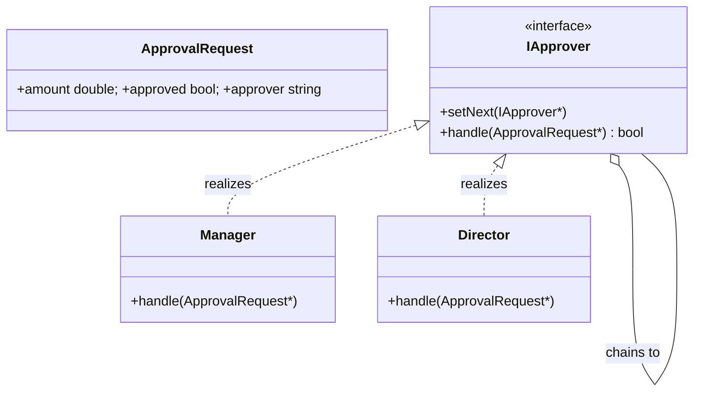

# Chain of Responsibility Design Pattern

The Chain of Responsibility decouples senders and receivers by passing a request along an ordered sequence of handlers; each handler may process the request or forward it to the next.

---

## Core Architecture

| Participant | Responsibility |
| --- | --- |
| **Handler (IHandler)** | Single virtual entry: handle(request). May hold pointer to successor; operates on borrowed request data. |
| **Concrete Handler** | Implements a focused concern (validation, auth, routing, audit). May short-circuit (handled=true). |
| **Bootstrapper** | Constructs and wires the chain at startup and owns handler instances; requests are caller-owned. |

Rules: chain wiring must remain immutable while serving requests; handlers should avoid per-request heap allocations.

---

## Standard UML Representation



---

## The Coupling Problem

Monolithic dispatch couples callers to a fixed orchestration`validate → authorize → route → log`.
CoR decouples sequence and ownership: handlers encapsulate behaviour and the bootstrapper composes them. 
Importantly, handlers operate on a single mutable request; downstream handlers rely on upstream mutations to make decisions.

---

## Example (Approval Workflow )

Requirements: explicit ownership, no per-request allocations, deterministic cleanup.

```cpp
// approval_workflow.cpp
#include <iostream>
#include <string>

struct ApprovalRequest { double amount; bool approved=false; std::string approver; };

class IApprover {
protected:
    IApprover* next = nullptr; 
public:
    virtual ~IApprover() = default;
    void setNext(IApprover* n) { next = n; }
    // return true if handled (terminal)
    virtual bool handle(ApprovalRequest* r) = 0;
};

class Manager : public IApprover {
    static constexpr double LIMIT = 1000.0;
public:
    bool handle(ApprovalRequest* r) override {
        if (r->amount <= LIMIT) { r->approved = true; r->approver = "Manager"; return true; }
        return next ? next->handle(r) : false;
    }
};

class Director : public IApprover {
    static constexpr double LIMIT = 10000.0;
public:
    bool handle(ApprovalRequest* r) override {
        if (r->amount <= LIMIT) { r->approved = true; r->approver = "Director"; return true; }
        return next ? next->handle(r) : false;
    }
};

int main() {
    // bootstrapper: single-threaded initialization
    IApprover* mgr = new Manager();
    IApprover* dir = new Director();
    mgr->setNext(dir);

    ApprovalRequest r1{250};
    mgr->handle(&r1);
    std::cout << r1.amount << " -> " << (r1.approved ? "approved by " + r1.approver : "rejected") << "\n";

    ApprovalRequest r2{25000};
    mgr->handle(&r2);
    std::cout << r2.amount << " -> " << (r2.approved ? "approved by " + r2.approver : "rejected") << "\n";

    // explicit cleanup
    delete mgr; delete dir;
    return 0;
}
```

Implementation notes:
- Handlers perform no dynamic allocation per request.
- Request is caller-owned and short lived; handlers mutate it to record decisions.
- Bootstrapper owns handlers and is responsible for teardown at shutdown.

---

## Concurrency & Low-level Considerations

| Concern              | Recommendation                                                                                                                  |
| -------------------- | ------------------------------------------------------------------------------------------------------------------------------- |
| Chain mutability     | Build chain at startup; if dynamic swap is required, use atomic pointer swap (acquire/release) to provide snapshots to workers. |
| Allocation strategy  | Avoid per-request heap allocations; use stack buffers or thread-local arenas.                                                   |
| Locking & contention | Avoid global locks inside handlers; use per-shard atomics or batching for side-effects.                                         |
| Ownership            | Document: bootstrapper owns handlers; handlers borrow request pointers.                                                         |
| Exception safety     | Catch exceptions at chain entry; handlers should avoid throwing during normal flows.                                            |

---

## Design Tradeoffs

| Advantages (SOLID Alignment) | Drawbacks / Limitations |
|------------------------------|-------------------------|
| **Open/Closed Principle (OCP):** New handlers can be added, removed, or replaced without modifying existing handlers or client code. | **Linear Latency:** Every handler introduces an additional function call, so deeper chains increase end-to-end latency. |
| **Single Responsibility (SRP):** Each handler encapsulates one concern (validation, authentication, formatting, logging, etc.), improving modularity and testability. | **Debugging Complexity:** Tracing a request through a long chain requires inspecting handlers sequentially, complicating diagnosis. |
| **Decoupled Dispatching:** The client depends only on the first handler; the processing pipeline remains hidden and loosely coupled. | **Silent Failure:** If no handler processes the request and no terminal/default handler exists, the request may be dropped unnoticed. |
| **Runtime Flexibility:** Handlers can be reordered, inserted, or removed dynamically to build different processing pipelines. | **Ordering Dependencies:** Correct behavior may rely on handler order (e.g., validation before formatting), which is enforced during chain construction rather than by the type system. |
| **Reusable Cross-cutting Concerns:** Logging, metrics, auditing, caching, and authorization can be implemented as reusable handlers shared across pipelines. | **Execution Flow Fragmentation:** Business logic becomes distributed across many small classes, making the overall control flow harder to understand. |


---

## Comparison

| Aspect | Chain of Responsibility | Decorator |
| --- | --- | --- |
| **Primary intent** | Sequentially route and possibly consume a request through multiple handlers. | Attach or modify responsibilities of a single object via layered wrappers. |
| **Ownership model** | Bootstrapper owns handlers; handlers borrow the request. | Outer decorator owns inner component; ownership cascades. |
| **Mutability and visibility** | Handlers mutate a shared request object; mutations are visible downstream. | Decorators do not provide a shared, sequential mutation model; each wrapper delegates inward. |
| **Short-circuiting** | Any handler can terminate processing naturally by returning handled=true. | Termination requires decorators to conditionally forward; this recreates pipeline behavior and breaks pure decorator semantics. |
| **Observers and side-effects** | Observers (audit, metrics) can be positioned within the chain relative to terminators. | Guaranteeing observers run despite short-circuits needs external wiring or duplication. |
| **When to choose** | Use CoR for approval flows, middleware pipelines, or any scenario where independent actors examine/mutate a shared request and can stop propagation. | Use Decorator to add orthogonal features (compression, logging, caching) to objects without changing their interfaces. |

---

