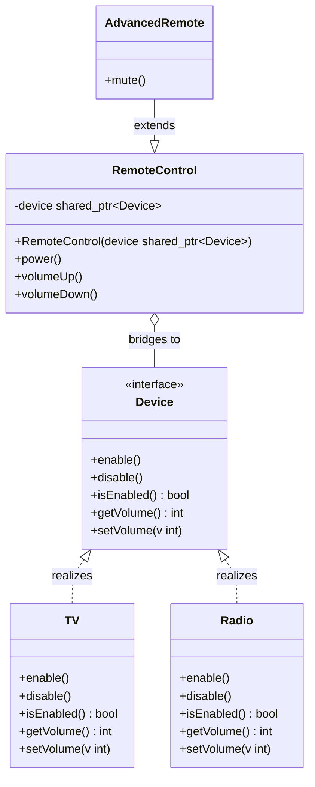

# Bridge Design Pattern

The Bridge pattern is a structural design pattern that splits a large class hierarchy into two independent hierarchies: abstraction and implementation. The goal is to let both sides evolve without multiplying subclasses for every combination.

---

## Core Architecture

| Participant | Responsibility |
| --- | --- |
| **Abstraction** | Defines the high level operations exposed to the client. |
| **RefinedAbstraction** | Extends the abstraction with extra behavior. |
| **Implementor** | Declares the low level operations used by the abstraction. |
| **ConcreteImplementor** | Provides platform or variant specific behavior. |
| **Client** | Works with the abstraction and connects it to an implementor. |

---

## Standard UML Representation



---

## The Class Explosion Problem

When two dimensions of variation are hardcoded into inheritance, the number of subclasses grows quickly. A `TVRemote`, `RadioRemote`, `SmartTVRemote`, and `SmartRadioRemote` style hierarchy is a sign that abstraction and implementation are coupled too tightly.

Bridge fixes that by moving the device-specific behavior into a separate implementor hierarchy. The remote stays focused on control logic, and the device hierarchy stays focused on hardware behavior.

---

## Example (Remote Control System)

```cpp
#include <algorithm>
#include <iostream>
#include <memory>
#include <stdexcept>
#include <string>
#include <utility>

using namespace std;

class BridgeException : public runtime_error {
public:
    explicit BridgeException(const string& msg) : runtime_error(msg) {}
};

class Device {
public:
    virtual ~Device() = default;
    virtual void enable() = 0;
    virtual void disable() = 0;
    virtual bool isEnabled() const = 0;
    virtual int getVolume() const = 0;
    virtual void setVolume(int volume) = 0;
};

class TV : public Device {
    bool enabled = false;
    int volume = 20;

public:
    void enable() override { enabled = true; cout << "TV on\n"; }
    void disable() override { enabled = false; cout << "TV off\n"; }
    bool isEnabled() const override { return enabled; }
    int getVolume() const override { return volume; }
    void setVolume(int v) override {
        volume = std::clamp(v, 0, 100);
        cout << "TV volume: " << volume << "\n";
    }
};

class Radio : public Device {
    bool enabled = false;
    int volume = 10;

public:
    void enable() override { enabled = true; cout << "Radio on\n"; }
    void disable() override { enabled = false; cout << "Radio off\n"; }
    bool isEnabled() const override { return enabled; }
    int getVolume() const override { return volume; }
    void setVolume(int v) override {
        volume = std::clamp(v, 0, 100);
        cout << "Radio volume: " << volume << "\n";
    }
};

class RemoteControl {
protected:
    shared_ptr<Device> device;

public:
    explicit RemoteControl(shared_ptr<Device> dev) : device(std::move(dev)) {
        if (!device) {
            throw BridgeException("Device cannot be null");
        }
    }

    virtual ~RemoteControl() = default;

    void power() {
        if (device->isEnabled()) {
            device->disable();
            return;
        }
        device->enable();
    }

    void volumeUp() {
        device->setVolume(device->getVolume() + 10);
    }

    void volumeDown() {
        device->setVolume(device->getVolume() - 10);
    }
};

class AdvancedRemote : public RemoteControl {
public:
    using RemoteControl::RemoteControl;

    void mute() {
        device->setVolume(0);
        cout << "Muted\n";
    }
};

int main() {
    auto tvRemote = make_unique<RemoteControl>(make_shared<TV>());
    tvRemote->power();
    tvRemote->volumeUp();

    auto radioRemote = make_unique<AdvancedRemote>(make_shared<Radio>());
    radioRemote->power();
    radioRemote->volumeDown();
    radioRemote->mute();
}
```

---

## Concurrency & Design Considerations

* **Thread Safe Implementors**: If the `ConcreteImplementor` holds mutable state (such as device volume or power status), access to the implementor must be serialized using `std::mutex` or `std::shared_mutex`.
* **Abstraction Statelessness**: The `Abstraction` and `RefinedAbstraction` layers should remain stateless or hold only immutable configuration. This allows multiple threads to share the same abstraction instance safely without locks.
* **Independent Lifecycle**: Because the abstraction and implementor hierarchies evolve independently, they can be updated or replaced in separate translation units, reducing recompilation cascades in large codebases.

---

## Design Tradeoffs

| Advantages & SOLID Alignment | Drawbacks & Limitations |
| --- | --- |
| **OCP Compliance**: Abstraction and implementor hierarchies evolve independently, so new platforms or new abstractions do not require changes to the other hierarchy. | **Increased Complexity**: Introducing two hierarchies instead of one adds initial design overhead and requires more classes to achieve the same functionality. |
| **SRP Alignment**: Abstraction handles high-level logic while implementors handle platform-specific details, keeping each hierarchy focused. | **Indirection Overhead**: Every operation traverses from abstraction to implementor through a pointer or reference, adding a small but measurable call cost. |
| **Compile Time Isolation**: Changes to the implementor interface affect only the abstraction-implementor bridge, not all clients that use the abstraction. | **Overkill for Single Dimension**: If only one dimension of variation exists, Bridge introduces unnecessary abstraction layers. |

---

## Comparison

Bridge is often confused with Adapter and Strategy because all three rely on delegation.

| Pattern | Interface Change | Behavior Change | Use When |
| --- | --- | --- | --- |
| **Bridge** | No. Abstraction and implementor keep aligned contracts. | Yes. Separates abstraction from implementation so both can vary independently. | You have two orthogonal dimensions that would otherwise create subclass explosions. |
| **Adapter** | Yes. Converts an existing incompatible interface into the one the client expects. | No. Only translation, not new behavior. | You need to reuse legacy or third-party code without changing it. |
| **Strategy** | No. The context interface stays the same. | Yes. Swaps one algorithm for another at runtime. | You want interchangeable algorithms behind one context. |

- Use Bridge when abstraction and implementation change for different reasons.
- Do not use Bridge when you only need to translate one interface into another; that is usually Adapter.
- If the abstraction and implementor are shared across threads, guard mutable device state with locks.
