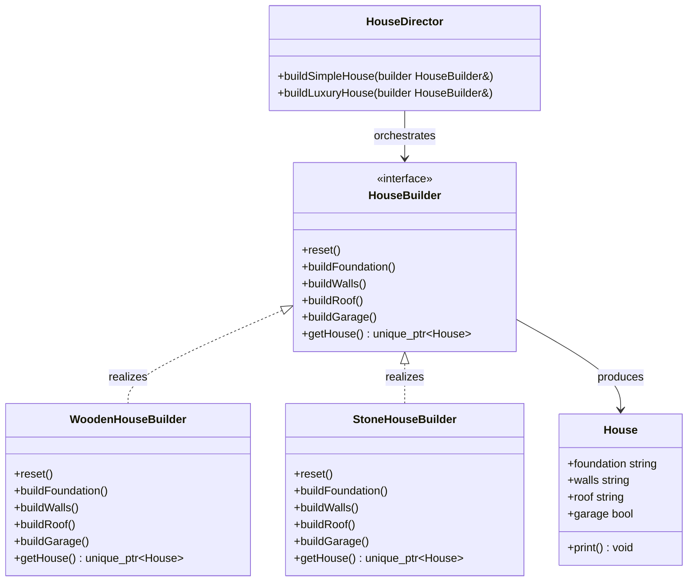

# Builder Design Pattern

The Builder pattern is a creational design pattern that constructs complex objects step by step. It separates construction from representation so the same process can create different variants of the final object.

---

## Core Architecture

| Participant | Responsibility |
| --- | --- |
| **Product** | The complex object being assembled. |
| **Builder** | Declares the construction steps. |
| **ConcreteBuilder** | Implements the construction steps for a specific representation. |
| **Director** | Defines the order in which steps are executed. |
| **Client** | Chooses the builder and asks for the final product. |

---

## Standard UML Representation



---

## The Telescoping Constructor Problem

When an object has many optional fields, construction logic tends to turn into long constructors, chained overloads, or scattered setter calls. That creates three problems:

- required and optional fields are easy to confuse
- validation becomes inconsistent
- object assembly is duplicated across callers

Builder moves those steps into a dedicated construction flow. The product stays immutable or partially hidden until the builder finishes the object.

---

## Example (House Construction)

```cpp
#include <iostream>
#include <memory>
#include <stdexcept>
#include <string>
#include <utility>

using namespace std;

class BuilderException : public runtime_error {
public:
    explicit BuilderException(const string& msg) : runtime_error(msg) {}
};

class House {
public:
    string foundation;
    string walls;
    string roof;
    bool garage = false;

    void print() const {
        cout << "House{foundation=" << foundation
             << ", walls=" << walls
             << ", roof=" << roof
             << ", garage=" << (garage ? "yes" : "no") << "}\n";
    }
};

class HouseBuilder {
public:
    virtual ~HouseBuilder() = default;
    virtual void reset() = 0;
    virtual void buildFoundation() = 0;
    virtual void buildWalls() = 0;
    virtual void buildRoof() = 0;
    virtual void buildGarage() = 0;
    virtual unique_ptr<House> getHouse() = 0;
};

class WoodenHouseBuilder : public HouseBuilder {
    unique_ptr<House> house;

public:
    WoodenHouseBuilder() { reset(); }

    void reset() override { house = make_unique<House>(); }
    void buildFoundation() override { house->foundation = "Wooden piles"; }
    void buildWalls() override { house->walls = "Wood"; }
    void buildRoof() override { house->roof = "Shingles"; }
    void buildGarage() override { house->garage = true; }

    unique_ptr<House> getHouse() override {
        if (!house) {
            throw BuilderException("House not ready");
        }
        return std::move(house);
    }
};

class StoneHouseBuilder : public HouseBuilder {
    unique_ptr<House> house;

public:
    StoneHouseBuilder() { reset(); }

    void reset() override { house = make_unique<House>(); }
    void buildFoundation() override { house->foundation = "Concrete"; }
    void buildWalls() override { house->walls = "Stone"; }
    void buildRoof() override { house->roof = "Tile"; }
    void buildGarage() override { house->garage = true; }

    unique_ptr<House> getHouse() override {
        if (!house) {
            throw BuilderException("House not ready");
        }
        return std::move(house);
    }
};

class HouseDirector {
public:
    unique_ptr<House> buildSimpleHouse(HouseBuilder& builder) {
        builder.reset();
        builder.buildFoundation();
        builder.buildWalls();
        builder.buildRoof();
        return builder.getHouse();
    }

    unique_ptr<House> buildLuxuryHouse(HouseBuilder& builder) {
        builder.reset();
        builder.buildFoundation();
        builder.buildWalls();
        builder.buildRoof();
        builder.buildGarage();
        return builder.getHouse();
    }
};

int main() {
    HouseDirector director;

    auto wood = WoodenHouseBuilder{};
    auto simpleHouse = director.buildSimpleHouse(wood);
    simpleHouse->print();

    auto stone = StoneHouseBuilder{};
    auto luxuryHouse = director.buildLuxuryHouse(stone);
    luxuryHouse->print();
}
```

---

## Design Tradeoffs

| Advantages & SOLID Alignment | Drawbacks & Limitations |
| --- | --- |
| **SRP Alignment**: Separates complex construction logic from the product's business representation, keeping the product class focused on its core responsibilities. | **Code Overhead**: Requires creating a dedicated `Builder` interface, `ConcreteBuilder` implementations, and often a `Director` class, increasing the total class count. |
| **Telescoping Constructor Elimination**: Eliminates long parameter lists and constructor overloads, making the construction process explicit and type-safe. | **Mutable State During Construction**: The builder holds mutable intermediate state. If the product is exposed before construction completes, clients can observe inconsistent objects. |
| **Flexible Representation**: The same director can produce different product variants by swapping builders, enabling multiple construction recipes without duplicating director logic. | **Increased Object Allocations**: Each builder instance creates temporary objects during the step-by-step assembly, which can increase memory churn in performance-critical paths. |
| **OCP Compliance**: New product representations are added by introducing new `ConcreteBuilder` subclasses without modifying existing directors or client code. | **Redundant for Simple Objects**: For objects with few optional fields, a builder adds unnecessary complexity compared to simple constructors or aggregate initialization. |

---

## Comparison

Builder is often confused with Factory Method because both hide concrete construction details.

| Dimension | Builder | Factory Method |
| --- | --- | --- |
| **Creation Style** | Step-by-step assembly of one complex product. | Single decision point that returns one concrete product. |
| **What Varies** | Construction process and optional parts. | Concrete product type. |
| **Use When** | The same product can be built in different representations or with many optional fields. | You need to choose which object to instantiate, not how to assemble it. |
