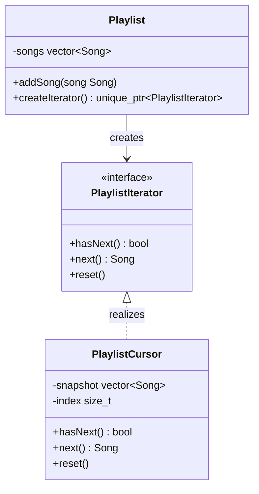

# Iterator Design Pattern

The Iterator pattern is a behavioral design pattern that lets you traverse a collection without exposing how the collection is stored. It moves traversal logic out of the collection and into a dedicated iterator object.

---

## Core Architecture

| Participant | Responsibility |
| --- | --- |
| **Iterator** | Declares traversal operations such as `hasNext()` and `next()`. |
| **ConcreteIterator** | Keeps traversal state for one collection instance. |
| **Aggregate** | Declares a factory method for creating iterators. |
| **ConcreteAggregate** | Returns an iterator over its internal data. |
| **Client** | Uses the iterator, not the collection internals. |

---

## Standard UML Representation



---

## The Traversal Duplication Problem

If every client loops over a collection directly, traversal code gets duplicated everywhere. If the collection is a tree or graph, traversal logic becomes even more invasive because the client must know the storage format.

Iterator keeps traversal outside the collection. The collection owns the data. The iterator owns the cursor state.

---

## Example (Playlist Traversal)

```cpp
#include <iostream>
#include <memory>
#include <stdexcept>
#include <string>
#include <vector>
#include <utility>

using namespace std;

class IteratorException : public runtime_error {
public:
    explicit IteratorException(const string& msg) : runtime_error(msg) {}
};

struct Song {
    string title;
    string artist;
};

class PlaylistIterator {
public:
    virtual ~PlaylistIterator() = default;
    virtual bool hasNext() const = 0;
    virtual Song next() = 0;
    virtual void reset() = 0;
};

class Playlist {
    vector<Song> songs;

public:
    void addSong(Song song) {
        songs.push_back(std::move(song));
    }

    class Cursor : public PlaylistIterator {
        vector<Song> snapshot;
        size_t index = 0;

    public:
        explicit Cursor(vector<Song> songs) : snapshot(std::move(songs)) {}

        bool hasNext() const override {
            return index < snapshot.size();
        }

        Song next() override {
            if (!hasNext()) {
                throw IteratorException("No more songs");
            }
            return snapshot[index++];
        }

        void reset() override {
            index = 0;
        }
    };

    unique_ptr<PlaylistIterator> createIterator() const {
        return make_unique<Cursor>(songs);
    }
};

int main() {
    Playlist playlist;
    playlist.addSong({"Naatu Naatu", "M. M. Keeravaani"});
    playlist.addSong({"Kesariya", "Arijit Singh"});
    playlist.addSong({"Believer", "Imagine Dragons"});

    auto it = playlist.createIterator();
    while (it->hasNext()) {
        Song song = it->next();
        cout << song.title << " by " << song.artist << "\n";
    }
}
```

---

## Design Tradeoffs

| Advantages & SOLID Alignment | Drawbacks & Limitations |
| --- | --- |
| **SRP Alignment**: Separates traversal mechanics from the collection's data storage and business logic. | **Snapshot Overhead**: Defensive-copy iterators (like `Cursor` in the example) duplicate the underlying collection into a snapshot, doubling memory usage during iteration. |
| **Encapsulation**: Clients cannot modify the collection's internal structure directly; they can only read through the iterator interface. | **Staleness Risk**: Snapshot iterators reflect the collection state at creation time. Concurrent mutations to the underlying collection are invisible to the iterator, which can lead to inconsistent views. |
| **Multiple Simultaneous Traversals**: Multiple independent iterators can traverse the same collection concurrently without interfering with each other. | **Custom Iterator Burden**: For every new collection type, a corresponding iterator must be implemented, tested, and maintained, adding development overhead. |
| **OCP Compliance**: New traversal algorithms (e.g., reverse, filtered, parallel) can be added as new iterator implementations without modifying the collection class. | **Performance Cost**: Virtual function calls through the `PlaylistIterator` interface add indirection overhead compared to raw pointer arithmetic or index-based loops. |

---

## Comparison

Iterator is often compared with Composite and Visitor because all three interact with object structures.

| Dimension | Iterator | Composite | Visitor |
| --- | --- | --- | --- |
| **Primary Intent** | Adds a cursor over existing data to hide traversal mechanics. | Represents part-whole trees with uniform treatment of leaves and composites. | Separates algorithms from the object structure by accepting a visitor object. |
| **Traversal Control** | Client controls traversal via `next()` and `hasNext()`. | Client invokes operations recursively on the root; traversal is implicit. | Visitor controls traversal by accepting each element in turn. |
| **Structure Dependency** | Hides the collection's internal storage format. | Exposes the tree structure as the domain model itself. | Requires the object structure to accept a visitor, adding an `accept()` method. |
| **Use When** | You need controlled traversal of a collection without exposing storage details. | You want clients to treat single objects and compositions the same way. | You need to define new operations on elements without changing their classes. |
