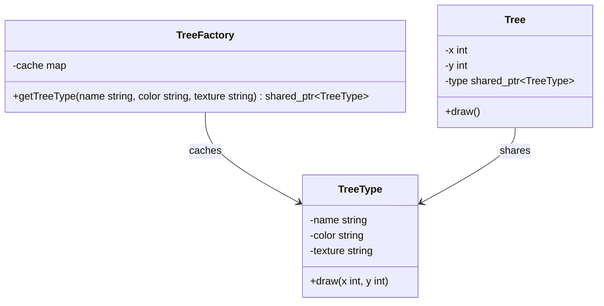

# Flyweight Design Pattern

The Flyweight pattern is a structural design pattern that reduces memory use by sharing common intrinsic state across many objects and keeping extrinsic state outside the shared object.

---

## Core Architecture

| Participant | Responsibility |
| --- | --- |
| **Flyweight** | Stores intrinsic state that can be shared. |
| **ConcreteFlyweight** | Implements the behavior using shared state. |
| **FlyweightFactory** | Reuses existing flyweights or creates new ones. |
| **Context** | Stores extrinsic state and passes it to flyweights. |
| **Client** | Requests flyweights through the factory. |

---

## Standard UML Representation



---

## The Many Similar Objects Problem

Flyweight is useful when a system creates a large number of objects that mostly differ only by a few fields. If those repeated fields are stored in every object, memory usage grows quickly.

The fix is to split the state:

- intrinsic state stays in the shared flyweight
- extrinsic state stays in the context object

This is an optimization pattern. If the memory problem does not exist, Flyweight adds complexity for no gain.

---

## Example (Forest Renderer)

```cpp
#include <iostream>
#include <memory>
#include <mutex>
#include <string>
#include <unordered_map>
#include <vector>
#include <utility>

using namespace std;

class TreeType {
    string name;
    string color;
    string texture;

public:
    TreeType(string n, string c, string t)
        : name(std::move(n)), color(std::move(c)), texture(std::move(t)) {}

    void draw(int x, int y) const {
        cout << "Draw " << name << " at (" << x << ", " << y
             << ") with color " << color
             << " and texture " << texture << "\n";
    }
};

class TreeFactory {
    unordered_map<string, shared_ptr<TreeType>> cache;
    mutable mutex cacheMutex;

public:
    shared_ptr<TreeType> getTreeType(const string& name, const string& color, const string& texture) {
        string key = name + "|" + color + "|" + texture;
        lock_guard<mutex> lock(cacheMutex);

        auto it = cache.find(key);
        if (it != cache.end()) {
            return it->second;
        }

        auto type = make_shared<TreeType>(name, color, texture);
        cache[key] = type;
        return type;
    }
};

class Tree {
    int x;
    int y;
    shared_ptr<TreeType> type;

public:
    Tree(int x, int y, shared_ptr<TreeType> treeType)
        : x(x), y(y), type(std::move(treeType)) {}

    void draw() const {
        type->draw(x, y);
    }
};

int main() {
    TreeFactory factory;
    vector<Tree> forest;

    auto oak = factory.getTreeType("Oak", "Green", "Rough");
    auto pine = factory.getTreeType("Pine", "Dark Green", "Needled");

    forest.emplace_back(10, 20, oak);
    forest.emplace_back(12, 25, oak);
    forest.emplace_back(50, 60, pine);

    for (const auto& tree : forest) {
        tree.draw();
    }
}
```

---

## Design Tradeoffs

| Advantages & SOLID Alignment | Drawbacks & Limitations |
| --- | --- |
| **Memory Efficiency**: Dramatically reduces memory footprint by sharing immutable intrinsic state across thousands of instances. | **Complexity Overhead**: Splitting state into intrinsic and extrinsic domains requires careful design and increases the cognitive load on developers. |
| **OCP Compliance**: New flyweight types can be added to the factory without modifying existing client or context code. | **Thread Safety Burden**: The shared factory cache must be protected by synchronization primitives, introducing lock contention under high concurrency. |
| **Cache Locality**: Shared flyweights improve CPU cache hit rates because the same intrinsic data is reused across multiple contexts. | **Extrinsic State Management**: Clients must correctly manage and pass extrinsic state on every operation, which reintroduces coupling between the client and the flyweight interface. |
| **SRP Alignment**: Flyweights focus strictly on shared intrinsic behavior; contexts own their unique extrinsic state, keeping responsibilities separate. | **Diminishing Returns**: If the intrinsic state is not heavily repeated, the factory and indirection overhead outweigh the memory savings. |

---

## Comparison

Flyweight is often confused with Singleton because both reuse objects to avoid duplication.

| Pattern | Instance Count | State Ownership | Use When |
| --- | --- | --- | --- |
| **Flyweight** | Many instances, but shared intrinsic state. | Shared intrinsic state plus per-use extrinsic state. | You need to reduce memory by reusing repeated data across many objects. |
| **Singleton** | Exactly one instance per process. | One global state holder. | You need one shared service or registry. |
