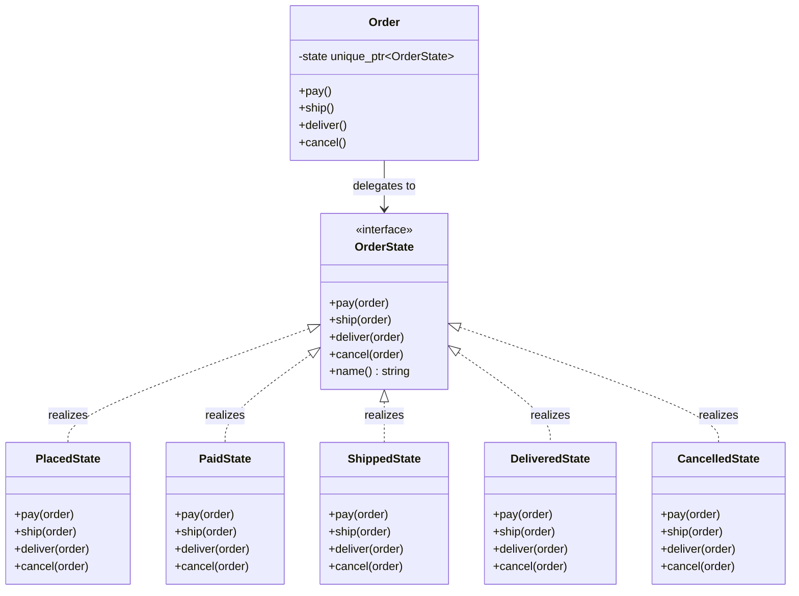

# State Design Pattern

The State pattern is a behavioral design pattern that lets an object change its behavior when its internal state changes. The object keeps the same public interface, but the active state object decides how each operation behaves.

---

## Core Architecture

| Participant | Responsibility |
| --- | --- |
| **Context** | Holds a reference to the current state and delegates work to it. |
| **State** | Declares the state-specific operations. |
| **ConcreteState** | Implements behavior for one lifecycle state. |
| **Client** | Calls the context without knowing the active state class. |

---

## Standard UML Representation



---

## The State Explosion Problem

When lifecycle rules are encoded with large switch statements, behavior gets hard to follow and harder to extend. Every new status adds more branches to every operation.

State moves that logic into separate classes. The context becomes small. Each state owns its own rules and legal transitions.

State is close to Strategy in structure, but the intent is different:

- Strategy swaps algorithms
- State models a lifecycle with valid transitions

---

## Example (Order Lifecycle)

```cpp
#include <iostream>
#include <memory>
#include <stdexcept>
#include <string>
#include <utility>

using namespace std;

class StateException : public runtime_error {
public:
    explicit StateException(const string& msg) : runtime_error(msg) {}
};

class Order;

class OrderState {
public:
    virtual ~OrderState() = default;
    virtual void pay(Order& order) = 0;
    virtual void ship(Order& order) = 0;
    virtual void deliver(Order& order) = 0;
    virtual void cancel(Order& order) = 0;
    virtual const char* name() const = 0;
};

class Order {
    string orderId;
    unique_ptr<OrderState> state;

public:
    explicit Order(string id);

    const string& id() const { return orderId; }
    const char* stateName() const { return state->name(); }

    void setState(unique_ptr<OrderState> nextState) {
        if (!nextState) {
            throw StateException("Order state cannot be null");
        }
        state = std::move(nextState);
    }

    void pay() { state->pay(*this); }
    void ship() { state->ship(*this); }
    void deliver() { state->deliver(*this); }
    void cancel() { state->cancel(*this); }
};

class PlacedState : public OrderState {
public:
    void pay(Order& order) override;
    void ship(Order& order) override;
    void deliver(Order& order) override;
    void cancel(Order& order) override;
    const char* name() const override { return "PLACED"; }
};

class PaidState : public OrderState {
public:
    void pay(Order& order) override;
    void ship(Order& order) override;
    void deliver(Order& order) override;
    void cancel(Order& order) override;
    const char* name() const override { return "PAID"; }
};

class ShippedState : public OrderState {
public:
    void pay(Order& order) override;
    void ship(Order& order) override;
    void deliver(Order& order) override;
    void cancel(Order& order) override;
    const char* name() const override { return "SHIPPED"; }
};

class DeliveredState : public OrderState {
public:
    void pay(Order& order) override;
    void ship(Order& order) override;
    void deliver(Order& order) override;
    void cancel(Order& order) override;
    const char* name() const override { return "DELIVERED"; }
};

class CancelledState : public OrderState {
public:
    void pay(Order& order) override;
    void ship(Order& order) override;
    void deliver(Order& order) override;
    void cancel(Order& order) override;
    const char* name() const override { return "CANCELLED"; }
};

Order::Order(string id) : orderId(std::move(id)), state(make_unique<PlacedState>()) {}

void PlacedState::pay(Order& order) {
    cout << order.id() << " paid\n";
    order.setState(make_unique<PaidState>());
}
void PlacedState::ship(Order&) { throw StateException("Order must be paid before shipping"); }
void PlacedState::deliver(Order&) { throw StateException("Order must be shipped before delivery"); }
void PlacedState::cancel(Order& order) {
    cout << order.id() << " cancelled\n";
    order.setState(make_unique<CancelledState>());
}

void PaidState::pay(Order&) { throw StateException("Order is already paid"); }
void PaidState::ship(Order& order) {
    cout << order.id() << " shipped\n";
    order.setState(make_unique<ShippedState>());
}
void PaidState::deliver(Order&) { throw StateException("Order must be shipped before delivery"); }
void PaidState::cancel(Order& order) {
    cout << order.id() << " cancelled\n";
    order.setState(make_unique<CancelledState>());
}

void ShippedState::pay(Order&) { throw StateException("Order is already paid"); }
void ShippedState::ship(Order&) { throw StateException("Order is already shipped"); }
void ShippedState::deliver(Order& order) {
    cout << order.id() << " delivered\n";
    order.setState(make_unique<DeliveredState>());
}
void ShippedState::cancel(Order&) { throw StateException("Shipped orders cannot be cancelled"); }

void DeliveredState::pay(Order&) { throw StateException("Order is already completed"); }
void DeliveredState::ship(Order&) { throw StateException("Order is already completed"); }
void DeliveredState::deliver(Order&) { throw StateException("Order is already completed"); }
void DeliveredState::cancel(Order&) { throw StateException("Order is already completed"); }

void CancelledState::pay(Order&) { throw StateException("Order is already cancelled"); }
void CancelledState::ship(Order&) { throw StateException("Order is already cancelled"); }
void CancelledState::deliver(Order&) { throw StateException("Order is already cancelled"); }
void CancelledState::cancel(Order&) { throw StateException("Order is already cancelled"); }

int main() {
    try {
        Order order("ORD-501");
        cout << "State: " << order.stateName() << "\n";
        order.pay();
        cout << "State: " << order.stateName() << "\n";
        order.ship();
        cout << "State: " << order.stateName() << "\n";
        order.deliver();
        cout << "State: " << order.stateName() << "\n";
    } catch (const StateException& ex) {
        cerr << ex.what() << "\n";
    }
}
```

---

## Design Tradeoffs

| Advantages & SOLID Alignment | Drawbacks & Limitations |
| --- | --- |
| **OCP Compliance**: New lifecycle states are introduced as new `ConcreteState` subclasses, leaving the context and existing state logic untouched. | **Class Proliferation**: Every distinct state requires a separate class. Systems with many transient states can create large numbers of small state classes. |
| **SRP Alignment**: Each state class encapsulates only the behavior valid for that specific lifecycle phase, eliminating monolithic conditional blocks. | **State Transition Complexity**: If transitions are not strictly localized inside state classes, the flow can become difficult to trace across multiple state implementations. |
| **Explicit State Transitions**: The current state object explicitly controls which transitions are legal, making lifecycle rules self-documenting within each state. | **Context Coupling**: States must hold a reference back to the context to trigger transitions, creating a bidirectional dependency that can complicate memory management. |
| **Elimination of Conditional Spam**: Replaces large `switch` or `if-else` blocks scattered across the context with polymorphic dispatch. | **Shared Behavior Duplication**: If many states share similar logic, that logic must be factored into a base `State` class or duplicated, introducing either inheritance coupling or code repetition. |

---

## Comparison

State is often compared with Strategy because both route behavior through a context-held object, but they differ in who chooses and why.

| Dimension | State | Strategy |
| --- | --- | --- |
| **Who Chooses** | The context changes itself based on lifecycle transitions. | The client selects the strategy. |
| **Variation Type** | Lifecycle-dependent behavior. | Interchangeable algorithms. |
| **Use When** | Valid operations and next steps depend on current state. | You want to swap algorithms without changing the context. |
