# LLD Delivery Framework

This framework provides a structured approach to solving Low Level Design (LLD) and Object Oriented Design (OOD) problems during technical interviews. It ensures a logical transition from a vague initial prompt to a complete, thread safe, and validated class implementation within a typical 45 minute session.

---

## The Diagram

Below is the conceptual diagram illustrating the framework phases:

---

## The 5 Phases of LLD Delivery

```mermaid
gantt
    title Typical 45 Minute LLD Interview Timeline
    dateFormat  X
    axisFormat %s
    section Phases
    1. Requirements (~5m) :active, p1, 0, 5
    2. Entities (~3m)      :active, p2, 5, 8
    3. Class Design (~12m) :active, p3, 8, 20
    4. Implementation (~15m):active, p4, 20, 35
    5. Verification (~5m)  :active, p5, 35, 40
```

| Phase | Duration | Core Goal | Primary Deliverables |
| --- | --- | --- | --- |
| **1. Requirements** | ~5 mins | Clarify scope and establish boundaries | Functional API list, lifecycle states, constraints, In/Out of Scope lists |
| **2. Entities** | ~3 mins | Map requirements to core structures | Primary data classes, attributes, relationship mapping (Composition/Aggregation) |
| **3. Class Design** | ~12 mins | Define system schemas and contracts | Class skeletons, interface contracts, method signatures, exception definitions |
| **4. Implementation** | ~15 mins | Translate templates into clean code | Happy path logic, edge case validation, thread safety locking primitives |
| **5. Verification** | ~5 mins | Validate implementation correctness | Line by line scenario dry run, requirements checklist match |

### Phase 1: Requirements Gathering (~5 minutes)

Before writing any class definitions, clarify the problem scope. OOD prompts are intentionally open ended. Clarify the system requirements across four distinct pillars:

1. **Core Operations**: What primary capabilities must the system support? (e.g., in a parking lot, check if a slot is available, park a vehicle, generate a ticket).
2. **State & Transitions**: Define the lifecycles and states of major objects (e.g., an order transition from `PLACED` to `PAID` to `COMPLETED`).
3. **Error Handling & Constraints**: Define the system behavior when constraints are violated (e.g., how the system reacts when the parking lot is full, or when a payment fails).
4. **Scope Boundaries**: Explicitly document what is in scope and what is out of scope.
   - *In Scope*: Class structure, class relationships, core business logic, thread safe collections, API signatures.
   - *Out of Scope*: Frontend UI, database integration, network calls (HTTP/gRPC), distributed systems scaling.

---

### Phase 2: Entities & Relationships (~3 minutes)

Map the requirements to core classes and structural models:
* **Identify Entities**: Extract the primary nouns from the clarified requirements list (e.g., `User`, `ParkingLot`, `Vehicle`, `Ticket`).
* **Define Properties**: Assign essential attributes to these entities (e.g., `Vehicle` has a license plate and size).
* **Define Relationships**: Establish how these classes interact:
  - **Composition**: A strong lifecycle bond where the child cannot exist without the parent (e.g., `Board` belongs to `Game`).
  - **Aggregation**: A loose reference where the child exists independently of the parent (e.g., `MenuItem` inside a `Cart`).
  - **Inheritance**: An "is a" relationship, used selectively to define hierarchical categories (e.g., `Car` inheriting from `Vehicle`).

---

### Phase 3: Class Design & APIs (~12 minutes)

Define the interfaces, classes, and method signatures:
* **Method Signatures**: Specify input parameters, return types, and explicit exceptions.
  - *Example*: `void processPayment(PaymentDetails details) throws PaymentFailedException;`
* **Design Patterns**: Apply structural or behavioral design patterns only when they are needed to keep the code extensible and clean.
  - Varying behaviors/algorithms -> **Strategy Pattern**
  - Event-driven state updates -> **Observer Pattern**
  - Complex lifecycle state changes -> **State Pattern**
  - Decoupling object creation -> **Factory Method**

---

### Phase 4: Implementation (~15 minutes)

Translate the class skeletons into clean, working code:
1. **Happy Path**: Write the core logic for the primary success flow first. Do not add premature optimizations or deep nested conditional edge cases in the first pass.
2. **Edge Cases**: Implement parameter validation, null guards, and exception handling.
3. **Concurrency Control**: Modern LLD requires handling concurrent access on a single machine. Protect shared resources (such as inventories, seats, and account balances) using synchronization primitives (`mutex`, `locks`, atomic variables, or thread safe collections).

---

### Phase 5: Verification (~5 minutes)

Validate the completed design:
* **Dry Run**: Trace a concrete execution path (e.g., *"User parks a large SUV in Spot #12 and pays via credit card"*) line by line through the classes.
* **Requirements Review**: Verify that every in scope requirement identified in Phase 1 is covered by the code.
* **Extensibility Analysis**: Explain how the design handles future requirements (e.g., adding a new vehicle type) without modifying existing codebase core logic (Open/Closed Principle).