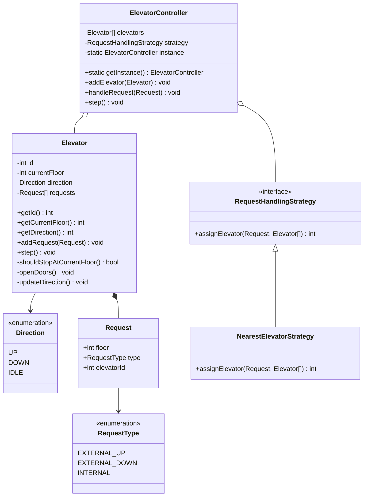

# Elevator System Design (LLD & Simulation)
This document contains the complete Low-Level Design (LLD) and C++ simulation code for an elevator control system.

---

## 1. Problem Statement & Requirements
Design a system to control multiple elevator cars in a building:
* **Multiple Elevators**: Scale up to $N$ elevators.
* **Floor Requests**: Handle external requests (hall calls: UP/DOWN) and internal requests (car calls: destination floors).
* **Efficiency**: Move elevators efficiently using the **LOOK (SCAN)** algorithm.
* **Simulation Loop**: The system is ticked via a simulation clock (`step()`) to advance time deterministically.

---

## 2. Core Entities
1. **Request**: Holds details about floor, type (`EXTERNAL_UP`, `EXTERNAL_DOWN`, `INTERNAL`), and destination elevator ID (if internal).
2. **Elevator**: Tracks its ID, current floor, current direction, and holds a collection of active requests.
3. **ElevatorController**: Singleton class orchestrating requests and propagating steps to all elevators.
4. **RequestHandlingStrategy**: Interface to delegate assigning external requests to the most optimal elevator.

---

## 3. Class Diagram (Mermaid)



---

## 4. The Algorithm (LOOK / SCAN)
To ensure optimal passenger transit time and minimize backtracking, the system runs the **LOOK algorithm**:
* **Idle State**: When an elevator receives a request, it selects the closest request floor and changes direction to head towards it.
* **Moving State**:
  * Advances 1 floor per tick.
  * Checks if the new current floor has matching requests:
    * **Always stop** if a passenger inside wants to get off there (`INTERNAL`).
    * **Stop** if a passenger outside wants to go in the same direction (`EXTERNAL_UP` while moving UP, or `EXTERNAL_DOWN` while moving DOWN).
  * Re-evaluates direction:
    * If moving **UP**: Keep moving UP if there are any requests above. If not, reverse direction to DOWN if there are requests below, otherwise switch to **IDLE**.
    * If moving **DOWN**: Keep moving DOWN if there are any requests below. If not, reverse direction to UP if there are requests above, otherwise switch to **IDLE**.

---

#### 5. Complete C++ Reference Code

```cpp
#include <iostream>
#include <vector>
#include <set>
#include <algorithm>
#include <memory>
#include <cmath>
#include <map>
#include <string>

// -------------------------------------------------------------
// Enums
// -------------------------------------------------------------
enum class RequestType {
    EXTERNAL_UP,
    EXTERNAL_DOWN,
    INTERNAL
};

enum class Direction {
    UP,
    DOWN,
    IDLE
};

std::string toString(Direction direction) {
    switch (direction) {
        case Direction::UP:   return "UP";
        case Direction::DOWN: return "DOWN";
        case Direction::IDLE: return "IDLE";
    }
    return "UNKNOWN";
}

// -------------------------------------------------------------
// Request Data Structure (with operator< for std::set compatibility)
// -------------------------------------------------------------
struct Request {
    int floor;
    RequestType type;
    int elevatorId; // Used only if type is INTERNAL (-1 otherwise)

    Request(int floorNum, RequestType reqType, int id = -1) 
        : floor(floorNum), type(reqType), elevatorId(id) {}

    // Strict weak ordering required by std::set
    bool operator<(const Request& other) const {
        if (floor != other.floor) {
            return floor < other.floor;
        }
        return type < other.type;
    }
};

class Elevator;

// -------------------------------------------------------------
// Strategy Pattern Interface (Open-Closed Principle)
// -------------------------------------------------------------
class RequestHandlingStrategy {
public:
    virtual ~RequestHandlingStrategy() = default;
    virtual int assignElevator(const Request& request, 
                               const std::vector<std::shared_ptr<Elevator>>& elevators) = 0;
};

// -------------------------------------------------------------
// Elevator Class (std::set version)
// -------------------------------------------------------------
class Elevator {
private:
    int id;
    int currentFloor;
    Direction direction;
    std::set<Request> requests; // Set automatically handles uniqueness!

public:
    Elevator(int elevatorId, int startFloor = 1) 
        : id(elevatorId), currentFloor(startFloor), direction(Direction::IDLE) {}

    int getId() const { return id; }
    int getCurrentFloor() const { return currentFloor; }
    Direction getDirection() const { return direction; }

    // Insertion is now a simple one-liner
    void addRequest(const Request& request) {
        requests.insert(request);
    }

    void step() {
        if (direction == Direction::IDLE) {
            handleIdle();
        } else {
            currentFloor += (direction == Direction::UP) ? 1 : -1;
            std::cout << "[Elevator " << id << "] Moved to floor " << currentFloor << "\n";
            if (shouldStopAtCurrentFloor()) {
                openDoors();
            }
        }
    }

    void printState() const {
        std::cout << "[Elevator " << id << "] Floor: " << currentFloor 
                  << " | Dir: " << toString(direction) << " | Requests: [ ";
        for (const auto& r : requests) {
            std::cout << r.floor << (r.type == RequestType::INTERNAL ? "(INT) " : 
                                    (r.type == RequestType::EXTERNAL_UP ? "(UP) " : "(DN) "));
        }
        std::cout << "]\n";
    }

private:
    bool hasRequestsAbove() const {
        return !requests.empty() && requests.rbegin()->floor > currentFloor;
    }

    bool hasRequestsBelow() const {
        return !requests.empty() && requests.begin()->floor < currentFloor;
    }

    bool shouldStopAtCurrentFloor() const {
        if (requests.empty()) return false;
        
        if (requests.count(Request(currentFloor, RequestType::INTERNAL))) return true;
        
        if (direction == Direction::UP) {
            return requests.count(Request(currentFloor, RequestType::EXTERNAL_UP)) || 
                   requests.rbegin()->floor == currentFloor;
        }
        if (direction == Direction::DOWN) {
            return requests.count(Request(currentFloor, RequestType::EXTERNAL_DOWN)) || 
                   requests.begin()->floor == currentFloor;
        }
        return false;
    }

    void openDoors() {
        std::cout << "[Elevator " << id << "] STOPPED at floor " << currentFloor << " (Opening doors)\n";
        
        auto it = requests.begin();
        while (it != requests.end()) {
            bool shouldErase = (it->floor == currentFloor) && 
                (it->type == RequestType::INTERNAL || 
                 direction == Direction::IDLE ||
                 (direction == Direction::UP   && (it->type == RequestType::EXTERNAL_UP   || requests.rbegin()->floor == currentFloor)) ||
                 (direction == Direction::DOWN && (it->type == RequestType::EXTERNAL_DOWN || requests.begin()->floor == currentFloor)));
                 
            if (shouldErase) {
                it = requests.erase(it);
            } else {
                ++it;
            }
        }

        updateDirection();
    }

    void handleIdle() {
        if (requests.empty()) return;
        
        auto closest = std::min_element(requests.begin(), requests.end(), [this](const Request& a, const Request& b) {
            return std::abs(a.floor - currentFloor) < std::abs(b.floor - currentFloor);
        });
        
        if (closest->floor > currentFloor) direction = Direction::UP;
        else if (closest->floor < currentFloor) direction = Direction::DOWN;
        else openDoors();
    }

    void updateDirection() {
        if (requests.empty()) {
            direction = Direction::IDLE;
        } else if (direction == Direction::UP && !hasRequestsAbove()) {
            direction = hasRequestsBelow() ? Direction::DOWN : Direction::IDLE;
        } else if (direction == Direction::DOWN && !hasRequestsBelow()) {
            direction = hasRequestsAbove() ? Direction::UP : Direction::IDLE;
        }
    }
};

// -------------------------------------------------------------
// Concrete Strategy: Nearest Elevator (Shortest Seek Time First)
// -------------------------------------------------------------
class NearestElevatorStrategy : public RequestHandlingStrategy {
public:
    int assignElevator(const Request& request, 
                       const std::vector<std::shared_ptr<Elevator>>& elevators) override {
        int bestId = elevators[0]->getId();
        int minCost = 1e9;

        for (const auto& e : elevators) {
            int cost = std::abs(e->getCurrentFloor() - request.floor);

            // Add distance penalty if the elevator is moving away from target floor
            if (e->getDirection() == Direction::UP && request.floor < e->getCurrentFloor()) {
                cost += 50; 
            } else if (e->getDirection() == Direction::DOWN && request.floor > e->getCurrentFloor()) {
                cost += 50;
            }

            if (cost < minCost) {
                minCost = cost;
                bestId = e->getId();
            }
        }
        return bestId;
    }
};

// -------------------------------------------------------------
// Elevator Controller
// -------------------------------------------------------------
class ElevatorController {
private:
    static std::shared_ptr<ElevatorController> instance;
    std::vector<std::shared_ptr<Elevator>> elevators;
    std::unique_ptr<RequestHandlingStrategy> strategy;

    ElevatorController() {
        strategy = std::make_unique<NearestElevatorStrategy>();
    }

public:
    static std::shared_ptr<ElevatorController> getInstance() {
        if (!instance) {
            instance = std::shared_ptr<ElevatorController>(new ElevatorController());
        }
        return instance;
    }

    void addElevator(std::shared_ptr<Elevator> elevator) {
        elevators.push_back(elevator);
    }

    void handleRequest(const Request& request) {
        if (request.type == RequestType::INTERNAL) {
            for (auto& elevator : elevators) {
                if (elevator->getId() == request.elevatorId) {
                    elevator->addRequest(request);
                    break;
                }
            }
        } else {
            int assignedId = strategy->assignElevator(request, elevators);
            std::cout << "[Controller] Assigned floor " << request.floor 
                      << " request to Elevator " << assignedId << "\n";
            
            for (auto& elevator : elevators) {
                if (elevator->getId() == assignedId) {
                    elevator->addRequest(request);
                    break;
                }
            }
        }
    }

    void step() {
        for (auto& elevator : elevators) {
            elevator->step();
        }
    }

    void printStatus() const {
        for (const auto& elevator : elevators) {
            elevator->printState();
        }
    }
};

// Static Initialization
std::shared_ptr<ElevatorController> ElevatorController::instance = nullptr;

// -------------------------------------------------------------
// Main Simulation
// -------------------------------------------------------------
int main() {
    auto controller = ElevatorController::getInstance();

    controller->addElevator(std::make_shared<Elevator>(1, 3));
    
    std::cout << "--- Initial State ---\n";
    controller->printStatus();

    std::multimap<int, Request> timeline;

    timeline.insert({1, Request(7, RequestType::EXTERNAL_DOWN)});
    timeline.insert({1, Request(8, RequestType::INTERNAL, 1)});
    timeline.insert({5, Request(50, RequestType::EXTERNAL_DOWN)});

    for (int tick = 1; tick <= 12; ++tick) {
        std::cout << "\n=== TICK " << tick << " ===\n";

        auto range = timeline.equal_range(tick);
        for (auto it = range.first; it != range.second; ++it) {
            controller->handleRequest(it->second);
        }

        controller->step();
        controller->printStatus();
    }

    return 0;
}
```
