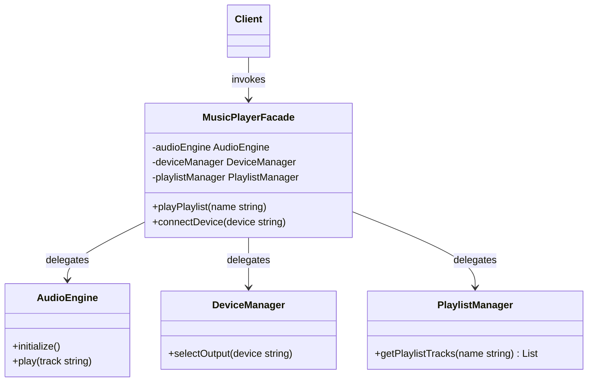

# Facade Design Pattern

The Facade pattern is a structural design pattern that provides a simplified, unified interface to a complex set of interfaces in a subsystem. It defines a higher level interface that makes the subsystem easier to use, shielding clients from low level API complexities.

---

## Core Architecture

The Facade pattern acts as an entry point to a subsystem. It delegates client requests to the appropriate subsystem classes, coordinating their interaction without preventing clients from accessing subsystem classes directly if they require advanced customization.

| Participant | Responsibility |
| --- | --- |
| **Facade** | Coordinates calls to various subsystem classes and provides a simplified interface to the client. |
| **Subsystem Classes** | Implement specific features of the subsystem; they operate independently of the Facade and have no reference to it. |
| **Client** | Calls the Facade instead of invoking subsystem operations directly. |

---

## UML Representation



---

## The Subsystem Complexity Problem

Integrating complex subsystems (such as audio engines, hardware device managers, and media playlist managers) forces client code to acquire deep transitive knowledge of multiple distinct interfaces. When the client must coordinate these low level dependencies directly, any internal modifications to method signatures or initialization procedures propagate throughout the entire codebase, leading to fragile integrations.

### Principle of Least Knowledge (Law of Demeter)

The Principle of Least Knowledge (also known as the Law of Demeter) provides a strict constraint for minimizing coupling. It dictates that a method `M` of an object `O` should only invoke methods of:
1. `O` itself.
2. The parameters passed into `M`.
3. Any object instantiated or created within `M`.
4. The direct member components of `O`.

It explicitly forbids traversing nested object graphs (e.g., `object.getComponent().getSubComponent().execute()`), which is commonly described as "talking to strangers". 

The Facade design pattern serves as the structural mechanism to enforce the Law of Demeter. By consolidating interactions with multiple subsystem dependencies behind a single interface, it acts as the client's sole immediate neighbor. The client remains completely oblivious to the subsystem's internal topology, object lifetimes, and coordination logic.

| Design Attribute | Subsystem Direct Interaction (Violates Law of Demeter) | Facade Mediated Interaction (Conforms to Law of Demeter) |
| --- | --- | --- |
| **Direct Collaborators** | High; client couples to multiple transient interfaces (`AudioEngine`, `DeviceManager`, etc.). | Low; client couples exclusively to a single `MusicPlayerFacade` object. |
| **Object Traversal** | Deep graph navigation (e.g., `client->getPlaylistManager()->getTracks(...)`). | Zero traversal; client calls high level methods directly on the Facade. |
| **Header Dependency & Compilation** | High header pollution; client must `#include` all subsystem headers, leading to compilation cascades. | Low header pollution; client only `#include`s the Facade header. Subsystem headers are hidden in the implementation file. |
| **Pointer Chasing & Cache Locality** | Deep pointer dereferencing across disjoint heap locations degrades L1/L2 cache locality. | Localized pointer dereferencing within the Facade context, optimizing memory cache patterns. |
| **Testability & Mocking** | High mocking complexity; tests must construct stubbed object graphs of all transitive dependencies. | Low mocking complexity; mock interface is restricted to a single class API. |

---

## C++ Implementation (Music Player System Facade)

This C++ implementation demonstrates a simplified `MusicPlayerFacade` that orchestrates a set of audio, device, and playlist subsystem classes.

```cpp
#include <iostream>
#include <string>
#include <vector>
#include <memory>
#include <mutex>
#include <stdexcept>

using namespace std;

// Custom System Exception
class FacadeException : public runtime_error {
public:
    explicit FacadeException(const string& msg) : runtime_error(msg) {}
};

// Subsystem 1: Audio Engine
class AudioEngine {
public:
    void play(const string& track) {
        cout << "[AudioEngine] Decoding and playing track: " << track << "\n";
    }
    void stop() {
        cout << "[AudioEngine] Audio playback stopped.\n";
    }
};

// Subsystem 2: Device Manager
class DeviceManager {
private:
    string activeDevice;

public:
    DeviceManager() : activeDevice("Internal Speaker") {}

    void connectDevice(const string& deviceType) {
        activeDevice = deviceType;
        cout << "[DeviceManager] Connected output device: " << activeDevice << "\n";
    }

    string getActiveDevice() const {
        return activeDevice;
    }
};

// Subsystem 3: Playlist Manager
class PlaylistManager {
public:
    vector<string> getTracks(const string& playlistName) {
        cout << "[PlaylistManager] Fetching tracks for playlist: " << playlistName << "\n";
        if (playlistName == "Bollywood Hits") {
            return {"Kesariya", "Tum Hi Ho", "Jai Ho"};
        }
        return {"Generic Track 1", "Generic Track 2"};
    }
};

// Facade: Orchestrates the complex subsystems
class MusicPlayerFacade {
private:
    shared_ptr<AudioEngine> audioEngine;
    shared_ptr<DeviceManager> deviceManager;
    shared_ptr<PlaylistManager> playlistManager;
    mutex playerMutex;

public:
    MusicPlayerFacade() {
        audioEngine = make_shared<AudioEngine>();
        deviceManager = make_shared<DeviceManager>();
        playlistManager = make_shared<PlaylistManager>();
    }

    void connectAudioDevice(const string& deviceType) {
        lock_guard<mutex> lock(playerMutex);
        deviceManager->connectDevice(deviceType);
    }

    void playPlaylist(const string& playlistName) {
        lock_guard<mutex> lock(playerMutex);
        
        // Orchestrate subsystems sequentially
        vector<string> tracks = playlistManager->getTracks(playlistName);
        if (tracks.empty()) {
            throw FacadeException("Playlist is empty");
        }

        cout << "[MusicPlayerFacade] Initiating playback on device: " 
             << deviceManager->getActiveDevice() << "\n";

        for (const string& track : tracks) {
            audioEngine->play(track);
        }
    }

    void stopPlayback() {
        lock_guard<mutex> lock(playerMutex);
        audioEngine->stop();
    }
};

// Client Driver
int main() {
    try {
        auto player = make_unique<MusicPlayerFacade>();

        // Client interacts only with the simple Facade interface
        cout << "--- Connecting Bluetooth Speaker ---\n";
        player->connectAudioDevice("Bluetooth Speaker");

        cout << "\n--- Playing Playlist ---\n";
        player->playPlaylist("Bollywood Hits");

        cout << "\n--- Stopping Playback ---\n";
        player->stopPlayback();

    } catch (const FacadeException& ex) {
        cerr << "Player Facade Error: " << ex.what() << "\n";
    }

    return 0;
}
```

---

## Concurrency & Design Considerations

* **Unified Serialization**: The Facade can serialize operations across stateful subsystems using a mutex (e.g. `playerMutex`) to prevent subsystems from entering inconsistent intermediate states.
* **Granular Lock Safety**: Avoid holding coarse facade locks during slow subsystem tasks (like track loading). Locks should be acquired briefly inside subsystems rather than blocking the facade.

---

## Design Tradeoffs

### Advantages
* **Decoupling**: Shields clients from complex internal changes to subsystem APIs.
* **Fallback Escape**: Advanced users can bypass the Facade and call subsystem methods directly if custom workflows are needed.

### Drawbacks
* **God Object Danger**: Facades can grow into monolithic classes that handle too much execution logic.
