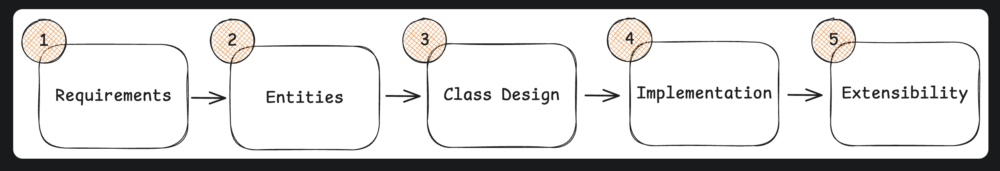

# Hello Interview LLD Delivery Framework

The **Hello Interview Low-Level Design (LLD) Delivery Framework** is a structured, step-by-step roadmap to guide you through OOD/LLD interviews. It keeps your thoughts grounded and ensures you cover requirements, entities, APIs, implementation, and verification within the typical 45-minute window.

---

## The Diagram

Below is the conceptual diagram illustrating the framework phases:

---

## The 5 Phases of LLD Delivery

```mermaid
gantt
    title Typical 45-Minute LLD Interview Timeline
    dateFormat  X
    axisFormat %s
    section Phases
    1. Requirements (~5m) :active, p1, 0, 5
    2. Entities (~3m)      :active, p2, 5, 8
    3. Class Design (~12m) :active, p3, 8, 20
    4. Implementation (~15m):active, p4, 20, 35
    5. Verification (~5m)  :active, p5, 35, 40
```

### Phase 1: Requirements (~5 minutes)
Don't jump straight into code! OOD interviews start with a intentionally vague prompt (e.g., *"Design a Parking Lot"*). Spend the first 5 minutes clarifying the scope by asking targeted questions across four dimensions:

1. **Operations (The "What")**: What operations must the system support? (e.g., *"Can users reserve slots in advance, or is it walk-in only?"*)
2. **State & Transitions**: What is the lifecycle of key objects? (e.g., *"How does a booking transition from PLACED to PAID to COMPLETED?"*)
3. **Constraints (Errors)**: What should happen when things go wrong? (e.g., *"What happens if the parking lot is full? Do we throw an exception or queue them?"*)
4. **Scope Boundaries**: Explicitly list what is **In-Scope** vs. **Out-of-Scope**.
   - *In-Scope*: Core design, data structures, state changes, APIs, concurrency.
   - *Out-of-Scope*: Web UI, network calls (HTTP/WebSockets), database integrations, microservices.

---

### Phase 2: Entities & Relationships (~3 minutes)
Decompose the requirements into core database models/classes:
* **Identify Nouns**: Scan your requirements list for key nouns (e.g., `User`, `ParkingLot`, `Vehicle`, `Ticket`).
* **Define Properties**: Give these nouns essential state attributes.
* **Determine Relationships**: Decide how they relate:
  - **Composition (Strict "Has-A")**: Lifespan of child is bound to parent (e.g., `Room` is part of `House`).
  - **Aggregation (Loose "Has-A")**: Child can exist independently of parent (e.g., `Teacher` and `Department`).
  - **Inheritance ("Is-A")**: Use sparingly; choose composition over inheritance where behaviors differ.

---

### Phase 3: Class Design & APIs (~10–15 minutes)
Sketch out the skeleton of your classes, interfaces, and methods.
* **Define Method Signatures**: Be precise with parameters, return types, and exceptions.
  - *Bad*: `processPayment(double amount)`
  - *Good*: `processPayment(PaymentDetails details) throws PaymentFailedException`
* **Identify Pattern Matches**: Apply design patterns only when code complexity warrants it.
  - Multiple algorithms? -> **Strategy Pattern**
  - Dynamic state updates? -> **Observer Pattern**
  - Complex states/lifecycles? -> **State Pattern**
  - Object creation decoupled? -> **Factory Method**

---

### Phase 4: Implementation (~10–15 minutes)
Write clean, compilable, and highly disciplined code.
1. **Happy Path First**: Implement the primary logical flow from input to output without getting distracted by edge cases.
2. **Edge Cases**: Add parameter validation checks, null checks, and error boundaries.
3. **Concurrency**: LLD interviews assume single-machine executions. You **must** address thread safety (e.g., using `mutex`, `locks`, atomic variables, or thread-safe data structures).

---

### Phase 5: Verification (~2–5 minutes)
Verify and test your design to prove it works:
* **Dry Run**: Trace a concrete user scenario (e.g., *"A customer arrives with a compact car and pays with UPI"*) line-by-line through your classes.
* **Requirement Checklist**: Cross-check your implementation against the Phase 1 requirements list.
* **Scalability & Trade-offs**: Discuss how the system would handle extensions without requiring a full redesign (violating the Open-Closed Principle).

---

## Hello Interview Golden Rules for LLD

1. **Don't Over-engineer (KISS & YAGNI)**: Avoid pre-emptively implementing features or abstract factories. Start simple and add abstractions only when a specific SOLID violation appears.
2. **Concurrency is a First-Class Citizen**: In real-world LLD, objects are accessed by multiple threads. Always design your core data entities (Carts, Seats, Inventories) to be thread-safe.
3. **Favor Composition Over Inheritance**: Inheritance creates brittle hierarchies. If behavior varies, encapsulate it in an interface and compose it.
4. **Stop Memorizing, Start Pattern Matching**: Don't try to force GoF patterns into every design. Instead, match patterns to actual requirements (e.g., Strategy pattern for payment processing, Command pattern for undo/redo actions).