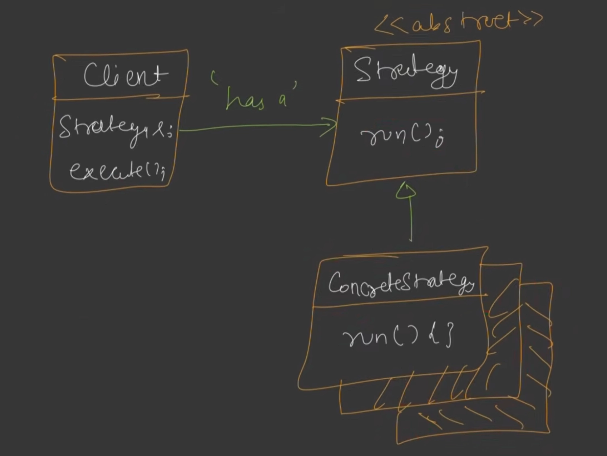

# Strategy Design Pattern

The **Strategy Design Pattern** is a behavioral design pattern that defines a family of algorithms, encapsulates each one, and makes them interchangeable. Strategy lets the algorithm vary independently from the clients that use it.

It promotes the core design principle: **Favor Composition over Inheritance**.

---

## The Diagram

Here is the architectural overview of the Strategy Pattern:



---

## Hello Interview Design Insights

In modern technical interviews, the Strategy Pattern is the most highly recommended tool to fix **Open-Closed Principle (OCP)** violations.

### 1. Identifying the Need (The OCP Smells)
You should apply the Strategy pattern when you see:
* **Massive `switch` or `if-else` blocks** matching strings or enums to execute different behaviors.
  - *Example*: `if (paymentType == "UPI") payWithUpi() else if (paymentType == "CARD") payWithCard()`. Adding a third method requires modifying this logic, violating OCP.
* **Brittle Subclassing**: Creating child classes just to slightly vary a single operation (e.g. `FastFlyingRobot`, `SilentTalkingRobot`). This leads to subclass explosion.

### 2. Integration with Dependency Injection (DI)
Instead of the client instantiating concrete strategies inside the context class:
1. Define the behaviors as interface references in your constructor.
2. Inject the concrete strategy object during context instantiation. This keeps the context class loosely coupled and highly testable (mockable).

---

## Implementation Example: Robot Behaviors (C++)

This example demonstrates composing a `Robot` with `WalkableRobot`, `TalkableRobot`, and `FlyableRobot` behaviors dynamically.

```cpp
#include <iostream>
#include <memory>

// ==========================================
// 1. STRATEGY INTERFACES & CONCRETE STRATEGIES
// ==========================================

class WalkableRobot {
public:
    virtual ~WalkableRobot() = default;
    virtual void walk() = 0;
};

class NormalWalk : public WalkableRobot {
public:
    void walk() override { 
        std::cout << "Walking normally on two legs..." << std::endl; 
    }
};

class NoWalk : public WalkableRobot {
public:
    void walk() override { 
        std::cout << "Cannot walk." << std::endl; 
    }
};

// --- Talk Strategy ---
class TalkableRobot {
public:
    virtual ~TalkableRobot() = default;
    virtual void talk() = 0;
};

class NormalTalk : public TalkableRobot {
public:
    void talk() override { 
        std::cout << "Talking normally..." << std::endl; 
    }
};

// ==========================================
// 2. CONTEXT CLASS WITH CONSTRUCTOR INJECTION
// ==========================================

class Robot {
protected:
    std::unique_ptr<WalkableRobot> walkBehavior;
    std::unique_ptr<TalkableRobot> talkBehavior;

public:
    // Dependency Injection via constructor
    Robot(std::unique_ptr<WalkableRobot> w, std::unique_ptr<TalkableRobot> t)
        : walkBehavior(std::move(w)), talkBehavior(std::move(t)) {}

    void performWalk() { walkBehavior->walk(); }
    void performTalk() { talkBehavior->talk(); }

    // Dynamic strategy updates at runtime
    void setWalkBehavior(std::unique_ptr<WalkableRobot> newWalk) {
        walkBehavior = std::move(newWalk);
    }
};

// Concrete Context
class CompanionRobot : public Robot {
public:
    CompanionRobot(std::unique_ptr<WalkableRobot> w, std::unique_ptr<TalkableRobot> t)
        : Robot(std::move(w), std::move(t)) {}
};

int main() {
    // Inject strategies on creation
    auto companion = std::make_unique<CompanionRobot>(
        std::make_unique<NormalWalk>(), 
        std::make_unique<NormalTalk>()
    );

    companion->performWalk();
    companion->performTalk();

    // Dynamically change behavior at runtime
    companion->setWalkBehavior(std::make_unique<NoWalk>());
    companion->performWalk();

    return 0;
}
```

---

## Pattern Comparison: Strategy vs. State vs. Factory

| Pattern | Primary Intent | Key Distinction |
| --- | --- | --- |
| **Strategy** | Encapsulate interchangeable algorithms/behaviors. | Client explicitly passes or changes strategies; strategies are usually independent of each other. |
| **State** | Modify behavior based on internal state changes. | State transitions happen internally in response to events; states often manage transitions between each other. |
| **Factory** | Handle object creation details. | Focuses on *creation* time decisions; Strategy focuses on *execution* time behaviors. |
