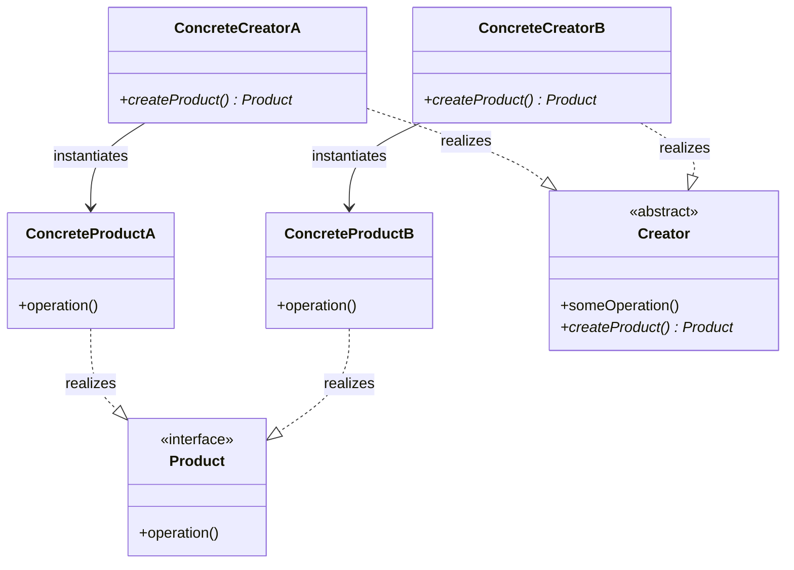

# Factory Design Pattern

The Factory pattern is a creational design pattern that abstracts the instantiation logic of objects. Decoupling client code from concrete types is achieved by delegating instantiation to a specialized creator entity.

---

## Core Architecture

Creational factory designs typically manifest in three distinct forms:

| Pattern Variant | Core Intent | Instantiation Mechanism | Flexibility Level |
| --- | --- | --- | --- |
| **Simple Factory** | Centralize creation logic in a single class | Static method with conditional branching | Low (violates OCP on adding new types) |
| **Factory Method** | Delegate instantiation to subclasses | Virtual creation methods overridden by derived creators | Medium (OCP compliant for new products) |
| **Abstract Factory** | Create families of related/dependent products | Polymorphic interfaces grouping multiple creation methods | High (ensures product suite compatibility) |

---

## UML Representation

Below is the structure of the **Factory Method** pattern:



---

## The Coupling Problem

* **Problem**: In a direct instantiation model, client code must import and instantiate concrete classes (e.g. `new InstantOrder()`, `new ScheduledOrder()`) directly.
* **Impact**: Adding a new product type requires modifying the client's routing or creation switch statements, violating the **Open/Closed Principle (OCP)**.
* **Solution**: The client interacts exclusively with the abstract `Order` product and abstract `OrderDispatcher` creator, shielding the client from concrete class modifications.

---

## C++ Implementation (Scheduled Order Dispatcher)

This implementation demonstrates a thread safe scheduled order dispatch system using the Factory Method pattern. It features robust dynamic allocation, custom exceptions, and registry synchronization.

```cpp
#include <iostream>
#include <memory>
#include <mutex>
#include <stdexcept>
#include <string>
#include <unordered_map>

using namespace std;

// Custom System Exception
class DispatchException : public runtime_error {
public:
    explicit DispatchException(const string& msg) : runtime_error(msg) {}
};

// Abstract Product
class Order {
protected:
    string orderId;
    double amount;

public:
    Order(string id, double amt) : orderId(id), amount(amt) {}
    virtual ~Order() = default;
    virtual void dispatch() = 0;
};

// Concrete Products
class InstantOrder : public Order {
public:
    InstantOrder(string id, double amt) : Order(id, amt) {}
    
    void dispatch() override {
        cout << "Dispatching Instant Order [" << orderId << "] for immediate delivery. Amount: " << amount << "\n";
    }
};

class ScheduledOrder : public Order {
private:
    string deliveryWindow;

public:
    ScheduledOrder(string id, double amt, string window) 
        : Order(id, amt), deliveryWindow(window) {}

    void dispatch() override {
        cout << "Dispatching Scheduled Order [" << orderId << "] for window: " 
             << deliveryWindow << ". Amount: " << amount << "\n";
    }
};

// Abstract Creator
class OrderDispatcher {
public:
    virtual ~OrderDispatcher() = default;
    
    // Factory Method
    virtual unique_ptr<Order> createOrder(string id, double amt) = 0;

    // Helper business logic leveraging the Factory Method
    void processAndDispatch(string id, double amt) {
        unique_ptr<Order> order = createOrder(id, amt);
        if (!order) {
            throw DispatchException("Order creation failed");
        }
        order->dispatch();
    }
};

// Concrete Creators
class InstantOrderDispatcher : public OrderDispatcher {
public:
    unique_ptr<Order> createOrder(string id, double amt) override {
        return make_unique<InstantOrder>(id, amt);
    }
};

class ScheduledOrderDispatcher : public OrderDispatcher {
private:
    string scheduleTimeWindow;

public:
    explicit ScheduledOrderDispatcher(string timeWindow) : scheduleTimeWindow(timeWindow) {}

    unique_ptr<Order> createOrder(string id, double amt) override {
        return make_unique<ScheduledOrder>(id, amt, scheduleTimeWindow);
    }
};

// Thread Safe Factory Registry
class DispatchRegistry {
private:
    unordered_map<string, shared_ptr<OrderDispatcher>> registry;
    mutable mutex registryMutex;

public:
    void registerDispatcher(const string& type, shared_ptr<OrderDispatcher> dispatcher) {
        lock_guard<mutex> lock(registryMutex);
        if (!dispatcher) {
            throw DispatchException("Cannot register null dispatcher");
        }
        registry[type] = dispatcher;
    }

    shared_ptr<OrderDispatcher> getDispatcher(const string& type) const {
        lock_guard<mutex> lock(registryMutex);
        auto it = registry.find(type);
        if (it == registry.end()) {
            throw DispatchException("Dispatcher type not registered: " + type);
        }
        return it->second;
    }
};

// Client Driver
int main() {
    try {
        auto registry = make_unique<DispatchRegistry>();

        // Register dispatchers
        registry->registerDispatcher("instant", make_shared<InstantOrderDispatcher>());
        registry->registerDispatcher("scheduled_evening", make_shared<ScheduledOrderDispatcher>("18:00 - 20:00"));

        // Client usage decoupling concrete product types
        cout << "--- Client Processing Instant Order ---\n";
        shared_ptr<OrderDispatcher> instantDispatcher = registry->getDispatcher("instant");
        instantDispatcher->processAndDispatch("ORD-101", 250.75);

        cout << "\n--- Client Processing Scheduled Order ---\n";
        shared_ptr<OrderDispatcher> scheduledDispatcher = registry->getDispatcher("scheduled_evening");
        scheduledDispatcher->processAndDispatch("ORD-102", 1200.00);

    } catch (const DispatchException& ex) {
        cerr << "Dispatch System Failure: " << ex.what() << "\n";
    }

    return 0;
}
```

---

## Concurrency & Design Considerations

* **Thread Safe Registry**: When stored in a global lookup registry (e.g. `DispatchRegistry`), access to the dispatchers map must be protected using standard synchronization primitives (`std::mutex` or `std::shared_mutex`).
* **Eager Initialization**: To avoid lock overhead, the registry can be populated eagerly at startup before spawning worker threads.
* **Factory Caching / Object Pooling**: For expensive products (like database connection adapters or network sockets), the concrete factory can encapsulate a thread safe object pool to recycle instances, minimizing memory churn.

---

## Design Tradeoffs

### Advantages & SOLID Alignment
* **OCP Compliance**: Introducing a new product variant only requires adding a new creator class, leaving the client and existing dispatchers unchanged.
* **SRP Alignment**: Separates execution orchestration rules from concrete class construction mechanics.

### Drawbacks
* **Class Proliferation**: Defining a new product type requires creating both the product class and a corresponding creator class, doubling class counts.