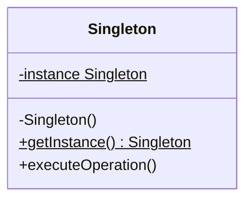

# Singleton Design Pattern

The Singleton pattern is a creational design pattern that ensures a class has only one instance and provides a global point of access to that instance. It is typically applied to coordinate shared resources, such as database connection pools, thread pools, or configuration registries.

---

## Core Architecture

The static structure locks down instantiation. The constructor and assignment operators are made private, and access is routed exclusively through a static method returning a reference or pointer to the single instance.

| Participant | Responsibility |
| --- | --- |
| **Singleton** | Restricts constructor access, maintains the single instance reference, and exposes `getInstance()`. |
| **Client** | Queries the singleton instance using the global access point. |

---

## UML Representation



---

## The Coupling Problem

* **Problem**: Hardcoding class accessor calls like `DatabaseConnectionPool::getInstance().query()` binds consumers directly to concrete classes.
* **Impact**: Unit testing becomes difficult since the database layer cannot be mocked. Global state leaks across test suites, causing flaky results and test ordering dependencies.
* **Solution**: Rely on Dependency Injection (DI) to pass the single instance into constructors, keeping callers decoupled and mockable.

---

## C++ Implementation (Database Connection Pool)

This implementation demonstrates a thread safe Database Connection Pool. It provides both Meyers' Singleton (modern C++ default) and a Double Checked Locking implementation with explicit acquire/release memory barriers for pre-C++11 compatibility or low level memory control.

```cpp
#include <iostream>
#include <mutex>
#include <atomic>
#include <string>
#include <memory>

using namespace std;

// Custom System Exception
class SingletonException : public runtime_error {
public:
    explicit SingletonException(const string& msg) : runtime_error(msg) {}
};

// ==========================================
// 1. MEYERS' SINGLETON (Modern C++ Best Practice)
// ==========================================
class MeyersDatabasePool {
private:
    int activeConnections;

    MeyersDatabasePool() : activeConnections(0) {
        cout << "Meyers Connection Pool initialized.\n";
    }

public:
    MeyersDatabasePool(const MeyersDatabasePool&) = delete;
    MeyersDatabasePool& operator=(const MeyersDatabasePool&) = delete;

    static MeyersDatabasePool& getInstance() {
        // Guarded by compiler-generated thread safe initialization (C++11 onward)
        static MeyersDatabasePool instance;
        return instance;
    }

    void executeQuery(const string& query) {
        cout << "Executing query via Meyers Pool: " << query << "\n";
    }
};

// ==========================================
// 2. DOUBLE CHECKED LOCKING SINGLETON (Acquire-Release Memory Model)
// ==========================================
class DoubleCheckedDatabasePool {
private:
    static atomic<DoubleCheckedDatabasePool*> instance;
    static mutex lockMutex;
    int activeConnections;

    DoubleCheckedDatabasePool() : activeConnections(0) {
        cout << "Double Checked Connection Pool initialized.\n";
    }

public:
    DoubleCheckedDatabasePool(const DoubleCheckedDatabasePool&) = delete;
    DoubleCheckedDatabasePool& operator=(const DoubleCheckedDatabasePool&) = delete;

    static DoubleCheckedDatabasePool* getInstance() {
        // First read uses acquire semantics to ensure we see all prior writes
        DoubleCheckedDatabasePool* temp = instance.load(memory_order_acquire);
        if (temp == nullptr) {
            lock_guard<mutex> lock(lockMutex);
            temp = instance.load(memory_order_relaxed);
            if (temp == nullptr) {
                temp = new DoubleCheckedDatabasePool();
                // Store uses release semantics to ensure object construction is fully visible
                instance.store(temp, memory_order_release);
            }
        }
        return temp;
    }

    void executeQuery(const string& query) {
        cout << "Executing query via Double Checked Pool: " << query << "\n";
    }
};

// Static members initialization
atomic<DoubleCheckedDatabasePool*> DoubleCheckedDatabasePool::instance(nullptr);
mutex DoubleCheckedDatabasePool::lockMutex;

// Client Driver
int main() {
    cout << "--- Meyers Singleton Demonstration ---\n";
    MeyersDatabasePool& pool1 = MeyersDatabasePool::getInstance();
    pool1.executeQuery("SELECT * FROM users");

    cout << "\n--- Double Checked Locking Demonstration ---\n";
    DoubleCheckedDatabasePool* pool2 = DoubleCheckedDatabasePool::getInstance();
    pool2->executeQuery("INSERT INTO logs VALUES ('info')");

    return 0;
}
```

---

## Concurrency & Design Considerations

To prevent dynamic instantiations from crashing under concurrent conditions, we use `std::atomic` with acquire/release memory barriers:
* **The CPU Reordering Issue**: Compilers or CPUs can reorder the steps of object creation (allocating memory, running the constructor, and setting the pointer address), making a partially initialized object visible to other threads.
* **Release Semantics (`memory_order_release`)**: Guarantees that preceding writes (constructor execution) are finalized and visible before the pointer address is stored in memory.
* **Acquire Semantics (`memory_order_acquire`)**: Guarantees that subsequent read operations cannot run before the pointer load, ensuring the calling thread reads the fully initialized state of the object.

---

## Design Tradeoffs

### Advantages
* **Unified Control**: Guarantees a single instance, preventing duplicate connections and resource conflicts.
* **Lazy Loading**: Delays allocation overhead until the object is actually requested by the client.

### Drawbacks & SOLID Violations

| Area | Impact | Mitigation |
| --- | --- | --- |
| **SRP Violation** | Class manages both its core logic and its own lifecycle. | Decouple lifetime orchestration to a Dependency Injection container. |
| **State Pollution** | Hidden global state makes APIs misleading and leaks data between tests. | Inject the shared instance as a constructor dependency. |
| **Mocking Limits** | Concrete static accessors cannot be substituted with mock objects. | Have the singleton implement an interface and pass an interface reference. |