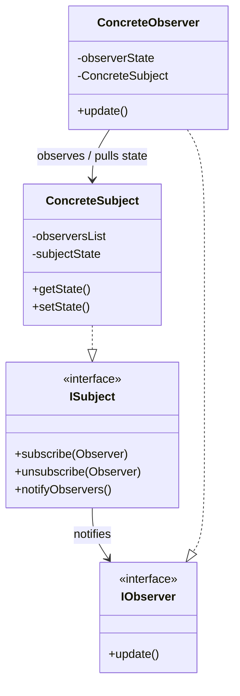

# Observer Design Pattern

The **Observer Pattern** is a behavioral design pattern that defines a **one-to-many dependency** between objects. When one object (the **Subject**) changes state, all its dependents (the **Observers**) are notified and updated automatically.

This pattern is the foundation of **event-driven programming** and is widely used to achieve **loose coupling** between components.

---

## Core Architecture



---

## Hello Interview Design Insights

In high-performance LLD interview scenarios, simply iterating over a list of observers in a single thread is insufficient. You should address two critical system issues:

### 1. Thread-Safe Subscriptions
If multiple threads are subscribing and unsubscribing concurrently (e.g. users opening and closing stock screens), the observer collection inside the Subject will experience race conditions. 
- You must protect the observers collection with a lock (`std::mutex` or `std::shared_mutex`) during `subscribe()`, `unsubscribe()`, and `notifyObservers()` calls.

### 2. The Slow Observer Problem (Asynchronous Notification Pool)
If the Subject notifies observers synchronously in a single thread, and one observer performs a slow operation (e.g. disk I/O, network call, heavy computation) inside its `update()` method:
- The entire subject execution thread will **block**, stalling notifications to all subsequent observers.
- **Solution**: Push the notification events to a thread pool or queue. The subject thread immediately returns, while worker threads notify observers asynchronously.

---

## Thread-Safe Implementation (C++)

This C++ implementation implements thread-safe subscription and highlights where asynchronous worker execution would plug in.

```cpp
#include <iostream>
#include <vector>
#include <string>
#include <mutex>
#include <algorithm>
#include <thread>
#include <future>

// Observer Interface
class ISubscriber {
public:
    virtual ~ISubscriber() = default;
    virtual void update(const std::string& videoTitle) = 0;
};

// Concrete Subject (Thread-Safe)
class Channel {
private:
    std::vector<ISubscriber*> subscribers;
    std::string name;
    std::mutex channelMutex; // Protects subscribers list from concurrent changes

public:
    Channel(const std::string& name) : name(name) {}

    void subscribe(ISubscriber* subscriber) {
        std::lock_guard<std::mutex> lock(channelMutex); // Lock for writing
        if (std::find(subscribers.begin(), subscribers.end(), subscriber) == subscribers.end()) {
            subscribers.push_back(subscriber);
        }
    }

    void unsubscribe(ISubscriber* subscriber) {
        std::lock_guard<std::mutex> lock(channelMutex); // Lock for writing
        auto it = std::find(subscribers.begin(), subscribers.end(), subscriber);
        if (it != subscribers.end()) {
            subscribers.erase(it);
        }
    }

    void uploadVideo(const std::string& title) {
        std::cout << "\n[" << name << " uploaded \"" << title << "\"]" << std::endl;

        // Take a local snapshot of observers to minimize locking duration
        std::vector<ISubscriber*> subscribersSnapshot;
        {
            std::lock_guard<std::mutex> lock(channelMutex);
            subscribersSnapshot = subscribers;
        }

        // Notify observers asynchronously (Slow Observer Mitigation)
        for (ISubscriber* sub : subscribersSnapshot) {
            // Run notifications in separate threads (or dispatch to thread pool)
            std::thread([sub, title]() {
                sub->update(title);
            }).detach();
        }
    }
};

// Concrete Observer
class Subscriber : public ISubscriber {
private:
    std::string name;

public:
    Subscriber(const std::string& name) : name(name) {}

    void update(const std::string& videoTitle) override {
        // Simulate a slow notification process (e.g. sending SMS)
        std::this_thread::sleep_for(std::chrono::milliseconds(50));
        std::cout << "Notification delivered to " << name << " for video: " << videoTitle << std::endl;
    }
};

int main() {
    Channel channel("CoderArmy");

    Subscriber subs1("Varun");
    Subscriber subs2("Tarun");

    channel.subscribe(&subs1);
    channel.subscribe(&subs2);

    channel.uploadVideo("Thread-Safe Observer Pattern Tutorial");

    // Sleep briefly to let detached threads finish writing to stdout
    std::this_thread::sleep_for(std::chrono::milliseconds(200));

    return 0;
}
```

---

## The Lapsed Listener Problem (Memory Leaks)

The Observer pattern can lead to memory leaks if not managed carefully:
* A Subject holds references to its Observers. If an observer goes out of scope but fails to call `unsubscribe()`, the subject maintains a dangling reference to it.
* In garbage-collected languages (Java, C#), the garbage collector cannot clean up the observer because the subject still points to it. This is called the **Lapsed Listener Problem**.
* **Mitigation**: Instruct observers to unsubscribe in their destructors, or store weak references (`std::weak_ptr` in C++) inside the subject to check if observers are still alive before notifying.