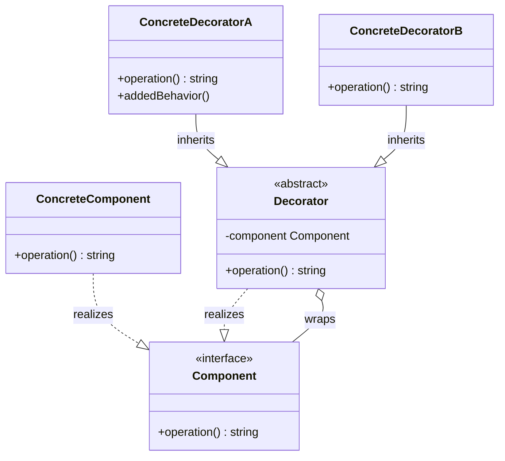

# Decorator Design Pattern

The Decorator pattern is a structural design pattern that allows attaching new behaviors to objects dynamically by placing them inside special wrapper objects that contain these behaviors. It provides a flexible alternative to subclassing for extending functionality.

---

## Core Architecture

The Decorator pattern establishes a wrapper chain. The decorator class **is a** Component (implements the interface) and **has a** Component (aggregates a reference to a wrapped component).

| Participant | Responsibility |
| --- | --- |
| **Component** | Defines the interface for objects that can have responsibilities added to them dynamically. |
| **ConcreteComponent** | Defines an object to which additional responsibilities can be attached. |
| **Decorator** | Maintains a reference to a Component object and defines an interface that conforms to Component's interface. |
| **ConcreteDecorator** | Adds responsibilities to the component. |

---

## UML Representation



---

## The Subclass Explosion Problem

* **Problem**: Extending a database client using static inheritance to support various combinations of caching, query logging, and encryption causes a combinatorial class growth:
  - `LoggingSqlDatabase`, `CachingSqlDatabase`, `LoggingCachingSqlDatabase`, etc.
* **Impact**: Rapid subclass explosion and massive code duplication.
* **Solution**: Compose a stack of wrappers dynamically at runtime (e.g. wrapping a `SqlDatabase` in a `CachingDatabase`, which is then wrapped in a `LoggingDatabase`).

---

## C++ Implementation (Database Client Wrappers)

This C++ implementation demonstrates a database query execution pipeline wrapped with caching and logging behaviors using modern memory management.

```cpp
#include <iostream>
#include <string>
#include <unordered_map>
#include <memory>
#include <utility>

using namespace std;

// Component Interface
class Database {
public:
    virtual ~Database() = default;
    virtual string readData(const string& key) = 0;
};

// Concrete Component
class SqlDatabase : public Database {
public:
    string readData(const string& key) override {
        cout << "-> Executing raw SQL query to fetch: " << key << "\n";
        return "ValueFor_" + key;
    }
};

// Base Decorator (Is A & Has A)
class DatabaseDecorator : public Database {
protected:
    unique_ptr<Database> wrappedDatabase; // Has A ownership delegation

public:
    explicit DatabaseDecorator(unique_ptr<Database> db) 
        : wrappedDatabase(move(db)) {}
};

// Concrete Decorator - Logging
class LoggingDatabase : public DatabaseDecorator {
public:
    explicit LoggingDatabase(unique_ptr<Database> db) : DatabaseDecorator(move(db)) {}
    
    string readData(const string& key) override {
        cout << "[LOG] Initiating read operation for key: " << key << "\n";
        string result = wrappedDatabase->readData(key);
        cout << "[LOG] Read operation finished.\n";
        return result;
    }
};

// Concrete Decorator - Caching
class CachingDatabase : public DatabaseDecorator {
private:
    unordered_map<string, string> cache;

public:
    explicit CachingDatabase(unique_ptr<Database> db) : DatabaseDecorator(move(db)) {}
    
    string readData(const string& key) override {
        auto it = cache.find(key);
        if (it != cache.end()) {
            cout << "[CACHE] Hit! Returning cached result for key: " << key << "\n";
            return it->second;
        }
        
        cout << "[CACHE] Miss. Delegating downstream...\n";
        string result = wrappedDatabase->readData(key);
        cache[key] = result; // Write to cache
        return result;
    }
};

// Client Flow
int main() {
    // 1. Create base DB client
    unique_ptr<Database> db = make_unique<SqlDatabase>();

    // 2. Add Caching behavior
    db = make_unique<CachingDatabase>(move(db));

    // 3. Add Logging behavior
    db = make_unique<LoggingDatabase>(move(db));

    // First request - Cache Miss -> SQL execution
    cout << "--- First Query ---\n";
    string data1 = db->readData("user_101");
    cout << "Data: " << data1 << "\n";

    // Second request - Cache Hit -> No SQL execution
    cout << "\n--- Second Query (Duplicate) ---\n";
    string data2 = db->readData("user_101");
    cout << "Data: " << data2 << "\n";

    return 0;
}
```

---

## Concurrency & Design Considerations

* **Pipeline Thread Safety**: If the wrapped component or decorators maintain mutable state (such as the cache map in `CachingDatabase`), access must be protected using standard locks (`std::mutex` or `std::shared_mutex`).
* **Stateless Decorators**: If components are entirely stateless behavioral extensions, the pipeline is thread safe by default and needs no synchronization locks.

### Strategy vs. Decorator Comparison

| Dimension | Strategy Pattern | Decorator Pattern |
| --- | --- | --- |
| **Primary Intent** | Encapsulate and swap core internal logic or algorithms. | Dynamically add accessory layers around an object transparently. |
| **Object Awareness** | Context class holds and explicitly calls a reference to the strategy. | The wrapped class is completely unaware of the decorators wrapping it. |
| **Relationship** | Typically a one to one mapping (Context has a Strategy). | Nested wrapper chains where each decorator aggregates and delegates. |
| **Typical Use Cases** | Payment processing (UPI vs Card), sorting algorithms, routing logic. | Cross cutting concerns like logging, encryption, metrics, and caching. |

---

## Design Tradeoffs

### Advantages & SOLID Alignment
* **SRP Alignment**: Segregates individual concerns (caching, logging) into separate wrapper classes.
* **Extensibility**: Allows nesting and combining multiple independent behaviors dynamically at runtime.

### Drawbacks
* **Removal Complexity**: Once nested, it is difficult to inspect or remove a specific decorator from deep within a wrapper chain.
* **Debugging Indirection**: Call tracing and debugging become complex due to deep delegation call stacks passing through multiple wrappers.
