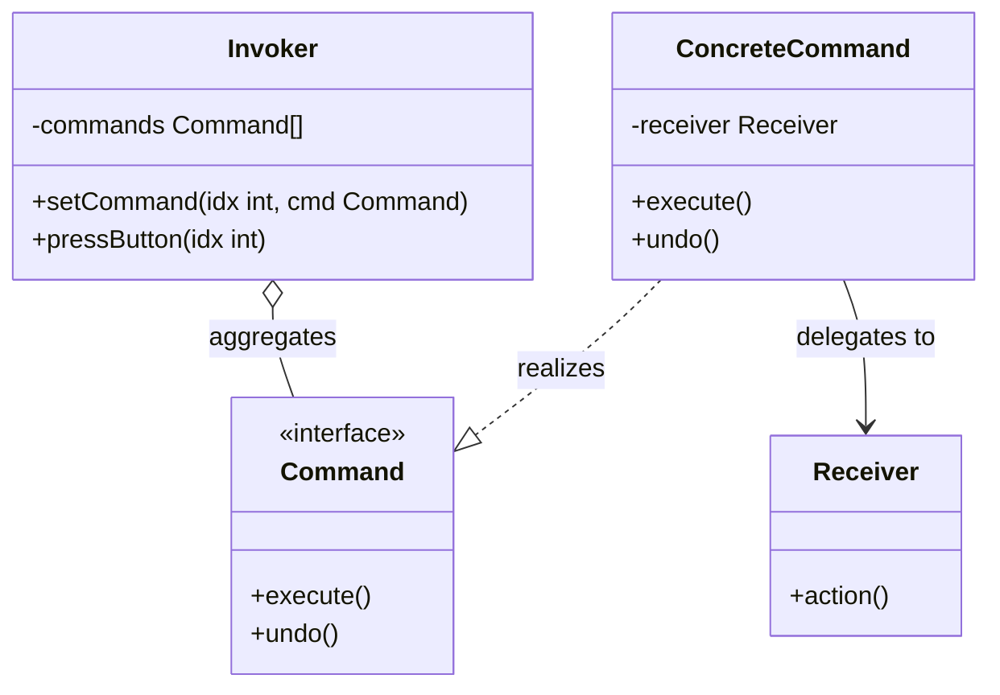

# Command Design Pattern

The Command pattern is a behavioral design pattern that encapsulates a request as an object, thereby letting you parameterize clients with different requests, queue or log requests, and support undoable operations. By turning a request into a standalone object, it decouples the object that invokes the operation from the one that actually knows how to perform it.

---

## Core Architecture

The static class hierarchy decouples request emission from execution. The invoker depends exclusively on the Command interface, isolating it from concrete receiver implementations.

| Participant | Responsibility |
| --- | --- |
| **Command** | Declares the execution contract, exposing `execute()` and `undo()`. |
| **ConcreteCommand** | Binds a specific set of operations on the Receiver and stores state for undoing. |
| **Receiver** | Performs the actual operations (e.g., Light, Fan). |
| **Invoker** | Coordinates execution timing and triggers the command. |
| **Client** | Instantiates receivers and concrete commands, and registers them with the invoker. |

---

## UML Representation



---

## The Coupling Problem

* **Problem**: In a direct invocation model, the object triggering an action (e.g., a remote controller) must maintain direct references to concrete appliances and call their specific methods (like `fan->speedUp()`).
* **Impact**: Adding a new appliance type or modifying method signatures requires modifying the remote controller class, violating the **Open/Closed Principle (OCP)**. Queueing, scheduling, or tracking state for multi step undo/redo buffers becomes messy.
* **Solution**: Wrap requests inside unified command objects. The invoker only calls `execute()` or `undo()` on the `Command` interface, decoupling the remote from appliance details.

---

## C++ Implementation (Smart Home Automation System)

This implementation demonstrates a thread safe remote controller invoking home automation commands, demonstrating safe memory management, custom exceptions, and scoped locking.

```cpp
#include <iostream>
#include <memory>
#include <mutex>
#include <stdexcept>
#include <string>

using namespace std;

// Custom System Exception
class CommandException : public runtime_error {
public:
    explicit CommandException(const string& msg) : runtime_error(msg) {}
};

// Receivers
class Light {
public:
    void on() { cout << "Light is ON\n"; }
    void off() { cout << "Light is OFF\n"; }
};

class Fan {
public:
    void on() { cout << "Fan is ON\n"; }
    void off() { cout << "Fan is OFF\n"; }
};

// Command Interface
class Command {
public:
    virtual ~Command() = default;
    virtual void execute() = 0;
    virtual void undo() = 0;
};

// Concrete Commands
class LightCommand : public Command {
private:
    shared_ptr<Light> light;
public:
    explicit LightCommand(shared_ptr<Light> l) : light(l) {
        if (!light) throw CommandException("Null light receiver");
    }
    void execute() override { light->on(); }
    void undo() override { light->off(); }
};

class FanCommand : public Command {
private:
    shared_ptr<Fan> fan;
public:
    explicit FanCommand(shared_ptr<Fan> f) : fan(f) {
        if (!fan) throw CommandException("Null fan receiver");
    }
    void execute() override { fan->on(); }
    void undo() override { fan->off(); }
};

// Invoker
class RemoteController {
private:
    static const int numButtons = 4;
    shared_ptr<Command> buttons[numButtons];
    bool buttonPressed[numButtons];
    mutable mutex controllerMutex;

public:
    RemoteController() {
        for (int i = 0; i < numButtons; i++) {
            buttons[i] = nullptr;
            buttonPressed[i] = false;
        }
    }

    void setCommand(int idx, shared_ptr<Command> cmd) {
        lock_guard<mutex> lock(controllerMutex);
        if (idx < 0 || idx >= numButtons) {
            throw CommandException("Button index out of range");
        }
        buttons[idx] = cmd;
        buttonPressed[idx] = false;
    }

    void pressButton(int idx) {
        shared_ptr<Command> cmd;
        bool state;

        {
            lock_guard<mutex> lock(controllerMutex);
            if (idx < 0 || idx >= numButtons) {
                throw CommandException("Button index out of range");
            }
            cmd = buttons[idx];
            if (!cmd) {
                throw CommandException("No command assigned at button");
            }
            state = buttonPressed[idx];
            buttonPressed[idx] = !buttonPressed[idx];
        }

        if (!state) cmd->execute();
        else cmd->undo();
    }
};

// Client Driver
int main() {
    try {
        auto light = make_shared<Light>();
        auto fan = make_shared<Fan>();
        auto remote = make_unique<RemoteController>();

        remote->setCommand(0, make_shared<LightCommand>(light));
        remote->setCommand(1, make_shared<FanCommand>(fan));

        remote->pressButton(0); // Light ON
        remote->pressButton(0); // Light OFF
        remote->pressButton(1); // Fan ON
        remote->pressButton(2); // Throws exception

    } catch (const CommandException& ex) {
        cerr << "Error: " << ex.what() << endl;
    }
    return 0;
}
```

---

## Concurrency & Design Considerations

* **Synchronizing Access**: Mutexes protect the button registries and active toggle flags against race conditions from concurrent execution and configuration threads.
* **Executing Outside Locks**: The call to `Command::execute()` or `Command::undo()` runs **outside the mutex lock**.
* **Avoiding Stalls**: Smart home commands often execute slow network requests (WiFi communication). Copying the pointer under lock and executing it outside prevents blocking the remote controller's registration threads.

---

## Design Tradeoffs

### Advantages & SOLID Alignment
* **OCP Compliance**: You can add new command subclasses (e.g. `ThermostatCommand`) without modifying the invoker or existing commands.
* **SRP Alignment**: Segregates request triggering logic (Invoker), request parameter binding (Command), and core execution logic (Receiver).

### Drawbacks
* **Subclass Proliferation**: Every unique command behavior requires a separate class definition, leading to class explosion.
* **Call Indirection**: Introduces additional execution layers, which can complicate debugging trace logs.
