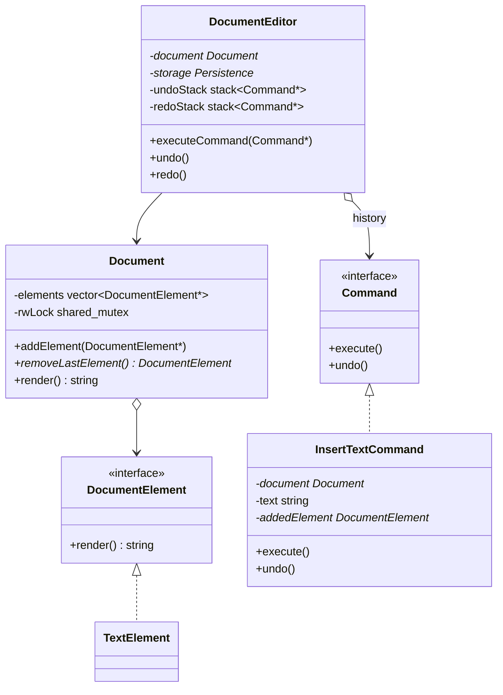

# Notepad (Document Editor) LLD

This project details the low-level design of a standard **Notepad / Document Editor**. To align with **Hello Interview**'s expectations, this design addresses core system concerns: **concurrency (thread safety)** and **runtime action history (Undo/Redo)**.

---

## The Diagram

Below is the conceptual diagram for the document editor structure:


---

## 1. System Requirements

### Primary Capabilities
- **Rich Document Content**: Support adding text chunks, line breaks, tab indents, and images (Composite Pattern).
- **Concurrency (Thread Safety)**: Support multiple reader threads rendering the document concurrently while ensuring write actions (inserting/deleting elements) are mutually exclusive (Read-Write Lock).
- **History Tracking (Undo/Redo)**: Allow users to undo and redo document modifications (Command Pattern).
- **Flexible Storage**: Support saving the rendered document to different storage mediums (Strategy Pattern).

### Out of Scope
- Rich text styling rendering (HTML/CSS parsing).
- Collaborative OT (Operational Transformation) conflict resolution engines.

---

## 2. Core Entities & Class Design



---

## 3. C++ Implementation (Thread-Safe with Undo/Redo)

Below is the full C++ implementation using standard synchronization primitives (`std::shared_mutex` for read-write locking) and the Command pattern.

```cpp
#include <iostream>
#include <vector>
#include <string>
#include <stack>
#include <mutex>
#include <shared_mutex>
#include <fstream>

// ==========================================
// 1. COMPOSITE PATTERN - DOCUMENT ELEMENTS
// ==========================================

class DocumentElement {
public:
    virtual ~DocumentElement() = default;
    virtual std::string render() = 0;
};

class TextElement : public DocumentElement {
private:
    std::string text;
public:
    TextElement(std::string text) : text(text) {}
    std::string render() override { return text; }
};

class ImageElement : public DocumentElement {
private:
    std::string imagePath;
public:
    ImageElement(std::string imagePath) : imagePath(imagePath) {}
    std::string render() override { return "[Image: " + imagePath + "]"; }
};

// ==========================================
// 2. CONCURRENT DOCUMENT CONTAINER (THREAD-SAFE)
// ==========================================

class Document {
private:
    std::vector<DocumentElement*> elements;
    mutable std::shared_mutex rwLock; // Read-Write Lock for concurrency

public:
    ~Document() {
        std::unique_lock<std::shared_mutex> lock(rwLock);
        for (auto el : elements) delete el;
    }

    void addElement(DocumentElement* element) {
        std::unique_lock<std::shared_mutex> lock(rwLock); // Exclusive Lock (Writer)
        elements.push_back(element);
    }

    DocumentElement* removeLastElement() {
        std::unique_lock<std::shared_mutex> lock(rwLock); // Exclusive Lock (Writer)
        if (elements.empty()) return nullptr;
        DocumentElement* el = elements.back();
        elements.pop_back();
        return el; // Return ownership back to the caller
    }

    std::string render() const {
        std::shared_lock<std::shared_mutex> lock(rwLock); // Shared Lock (Reader)
        std::string result;
        for (const auto el : elements) {
            result += el->render();
        }
        return result;
    }
};

// ==========================================
// 3. COMMAND PATTERN - HISTORY MANAGEMENT (UNDO/REDO)
// ==========================================

class Command {
public:
    virtual ~Command() = default;
    virtual void execute() = 0;
    virtual void undo() = 0;
};

class InsertTextCommand : public Command {
private:
    Document* document;
    std::string text;
    DocumentElement* addedElement;

public:
    InsertTextCommand(Document* doc, std::string txt)
        : document(doc), text(txt), addedElement(nullptr) {}

    ~InsertTextCommand() {
        // If the command is undone and not redone, delete the orphaned element
        if (addedElement != nullptr) {
            delete addedElement;
        }
    }

    void execute() override {
        addedElement = new TextElement(text);
        document->addElement(addedElement);
    }

    void undo() override {
        DocumentElement* removed = document->removeLastElement();
        if (removed != addedElement) {
            std::cerr << "Error: History state mismatch during undo!" << std::endl;
        }
    }
};

// ==========================================
// 4. STRATEGY PATTERN - PERSISTENCE
// ==========================================

class Persistence {
public:
    virtual ~Persistence() = default;
    virtual void save(std::string data) = 0;
};

class FileStorage : public Persistence {
public:
    void save(std::string data) override {
        std::ofstream file("document.txt");
        if (file) {
            file << data;
            file.close();
            std::cout << "Saved to document.txt." << std::endl;
        }
    }
};

// ==========================================
// 5. ORCHESTRATOR - DOCUMENT EDITOR
// ==========================================

class DocumentEditor {
private:
    Document* document;
    Persistence* storage;
    std::stack<Command*> undoStack;
    std::stack<Command*> redoStack;
    std::mutex commandLock; // Lock to protect history stacks

    void clearRedoStack() {
        while (!redoStack.empty()) {
            delete redoStack.top();
            redoStack.pop();
        }
    }

public:
    DocumentEditor(Document* doc, Persistence* store)
        : document(doc), storage(store) {}

    ~DocumentEditor() {
        clearRedoStack();
        while (!undoStack.empty()) {
            delete undoStack.top();
            undoStack.pop();
        }
    }

    void executeCommand(Command* cmd) {
        std::lock_guard<std::mutex> lock(commandLock);
        cmd->execute();
        undoStack.push(cmd);
        clearRedoStack(); // Clear redo actions on new modification
    }

    void undo() {
        std::lock_guard<std::mutex> lock(commandLock);
        if (undoStack.empty()) {
            std::cout << "Nothing to Undo!" << std::endl;
            return;
        }
        Command* cmd = undoStack.top();
        undoStack.pop();
        cmd->undo();
        redoStack.push(cmd);
        std::cout << "Undo operation successful." << std::endl;
    }

    void redo() {
        std::lock_guard<std::mutex> lock(commandLock);
        if (redoStack.empty()) {
            std::cout << "Nothing to Redo!" << std::endl;
            return;
        }
        Command* cmd = redoStack.top();
        redoStack.pop();
        cmd->execute();
        undoStack.push(cmd);
        std::cout << "Redo operation successful." << std::endl;
    }

    void render() {
        std::cout << "\n[Current Document Render]:\n" << document->render() << "\n" << std::endl;
    }

    void save() {
        storage->save(document->render());
    }
};

// ==========================================
// 6. CLIENT FLOW
// ==========================================

int main() {
    Document* doc = new Document();
    Persistence* fileStore = new FileStorage();
    DocumentEditor* editor = new DocumentEditor(doc, fileStore);

    // Simulate user editing
    editor->executeCommand(new InsertTextCommand(doc, "Hello "));
    editor->executeCommand(new InsertTextCommand(doc, "World!"));
    editor->render(); // Output: Hello World!

    // Undo action
    editor->undo();
    editor->render(); // Output: Hello 

    // Redo action
    editor->redo();
    editor->render(); // Output: Hello World!

    editor->save();

    delete editor;
    delete fileStore;
    delete doc;
    return 0;
}
```

---

## 4. Architectural Highlights & Concurrency Analysis

### 1. Read-Write Locking for High Reader Throughput
In real-world document editors, **reading/rendering** is highly frequent compared to **writing** (inserting text). 
- Using standard mutex locking (`std::mutex`) blocks readers while other readers are active, causing serious bottlenecks.
- This design utilizes **`std::shared_mutex`**. Multiple readers can render the document simultaneously by acquiring a **shared lock** (`std::shared_lock`). Only writers modifying elements require an **exclusive lock** (`std::unique_lock`), preventing race conditions.

### 2. Command Pattern vs. Simple State Snapshots
We track history using the Command Pattern instead of taking full document snapshots:
* **Memory Efficiency**: Storing the exact inverse delta operation (e.g. deleting the added text element on undo) is vastly more efficient than storing the entire document string hierarchy at every step.
* **Separation of Concerns**: The command objects inherit from a common `Command` interface, meaning new formatting commands (such as changing font colors, adding sections) can be plugged in without modifying the `DocumentEditor` logic.
