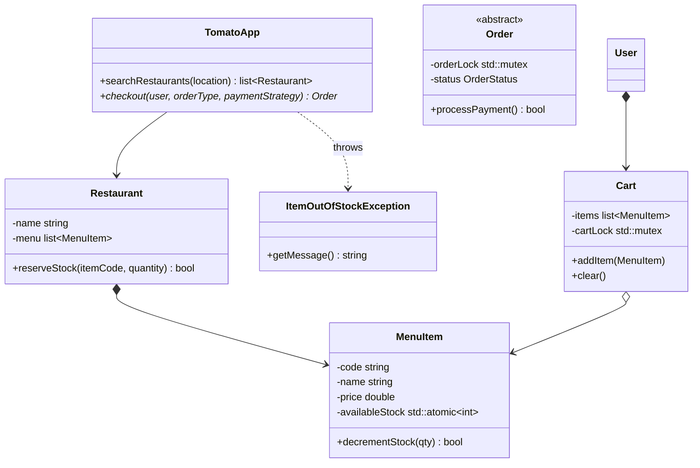

# Zomato (Food Delivery System) LLD

This project designs a low-level food delivery application (similar to Zomato, Swiggy, or DoorDash). In sync with **Hello Interview** guidelines, we focus heavily on **concurrency control (atomic inventory/item stock checks)**, **thread-safe user state (Cart modifications)**, and **expressive API exception handling**.

---

## The Diagram

Below is the conceptual diagram representing the flow and dependencies of the system:


---

## 1. System Requirements

### Functional Requirements
1. **Browse Restaurants**: Query restaurants by location.
2. **Cart Management**: Add/remove menu items in a thread-safe cart.
3. **Checkout Flow**: Place pickup or delivery orders immediate (now) or scheduled (Factory Pattern).
4. **Atomic Inventory Check**: Prevent double-selling. If two users concurrently order the last remaining portion of a dish, only one must succeed, and the other must get an error.
5. **Payment Processing**: Process payments dynamically (Strategy Pattern).
6. **Alert Notifications**: Dispatch notifications after order completion.

### Out of Scope
* GPS driver tracking algorithms.
* Microservices service discovery or network protocols.

---

## 2. Core Entities & Class Design



---

## 3. C++ Implementation (Thread-Safe & Exception-Safe)

Below is the robust C++ implementation demonstrating concurrency control during item stock updates and cart modifications.

```cpp
#include <iostream>
#include <vector>
#include <string>
#include <mutex>
#include <atomic>
#include <stdexcept>

// ==========================================
// 1. EXCEPTIONS DEFINITION (EXPRESSIVE APIS)
// ==========================================

class ItemOutOfStockException : public std::runtime_error {
public:
    ItemOutOfStockException(const std::string& itemCode)
        : std::runtime_error("Item with code " + itemCode + " is out of stock.") {}
};

class PaymentFailedException : public std::runtime_error {
public:
    PaymentFailedException(const std::string& msg)
        : std::runtime_error("Payment Failed: " + msg) {}
};

// ==========================================
// 2. DOMAIN MODELS
// ==========================================

class MenuItem {
private:
    std::string code;
    std::string name;
    double price;
    std::atomic<int> availableStock; // Atomic thread-safe stock tracking

public:
    MenuItem(std::string code, std::string name, double price, int initialStock)
        : code(code), name(name), price(price), availableStock(initialStock) {}

    std::string getCode() const { return code; }
    std::string getName() const { return name; }
    double getPrice() const { return price; }
    int getStock() const { return availableStock.load(); }

    // Atomic Stock Reservation (Hello Interview Concurrency Standard)
    bool reserveStock(int quantity) {
        int currentStock = availableStock.load();
        while (currentStock >= quantity) {
            // Atomically swap the new decremented value if currentStock matches what we loaded
            if (availableStock.compare_exchange_weak(currentStock, currentStock - quantity)) {
                return true; // Reservation succeeded atomically
            }
            // If exchange failed (another thread changed it), currentStock is updated automatically, loop retries
        }
        return false; // Out of stock
    }

    void releaseStock(int quantity) {
        availableStock += quantity; // Atomic increment
    }
};

class Restaurant {
private:
    std::string name;
    std::string location;
    std::vector<MenuItem*> menu;

public:
    Restaurant(std::string name, std::string loc) : name(name), location(loc) {}
    
    std::string getName() const { return name; }
    std::string getLocation() const { return location; }
    std::vector<MenuItem*> getMenu() const { return menu; }

    void addMenuItem(MenuItem* item) {
        menu.push_back(item);
    }
};

// ==========================================
// 3. THREAD-SAFE CART MANAGEMENT
// ==========================================

class Cart {
private:
    Restaurant* selectedRestaurant;
    std::vector<MenuItem*> items;
    std::mutex cartLock; // Mutex protecting cart state for concurrent edits

public:
    Cart() : selectedRestaurant(nullptr) {}

    void setRestaurant(Restaurant* restaurant) {
        std::lock_guard<std::mutex> lock(cartLock);
        if (selectedRestaurant != restaurant) {
            selectedRestaurant = restaurant;
            items.clear(); // Clear previous restaurant items
        }
    }

    void addItem(MenuItem* item) {
        std::lock_guard<std::mutex> lock(cartLock);
        items.push_back(item);
    }

    std::vector<MenuItem*> getItems() {
        std::lock_guard<std::mutex> lock(cartLock);
        return items;
    }

    Restaurant* getRestaurant() {
        std::lock_guard<std::mutex> lock(cartLock);
        return selectedRestaurant;
    }

    double getTotalCost() {
        std::lock_guard<std::mutex> lock(cartLock);
        double total = 0;
        for (auto item : items) {
            total += item->getPrice();
        }
        return total;
    }

    void clear() {
        std::lock_guard<std::mutex> lock(cartLock);
        items.clear();
        selectedRestaurant = nullptr;
    }

    bool isEmpty() {
        std::lock_guard<std::mutex> lock(cartLock);
        return items.empty();
    }
};

class User {
private:
    int id;
    std::string name;
    Cart cart;

public:
    User(int id, std::string name) : id(id), name(name) {}
    Cart* getCart() { return &cart; }
    std::string getName() const { return name; }
};

// ==========================================
// 4. STRATEGY PATTERN - PAYMENT INTEGRATION
// ==========================================

class PaymentStrategy {
public:
    virtual ~PaymentStrategy() = default;
    virtual bool pay(double amount) = 0;
};

class UpiPaymentStrategy : public PaymentStrategy {
private:
    std::string upiId;
public:
    UpiPaymentStrategy(std::string id) : upiId(id) {}
    bool pay(double amount) override {
        std::cout << "Processing UPI payment of ₹" << amount << " via " << upiId << std::endl;
        return true;
    }
};

// ==========================================
// 5. ORDER HIERARCHY
// ==========================================

enum class OrderStatus { PLACED, PAID, COMPLETED };

class Order {
private:
    User* user;
    Restaurant* restaurant;
    std::vector<MenuItem*> items;
    PaymentStrategy* payment;
    double cost;
    OrderStatus status;
    std::mutex orderStateLock; // Lock preventing concurrent updates to the same order

public:
    Order(User* u, Restaurant* r, std::vector<MenuItem*> items, PaymentStrategy* p, double cost)
        : user(u), restaurant(r), items(items), payment(p), cost(cost), status(OrderStatus::PLACED) {}

    bool executePayment() {
        std::lock_guard<std::mutex> lock(orderStateLock);
        if (status != OrderStatus::PLACED) return false;
        
        if (payment->pay(cost)) {
            status = OrderStatus::PAID;
            return true;
        }
        return false;
    }

    void cancelOrder() {
        std::lock_guard<std::mutex> lock(orderStateLock);
        // Release the reserved stock back to the restaurant if canceled
        for (auto item : items) {
            item->releaseStock(1);
        }
        std::cout << "Order cancelled. Stock returned." << std::endl;
    }
};

// ==========================================
// 6. SYSTEM ORCHESTRATOR (TOMATOAPP)
// ==========================================

class TomatoApp {
public:
    Order* checkout(User* user, PaymentStrategy* payment) {
        Cart* cart = user->getCart();
        if (cart->isEmpty()) {
            throw std::runtime_error("Cart is empty.");
        }

        std::vector<MenuItem*> itemsToOrder = cart->getItems();
        Restaurant* restaurant = cart->getRestaurant();

        // Step 1: Reserve stock atomically (Hello Interview Concurrency Standard)
        std::vector<MenuItem*> reservedItems;
        try {
            for (auto item : itemsToOrder) {
                if (!item->reserveStock(1)) {
                    throw ItemOutOfStockException(item->getCode());
                }
                reservedItems.push_back(item);
            }
        } catch (const ItemOutOfStockException& e) {
            // Rollback any stock reserved so far before throwing
            for (auto item : reservedItems) {
                item->releaseStock(1);
            }
            throw; // Re-throw out of stock exception
        }

        // Step 2: Create Order
        double totalCost = cart->getTotalCost();
        Order* order = new Order(user, restaurant, itemsToOrder, payment, totalCost);

        // Step 3: Attempt Payment
        if (!order->executePayment()) {
            order->cancelOrder();
            delete order;
            throw PaymentFailedException("Transaction rejected by bank.");
        }

        // Clear cart on success
        cart->clear();
        std::cout << "Checkout succeeded! Notification sent." << std::endl;
        return order;
    }
};

// ==========================================
// 7. CLIENT USAGE DEMONSTRATION
// ==========================================

int main() {
    TomatoApp app;
    Restaurant bikaner("Bikaner", "Delhi");
    
    // Dish with only 1 serving left in stock
    MenuItem choleBhature("CB", "Chole Bhature", 120.0, 1);
    bikaner.addMenuItem(&choleBhature);

    User user1(1, "Aditya");
    user1.getCart()->setRestaurant(&bikaner);
    user1.getCart()->addItem(&choleBhature);

    User user2(2, "Amit");
    user2.getCart()->setRestaurant(&bikaner);
    user2.getCart()->addItem(&choleBhature);

    UpiPaymentStrategy payment1("aditya@upi");
    UpiPaymentStrategy payment2("amit@upi");

    std::cout << "--- Thread 1 Checking Out ---" << std::endl;
    try {
        Order* o1 = app.checkout(&user1, &payment1);
    } catch (const std::exception& e) {
        std::cout << e.what() << std::endl;
    }

    std::cout << "\n--- Thread 2 Checking Out Concurrently ---" << std::endl;
    try {
        Order* o2 = app.checkout(&user2, &payment2);
    } catch (const std::exception& e) {
        std::cout << e.what() << std::endl; // Should output out of stock exception!
    }

    return 0;
}
```

---

## 4. Key Concurrency & Scale Analysis

### 1. Atomic Stock Reservations (Avoiding Double Booking)
A common pitfall in LLD interviews is locking the entire checkout method or restaurant menu. 
- Locking the entire `checkout()` method severely degrades system throughput.
- Instead, this design utilizes fine-grained concurrency control at the **item level** using **atomic integer variables** (`std::atomic<int>`). By using `compare_exchange_weak`, thread reservations succeed concurrently without holding database or lock blocks.

### 2. Transactional Rollback
If a user adds multiple items to their cart, and the system fails to reserve stock for the *third* item, we must not leave the first two items reserved. The checkout routine catches the `ItemOutOfStockException` and releases (rolls back) all items reserved in the current transaction before notifying the user.
