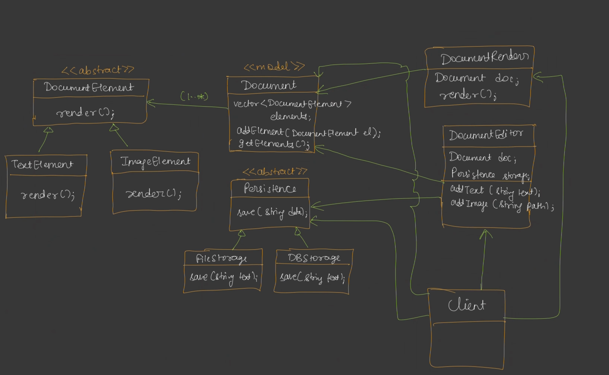
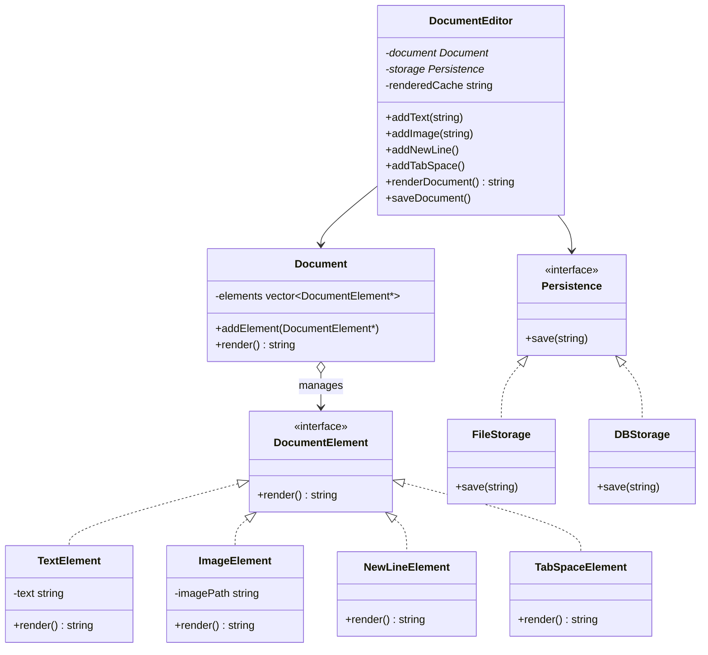

# Notepad (Document Editor) LLD

This project focuses on designing a standard **Notepad / Document Editor** supporting mixed content (text, layout formatting, images) and flexible persistence options.

---

## The Diagram

Below is the conceptual diagram for the document editor structure:



---

## 1. Requirements

### Primary Capabilities
- **Rich Document Content**: Support adding text chunks, line breaks, tab indents, and images to a single document.
- **Unified Rendering**: Generate a single string representing the current state of the document by traversing its elements in order.
- **Flexible Storage**: Support saving the rendered document to different storage mediums (e.g., local files, databases) without modifying the editor.

### Out of Scope
- Graphical User Interface (GUI) rendering.
- Real-time multiplayer synchronization.
- Complex font styling (rich text, bold, italics, HTML translation).

---

## 2. Core Entities & Class Design

The system divides concerns into **Document Structure** (using the Composite pattern) and **Storage Mechanism** (using the Strategy pattern).



---

## 3. C++ Implementation

Based on **Lecture 07 (Good Design)**, here is the object-oriented implementation:

```cpp
#include <iostream>
#include <vector>
#include <string>
#include <fstream>

// ==========================================
// 1. COMPOSITE PATTERN - DOCUMENT ELEMENTS
// ==========================================

// Component Interface
class DocumentElement {
public:
    virtual ~DocumentElement() = default;
    virtual std::string render() = 0;
};

// Leaf: Text
class TextElement : public DocumentElement {
private:
    std::string text;

public:
    TextElement(std::string text) : text(text) {}
    std::string render() override { return text; }
};

// Leaf: Image
class ImageElement : public DocumentElement {
private:
    std::string imagePath;

public:
    ImageElement(std::string imagePath) : imagePath(imagePath) {}
    std::string render() override { return "[Image: " + imagePath + "]"; }
};

// Leaf: NewLine Layout
class NewLineElement : public DocumentElement {
public:
    std::string render() override { return "\n"; }
};

// Leaf: TabSpace Layout
class TabSpaceElement : public DocumentElement {
public:
    std::string render() override { return "\t"; }
};

// Composite: Represents the full Document containing elements
class Document {
private:
    std::vector<DocumentElement*> documentElements;

public:
    ~Document() {
        for (auto element : documentElements) {
            delete element;
        }
    }

    void addElement(DocumentElement* element) {
        documentElements.push_back(element);
    }

    // Traverse and concatenate all leaf elements (polymorphic render)
    std::string render() {
        std::string result;
        for (auto element : documentElements) {
            result += element->render();
        }
        return result;
    }
};

// ==========================================
// 2. STRATEGY PATTERN - PERSISTENCE
// ==========================================

// Strategy Interface
class Persistence {
public:
    virtual ~Persistence() = default;
    virtual void save(std::string data) = 0;
};

// Concrete Strategy: File Storage
class FileStorage : public Persistence {
public:
    void save(std::string data) override {
        std::ofstream outFile("document.txt");
        if (outFile) {
            outFile << data;
            outFile.close();
            std::cout << "Document saved successfully to document.txt" << std::endl;
        } else {
            std::cerr << "Error: Unable to open file for writing." << std::endl;
        }
    }
};

// Concrete Strategy: Database Storage
class DBStorage : public Persistence {
public:
    void save(std::string data) override {
        std::cout << "Saving data to SQL Database..." << std::endl;
        // DB writing logic
    }
};

// ==========================================
// 3. ORCHESTRATOR - DOCUMENT EDITOR
// ==========================================

class DocumentEditor {
private:
    Document* document;
    Persistence* storage;
    std::string renderedDocument;

public:
    DocumentEditor(Document* doc, Persistence* store)
        : document(doc), storage(store) {}

    void addText(std::string text) {
        document->addElement(new TextElement(text));
        renderedDocument.clear(); // Invalidate cache
    }

    void addImage(std::string imagePath) {
        document->addElement(new ImageElement(imagePath));
        renderedDocument.clear(); // Invalidate cache
    }

    void addNewLine() {
        document->addElement(new NewLineElement());
        renderedDocument.clear(); // Invalidate cache
    }

    void addTabSpace() {
        document->addElement(new TabSpaceElement());
        renderedDocument.clear(); // Invalidate cache
    }

    std::string renderDocument() {
        if (renderedDocument.empty()) {
            renderedDocument = document->render();
        }
        return renderedDocument;
    }

    void saveDocument() {
        storage->save(renderDocument());
    }
};

// ==========================================
// 4. CLIENT FLOW
// ==========================================

int main() {
    Document* document = new Document();
    Persistence* fileStorage = new FileStorage();

    DocumentEditor* editor = new DocumentEditor(document, fileStorage);

    editor->addText("Dear Diary,");
    editor->addNewLine();
    editor->addTabSpace();
    editor->addText("Today I learned about LLD design patterns.");
    editor->addNewLine();
    editor->addTabSpace();
    editor->addText("Here is a screenshot of my UML class diagram:");
    editor->addNewLine();
    editor->addImage("uml_diagram.png");

    std::cout << "--- Document Render Preview ---" << std::endl;
    std::cout << editor->renderDocument() << std::endl;
    std::cout << "-------------------------------" << std::endl;

    editor->saveDocument();

    delete editor;
    delete fileStorage;
    delete document;
    return 0;
}
```

---

## 4. Key Design Patterns Utilized

1. **Composite Pattern**: The document elements form a tree/list-like structural hierarchy. The `Document` (composite) aggregates various `DocumentElement`s (leaves like `TextElement`, `ImageElement`, `NewLineElement`, `TabSpaceElement`). The client treats the composite and leaf objects uniformly via the `render()` method.
2. **Strategy Pattern / Bridge Pattern**: The persistence mechanism (`Persistence`) is detached from the `DocumentEditor`. We can swap `FileStorage` with `DBStorage` or any cloud storage at runtime without changing the core editor code.
