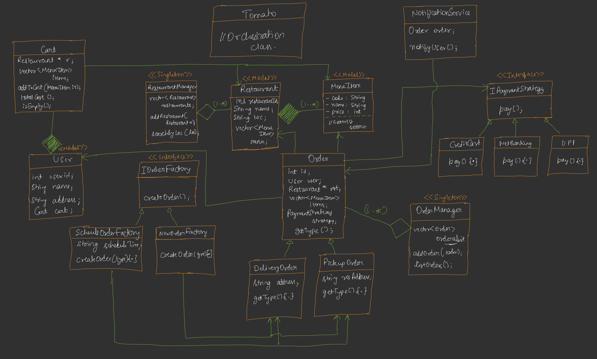
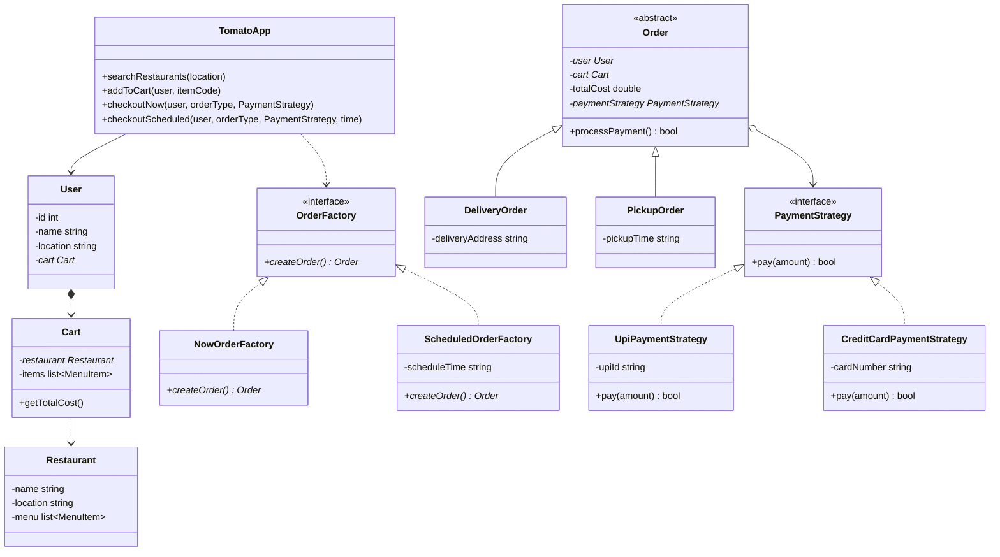

# Zomato (Food Delivery System) LLD

This case study designs a food delivery application (similar to Zomato or Swiggy) supporting restaurant browsing, cart operations, orders of different types (pickup vs delivery), payment integrations, scheduling, and notification workflows.

---

## The Diagram[]()

Below is the conceptual diagram representing the flow and dependencies of the system:



---

## 1. System Requirements

### Primary Capabilities
1. **Browse Restaurants**: Users can search for restaurants operating in their current location.
2. **Cart Management**: Users can select a restaurant, view its menu, and add/remove menu items in their cart.
3. **Flexible Checkout**:
   - Orders can be either **Delivery** or **Self-Pickup**.
   - Orders can be placed **Immediately (Now)** or **Scheduled for Later**.
4. **Payment Options**: Support multiple payment interfaces (e.g., UPI, Credit Cards).
5. **Real-time Notifications**: Notify the customer immediately after successful payment checkout.

---

## 2. Core Entities & Class Design

The architecture uses a clean separation of concerns:
- **TomatoApp**: The main orchestrator providing client APIs.
- **Managers**: Centralized Singletons managing domain registry objects (`RestaurantManager`, `OrderManager`).
- **Factory Method Pattern**: Decouples the instantiation of immediate orders from scheduled ones.
- **Strategy Pattern**: Decouples payment gateway operations.



---

## 3. Implementation Details

Based on **Lecture 11 (Tomato Application)**, here are the code structures in Java/C++ style.

### A. Payment Strategies (Strategy Pattern)
```java
// Strategy Interface
public interface PaymentStrategy {
    boolean pay(double amount);
}

// UPI Implementation
public class UpiPaymentStrategy implements PaymentStrategy {
    private String upiId;

    public UpiPaymentStrategy(String upiId) {
        this.upiId = upiId;
    }

    @Override
    public boolean pay(double amount) {
        System.out.println("Processing UPI payment of ₹" + amount + " using ID: " + upiId);
        return true; // Assume success
    }
}

// Card Implementation
public class CreditCardPaymentStrategy implements PaymentStrategy {
    private String cardNumber;

    public CreditCardPaymentStrategy(String cardNumber) {
        this.cardNumber = cardNumber;
    }

    @Override
    public boolean pay(double amount) {
        System.out.println("Processing Card payment of ₹" + amount + " using Card: " + cardNumber);
        return true;
    }
}
```

### B. Order Hierarchy & Creation (Factory Method Pattern)
Different order types (Instant vs. Scheduled) require different instantiation processes.

```java
// Abstract Order Product
public abstract class Order {
    protected User user;
    protected Restaurant restaurant;
    protected List<MenuItem> items;
    protected PaymentStrategy paymentStrategy;
    protected double totalCost;
    protected String orderType;

    public Order(User user, Restaurant restaurant, List<MenuItem> items, 
                 PaymentStrategy paymentStrategy, double totalCost, String orderType) {
        this.user = user;
        this.restaurant = restaurant;
        this.items = items;
        this.paymentStrategy = paymentStrategy;
        this.totalCost = totalCost;
        this.orderType = orderType;
    }

    public boolean processPayment() {
        return paymentStrategy.pay(totalCost);
    }
}

// Concrete Order: Delivery
public class DeliveryOrder extends Order {
    public DeliveryOrder(User user, Restaurant restaurant, List<MenuItem> items, 
                         PaymentStrategy paymentStrategy, double totalCost) {
        super(user, restaurant, items, paymentStrategy, totalCost, "Delivery");
    }
}

// Order Creator Factory Base
public interface OrderFactory {
    Order createOrder(User user, Cart cart, Restaurant restaurant, 
                      List<MenuItem> items, PaymentStrategy paymentStrategy, 
                      double totalCost, String orderType);
}

// Concrete Creator: Now Order (Immediate)
public class NowOrderFactory implements OrderFactory {
    @Override
    public Order createOrder(User user, Cart cart, Restaurant restaurant, 
                      List<MenuItem> items, PaymentStrategy paymentStrategy, 
                      double totalCost, String orderType) {
        // Immediate validation and creation
        if (orderType.equalsIgnoreCase("Delivery")) {
            return new DeliveryOrder(user, restaurant, items, paymentStrategy, totalCost);
        }
        // Can add PickupOrder logic
        return null;
    }
}
```

### C. System Orchestration (TomatoApp Checkout)
```java
public class TomatoApp {
    // ... Initialization of restaurants and menu ...

    public Order checkoutNow(User user, String orderType, PaymentStrategy paymentStrategy) {
        return checkout(user, orderType, paymentStrategy, new NowOrderFactory());
    }

    public Order checkoutScheduled(User user, String orderType, PaymentStrategy paymentStrategy, String scheduleTime) {
        return checkout(user, orderType, paymentStrategy, new ScheduledOrderFactory(scheduleTime));
    }

    private Order checkout(User user, String orderType, PaymentStrategy paymentStrategy, OrderFactory orderFactory) {
        if (user.getCart().isEmpty()) return null;

        Cart userCart = user.getCart();
        Restaurant orderedRestaurant = userCart.getRestaurant();
        List<MenuItem> itemsOrdered = userCart.getItems();
        double totalCost = userCart.getTotalCost();

        // Create order via factory
        Order order = orderFactory.createOrder(user, userCart, orderedRestaurant, itemsOrdered, paymentStrategy, totalCost, orderType);
        
        // Register order with central manager
        OrderManager.getInstance().addOrder(order);
        return order;
    }

    public void payForOrder(User user, Order order) {
        boolean isPaymentSuccess = order.processPayment();
        if (isPaymentSuccess) {
            NotificationService.notify(order);
            user.getCart().clear(); // Safe cart release
        }
    }
}
```

---

## 4. Key Design Patterns Utilized

1. **Factory Method Pattern**: Decoupled the creation of instant orders from scheduled ones. `TomatoApp` depends on the `OrderFactory` abstraction to create `Order` instances, allowing new order configurations (e.g., contactless delivery, dining orders) to be added without modifying the core checkout engine.
2. **Strategy Pattern**: The payment logic is encapsulated inside subclasses of `PaymentStrategy`. This makes it simple to add payment options (Google Pay, PayPal, cash-on-delivery) without modifying the `Order` or `TomatoApp` class files.
3. **Singleton Pattern**: The `RestaurantManager` and `OrderManager` utilize the Singleton pattern to provide a single, globally accessible memory-state repository for restaurants and orders.